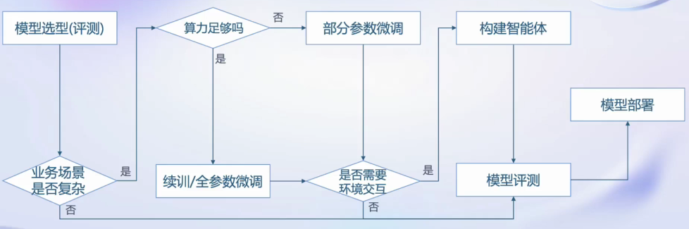
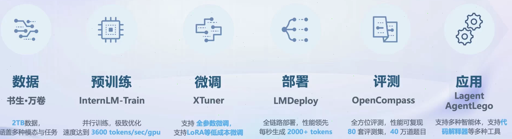
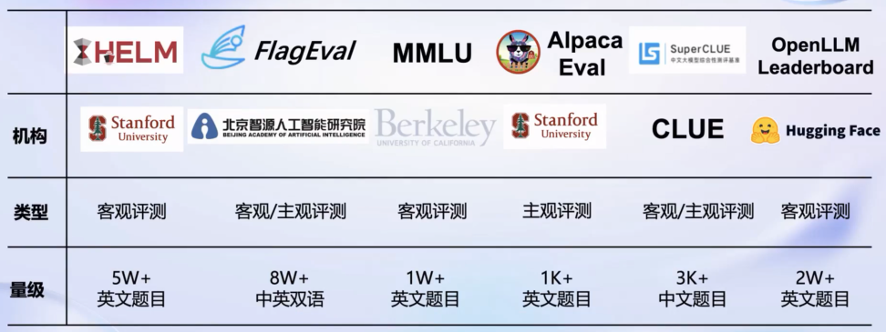
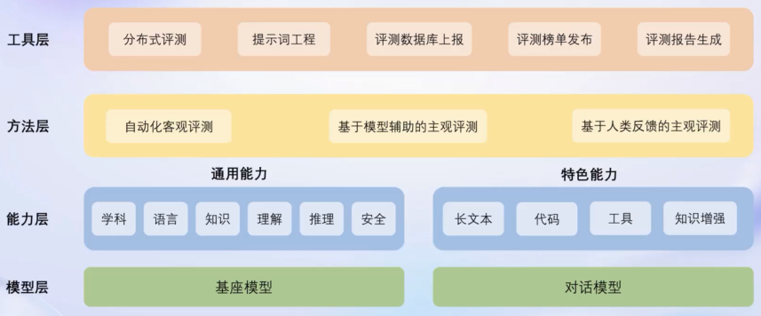
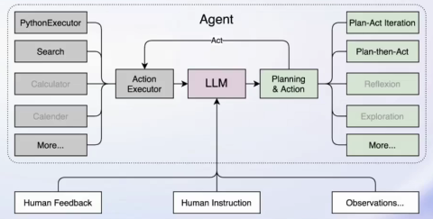
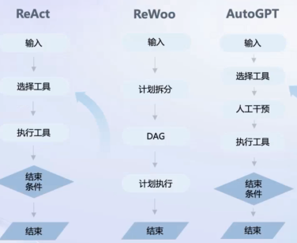

## 模型应用流程图

## 书生·浦语开放体系

### 数据

#### 概述

- 共2TB
- 文本数据：1TB+，50亿文档
- 图像-文本数据集：140GB，2200万+文件
- 视频数据：900GB，1000+文件
- 多模态数据（各个领域）
- 精细化处理
  - 语言筛选、文本提取、格式标准化、数据过滤和清洗（基于规则和模型）、多尺度去重和数据质量评估等
- OpenDataLab：数据集下载网站

### 预训练

- 可8卡到千卡训练
- 兼容HuggingFace等技术生态和轻量化技术

### 微调

- LLM下游应用使用微调方式
  - 增量续训练
  - 有监督微调
- 全量和部分参数微调
- LoRA、QLoRA

#### 增量续训

- 场景：基座模型学习到一些新知识，如某个垂类领域知识
  - 垂类领域知识：某一特定行业或学科中深入、专业且垂直细分的知识内容。相对于通用知识而言，垂类领域知识更具有针对性和专业化特点，它聚焦于一个具体的分支或方向，在这个范围内进行深度研究、积累经验和形成独特的专业知识体系。（大领域的细分领域）
- 训练数据：文章、书籍、代码等

#### 有监督微调

- 场景：模型学会和遵循各种指令，或者注入少量领域知识
- 训练数据：高质量对话，QA数据（数据量少）

#### XTuner

- 微调算法：有多种微调策略和算法，覆盖各类SFT场景
- 兼容HuggingFace、ModelScope模型或数据集
- 最低8G显存微调7B模型
  - 20系以上显卡

### 评测

#### OpenCompass

##### 体系

- 学科考试
- 语言
- 知识问答
- 理解
- 推理
- 安全

##### 评测平台架构

### 部署

#### LLM特点

##### 内存开销大

- 参数量庞大
- 自回归生成token，需要缓存k/v

##### 动态shape

- 请求数不固定
- token逐个生成，数量不固定

##### 模型结构简单

- transformer结构
  - 大部分是decoder-only

#### 技术challenge

##### 设备

- 低存储设备部署
  - 消费级显卡、移动端

##### 推理

- token生成速度
- 解决动态shape，推理不间断
- 有效管理和利用内存

##### 服务

- 提升系统整体吞吐量
- 降低请求的平均响应时间

#### 部署方案

`技术点`

- 模型并行
- 低比特量化
  - 模型压缩与加速技术，减少神经网络模型的计算和存储开销
  - 高精度的数值转换为更低比特数（如8位、4位、1位）的整数或定点数进行存储和计算
- attention优化
- 计算和访存优化
- Continuous Batching（持续批量处理）
  - 结合了批量处理和流式处理特点的数据处理方法
  - 将批处理任务分解为一系列小的、连续运行的批次，这样可以在保持一定频率的情况下近乎实时地更新结果，同时又能利用批处理高效处理大量数据的优势。将批处理任务分解为一系列小的、连续运行的批次，这样可以在保持一定频率的情况下近乎实时地更新结果，同时又能利用批处理高效处理大量数据的优势。

#### LMDeploy

##### 接口

- Python、gRPC、RESTful

##### 推理引擎

- turbomind、pytorch

##### 服务

- openai-server、gradio、triton inference server

##### 轻量化

- 4 bit 权重
- 8 bit k/v

### 应用

#### Agent

- 智能体

##### 智能体类型

#### AgentLego

- 多模态智能体工具箱
- 提供大量视觉、多模态相关领域算法和工具
- 支持多个主流智能体系统
  - LangChain、Transformers Agent、Lagent
- 支持各类输入输出格式工具函数（多模态工具调用接口）
- 远程部署

