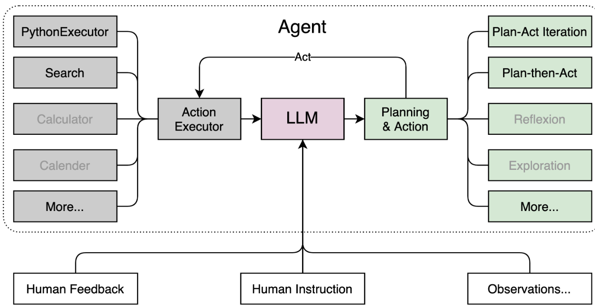

# 大模型

## 概念

- LLM：机器学习或人工智能领域中参数数量巨大、拥有庞大计算能力和参数规模的模型
  - 大量数据训练
  - 拥有数十亿甚至数千亿个参数
  - 结构： `Transformer`、`BERT`、`GPT`（ Generative Pre-trained Transformer ）等

## 优势

- 捕捉和理解数据中更为复杂、抽象的特征和关系
- 大规模参数的学习，提高在各种任务上的泛化能力，并在未经过大量特定领域数据训练的情况下实现较好的表现

## InternLM

- 开源的预训练模型：`InternLM-7B` 和 `InternLM-20B`
- `Lagent` ：轻量级、开源的基于大语言模型的智能体（agent）框架，支持用户快速地将一个大语言模型转变为多种类型的智能体，并提供了一些典型工具为大语言模型赋能




# InternLM-Chat-7B demo

- 基于`InternStudio` A100(1/4)部署`InternLM-Chat-7B`
- cuda11.7

## operation

### 环境配置

```
# enter conda env
bash # 每次使用 jupyter lab 打开终端时务必先执行 bash 命令进入 bash 中
conda create --name internlm-demo --clone=/root/share/conda_envs/internlm-base
conda activate internlm-demo

# 升级pip
python -m pip install --upgrade pip

# 其他配置
pip install modelscope==1.9.5
pip install transformers==4.35.2
pip install streamlit==1.24.0
pip install sentencepiece==0.1.99
pip install accelerate==0.24.1
```

### 模型下载

```
mkdir -p /root/model/Shanghai_AI_Laboratory
# /root/share文件存在InternLM模型，直接复制
cp -r /root/share/temp/model_repos/internlm-chat-7b /root/model/Shanghai_AI_Laboratory # -r 选项表示递归地复制目录及其内容

# 或modelscope snapshot_download 下载模型
# 新建download.py执行
import torch
from modelscope import snapshot_download, AutoModel, AutoTokenizer
import os

# cache_dir: 下载路径
# revision: 版本
model_dir = snapshot_download('Shanghai_AI_Laboratory/internlm-chat-7b', cache_dir='/root/model', revision='v1.0.3')
```

### 代码准备

```
mkdir /root/code
cd /root/code
git clone https://gitee.com/internlm/InternLM.git

cd InternLM
# 切换commit版本
git checkout 3028f07cb79e5b1d7342f4ad8d11efad3fd13d17

# 修改模型加载路径
# 将 /root/code/InternLM/web_demo.py 中 29 行和 33 行的模型更换为本地的 /root/model/Shanghai_AI_Laboratory/internlm-chat-7b
```

### 终端运行

```
# 新建cli_demo.py，执行
import torch
from transformers import AutoTokenizer, AutoModelForCausalLM


model_name_or_path = "/root/model/Shanghai_AI_Laboratory/internlm-chat-7b"

tokenizer = AutoTokenizer.from_pretrained(model_name_or_path, trust_remote_code=True)
model = AutoModelForCausalLM.from_pretrained(model_name_or_path, trust_remote_code=True, torch_dtype=torch.bfloat16, device_map='auto')
model = model.eval()

system_prompt = """You are an AI assistant whose name is InternLM (书生·浦语).
- InternLM (书生·浦语) is a conversational language model that is developed by Shanghai AI Laboratory (上海人工智能实验室). It is designed to be helpful, honest, and harmless.
- InternLM (书生·浦语) can understand and communicate fluently in the language chosen by the user such as English and 中文.
"""

messages = [(system_prompt, '')]

print("=============Welcome to InternLM chatbot, type 'exit' to exit.=============")

while True:
    input_text = input("User  >>> ")
    input_text = input_text.replace(' ', '')
    if input_text == "exit":
        break
    response, history = model.chat(tokenizer, input_text, history=messages)
    messages.append((input_text, response))
    print(f"robot >>> {response}")

# 终端执行cli_demo.py
python /root/code/InternLM/cli_demo.py
```

### web demo运行

```
# 切换 VScode ，运行 /root/code/InternLM 目录下的 web_demo.py 文件
bash
conda activate internlm-demo  # 首次进入 vscode 会默认是 base 环境，首先切换环境
cd /root/code/InternLM
# 执行前需要在本地终端进行端口映射
# ssh连接对应端口映射到本地 6006
ssh -CNg -L 6006:127.0.0.1:6006 root@ssh.intern-ai.org.cn -p ssh连接端口
streamlit run web_demo.py --server.address 127.0.0.1 --server.port 6006

# 浏览器打开http://127.0.0.1:6006进行对话
```


# Lagent demo

## operation

- 环境、模型同上

### Lagent安装

```
cd /root/code
git clone https://gitee.com/internlm/lagent.git
cd /root/code/lagent
git checkout 511b03889010c4811b1701abb153e02b8e94fb5e # 切换commit版本
pip install -e . # 源码安装
```

### 代码修改

- `react_web_demo.py`(/root/code/lagent/examples/react_web_demo.py)全部替换

```
import copy
import os

import streamlit as st
from streamlit.logger import get_logger

from lagent.actions import ActionExecutor, GoogleSearch, PythonInterpreter
from lagent.agents.react import ReAct
from lagent.llms import GPTAPI
from lagent.llms.huggingface import HFTransformerCasualLM


class SessionState:

    def init_state(self):
        """Initialize session state variables."""
        st.session_state['assistant'] = []
        st.session_state['user'] = []

        #action_list = [PythonInterpreter(), GoogleSearch()]
        action_list = [PythonInterpreter()]
        st.session_state['plugin_map'] = {
            action.name: action
            for action in action_list
        }
        st.session_state['model_map'] = {}
        st.session_state['model_selected'] = None
        st.session_state['plugin_actions'] = set()

    def clear_state(self):
        """Clear the existing session state."""
        st.session_state['assistant'] = []
        st.session_state['user'] = []
        st.session_state['model_selected'] = None
        if 'chatbot' in st.session_state:
            st.session_state['chatbot']._session_history = []


class StreamlitUI:

    def __init__(self, session_state: SessionState):
        self.init_streamlit()
        self.session_state = session_state

    def init_streamlit(self):
        """Initialize Streamlit's UI settings."""
        st.set_page_config(
            layout='wide',
            page_title='lagent-web',
            page_icon='./docs/imgs/lagent_icon.png')
        # st.header(':robot_face: :blue[Lagent] Web Demo ', divider='rainbow')
        st.sidebar.title('模型控制')

    def setup_sidebar(self):
        """Setup the sidebar for model and plugin selection."""
        model_name = st.sidebar.selectbox(
            '模型选择：', options=['gpt-3.5-turbo','internlm'])
        if model_name != st.session_state['model_selected']:
            model = self.init_model(model_name)
            self.session_state.clear_state()
            st.session_state['model_selected'] = model_name
            if 'chatbot' in st.session_state:
                del st.session_state['chatbot']
        else:
            model = st.session_state['model_map'][model_name]

        plugin_name = st.sidebar.multiselect(
            '插件选择',
            options=list(st.session_state['plugin_map'].keys()),
            default=[list(st.session_state['plugin_map'].keys())[0]],
        )

        plugin_action = [
            st.session_state['plugin_map'][name] for name in plugin_name
        ]
        if 'chatbot' in st.session_state:
            st.session_state['chatbot']._action_executor = ActionExecutor(
                actions=plugin_action)
        if st.sidebar.button('清空对话', key='clear'):
            self.session_state.clear_state()
        uploaded_file = st.sidebar.file_uploader(
            '上传文件', type=['png', 'jpg', 'jpeg', 'mp4', 'mp3', 'wav'])
        return model_name, model, plugin_action, uploaded_file

    def init_model(self, option):
        """Initialize the model based on the selected option."""
        if option not in st.session_state['model_map']:
            if option.startswith('gpt'):
                st.session_state['model_map'][option] = GPTAPI(
                    model_type=option)
            else:
                st.session_state['model_map'][option] = HFTransformerCasualLM(
                    '/root/model/Shanghai_AI_Laboratory/internlm-chat-7b')
        return st.session_state['model_map'][option]

    def initialize_chatbot(self, model, plugin_action):
        """Initialize the chatbot with the given model and plugin actions."""
        return ReAct(
            llm=model, action_executor=ActionExecutor(actions=plugin_action))

    def render_user(self, prompt: str):
        with st.chat_message('user'):
            st.markdown(prompt)

    def render_assistant(self, agent_return):
        with st.chat_message('assistant'):
            for action in agent_return.actions:
                if (action):
                    self.render_action(action)
            st.markdown(agent_return.response)

    def render_action(self, action):
        with st.expander(action.type, expanded=True):
            st.markdown(
                "<p style='text-align: left;display:flex;'> <span style='font-size:14px;font-weight:600;width:70px;text-align-last: justify;'>插    件</span><span style='width:14px;text-align:left;display:block;'>:</span><span style='flex:1;'>"  # noqa E501
                + action.type + '</span></p>',
                unsafe_allow_html=True)
            st.markdown(
                "<p style='text-align: left;display:flex;'> <span style='font-size:14px;font-weight:600;width:70px;text-align-last: justify;'>思考步骤</span><span style='width:14px;text-align:left;display:block;'>:</span><span style='flex:1;'>"  # noqa E501
                + action.thought + '</span></p>',
                unsafe_allow_html=True)
            if (isinstance(action.args, dict) and 'text' in action.args):
                st.markdown(
                    "<p style='text-align: left;display:flex;'><span style='font-size:14px;font-weight:600;width:70px;text-align-last: justify;'> 执行内容</span><span style='width:14px;text-align:left;display:block;'>:</span></p>",  # noqa E501
                    unsafe_allow_html=True)
                st.markdown(action.args['text'])
            self.render_action_results(action)

    def render_action_results(self, action):
        """Render the results of action, including text, images, videos, and
        audios."""
        if (isinstance(action.result, dict)):
            st.markdown(
                "<p style='text-align: left;display:flex;'><span style='font-size:14px;font-weight:600;width:70px;text-align-last: justify;'> 执行结果</span><span style='width:14px;text-align:left;display:block;'>:</span></p>",  # noqa E501
                unsafe_allow_html=True)
            if 'text' in action.result:
                st.markdown(
                    "<p style='text-align: left;'>" + action.result['text'] +
                    '</p>',
                    unsafe_allow_html=True)
            if 'image' in action.result:
                image_path = action.result['image']
                image_data = open(image_path, 'rb').read()
                st.image(image_data, caption='Generated Image')
            if 'video' in action.result:
                video_data = action.result['video']
                video_data = open(video_data, 'rb').read()
                st.video(video_data)
            if 'audio' in action.result:
                audio_data = action.result['audio']
                audio_data = open(audio_data, 'rb').read()
                st.audio(audio_data)


def main():
    logger = get_logger(__name__)
    # Initialize Streamlit UI and setup sidebar
    if 'ui' not in st.session_state:
        session_state = SessionState()
        session_state.init_state()
        st.session_state['ui'] = StreamlitUI(session_state)

    else:
        st.set_page_config(
            layout='wide',
            page_title='lagent-web',
            page_icon='./docs/imgs/lagent_icon.png')
        # st.header(':robot_face: :blue[Lagent] Web Demo ', divider='rainbow')
    model_name, model, plugin_action, uploaded_file = st.session_state[
        'ui'].setup_sidebar()

    # Initialize chatbot if it is not already initialized
    # or if the model has changed
    if 'chatbot' not in st.session_state or model != st.session_state[
            'chatbot']._llm:
        st.session_state['chatbot'] = st.session_state[
            'ui'].initialize_chatbot(model, plugin_action)

    for prompt, agent_return in zip(st.session_state['user'],
                                    st.session_state['assistant']):
        st.session_state['ui'].render_user(prompt)
        st.session_state['ui'].render_assistant(agent_return)
    # User input form at the bottom (this part will be at the bottom)
    # with st.form(key='my_form', clear_on_submit=True):

    if user_input := st.chat_input(''):
        st.session_state['ui'].render_user(user_input)
        st.session_state['user'].append(user_input)
        # Add file uploader to sidebar
        if uploaded_file:
            file_bytes = uploaded_file.read()
            file_type = uploaded_file.type
            if 'image' in file_type:
                st.image(file_bytes, caption='Uploaded Image')
            elif 'video' in file_type:
                st.video(file_bytes, caption='Uploaded Video')
            elif 'audio' in file_type:
                st.audio(file_bytes, caption='Uploaded Audio')
            # Save the file to a temporary location and get the path
            file_path = os.path.join(root_dir, uploaded_file.name)
            with open(file_path, 'wb') as tmpfile:
                tmpfile.write(file_bytes)
            st.write(f'File saved at: {file_path}')
            user_input = '我上传了一个图像，路径为: {file_path}. {user_input}'.format(
                file_path=file_path, user_input=user_input)
        agent_return = st.session_state['chatbot'].chat(user_input)
        st.session_state['assistant'].append(copy.deepcopy(agent_return))
        logger.info(agent_return.inner_steps)
        st.session_state['ui'].render_assistant(agent_return)


if __name__ == '__main__':
    root_dir = os.path.dirname(os.path.dirname(os.path.abspath(__file__)))
    root_dir = os.path.join(root_dir, 'tmp_dir')
    os.makedirs(root_dir, exist_ok=True)
    main()
```

### demo运行

```
# 本地终端输入
ssh -CNg -L 6006:127.0.0.1:6006 root@ssh.intern-ai.org.cn -p ssh连接端口
streamlit run /root/code/lagent/examples/react_web_demo.py --server.address 127.0.0.1 --server.port 6006

# 本地浏览器输入 http://127.0.0.1:6006访问
```


# 浦语·灵笔图文理解创作 demo

## Operation

### 环境配置

```
bash # 使用jupyter lab在终端 输入
conda create --name xcomposer-demo --clone=/root/share/conda_envs/internlm-base
conda activate xcomposer-demo

# 其他依赖包配置
pip install transformers==4.33.1 timm==0.4.12 sentencepiece==0.1.99 gradio==3.44.4 markdown2==2.4.10 xlsxwriter==3.1.2 einops accelerate
```

### 模型下载

```
mkdir -p /root/model/Shanghai_AI_Laboratory
cp -r /root/share/temp/model_repos/internlm-xcomposer-7b /root/model/Shanghai_AI_Laboratory

# 安装modelscope
pip install modelscope==1.9.5

# 或modelscope snapshot_download 下载模型
# 新建download.py执行
import torch
from modelscope import snapshot_download, AutoModel, AutoTokenizer
import os

# cache_dir: 下载路径
# revision: 版本
model_dir = snapshot_download('Shanghai_AI_Laboratory/internlm-xcomposer-7b', cache_dir='/root/model', revision='master')
```

### 代码准备

```
cd /root/code
git clone https://gitee.com/internlm/InternLM-XComposer.git
cd /root/code/InternLM-XComposer
git checkout 3e8c79051a1356b9c388a6447867355c0634932d  # 切换commit 版本
```

### demo运行

```
cd /root/code/InternLM-XComposer
python examples/web_demo.py --folder /root/model/Shanghai_AI_Laboratory/internlm-xcomposer-7b --num_gpus 1 --port 6006
    
# num_gpus 1: InternStudio平台对于 A100(1/4)*2 识别为一张显卡。如果使用两张 3090 运行此 demo，需将 num_gpus 设置为 2
```


# 通用环境配置

## pip换源

-  [MirrorZ Help](https://help.mirrors.cernet.edu.cn/) 提供相关help

```
# 临时使用镜像源安装
# some-package：需要安装的包名
pip install -i https://mirrors.cernet.edu.cn/pypi/web/simple some-package

# 设置pip默认镜像源
# 升级 pip 到最新的版本 (>=10.0.0) 后进行配置
python -m pip install --upgrade pip
pip config set global.index-url https://mirrors.cernet.edu.cn/pypi/web/simple
 or
python -m pip install -i https://mirrors.cernet.edu.cn/pypi/web/simple --upgrade pip
```

## conda换源

- 修改.condarc文件
  - `Linux`: `${HOME}/.condarc`
  - `macOS`: `${HOME}/.condarc`
  - `Windows`: `C:\Users\<YourUserName>\.condarc`
    - 需要先执行`conda config --set show_channel_urls yes`生成`.condarc`文件

```
# 快速配置
cat <<'EOF' > ~/.condarc
channels:
  - defaults
show_channel_urls: true
default_channels:
  - https://mirrors.tuna.tsinghua.edu.cn/anaconda/pkgs/main
  - https://mirrors.tuna.tsinghua.edu.cn/anaconda/pkgs/r
  - https://mirrors.tuna.tsinghua.edu.cn/anaconda/pkgs/msys2
custom_channels:
  conda-forge: https://mirrors.tuna.tsinghua.edu.cn/anaconda/cloud
  pytorch: https://mirrors.tuna.tsinghua.edu.cn/anaconda/cloud
EOF
```

## SSH隧道配置

- ssh隧道：将服务器上的这些特定端口映射到本地计算机的端口

### 生成SSH密钥

- 默认生成路径：`~/.ssh/`
  - `~`：用户主目录
  - `id_rsa.pub`：SSH 公钥文件的默认名称

```
ssh-keygen -t rsa
```

### 端口映射

```
# 在终端执行
ssh -CNg -L 6006:127.0.0.1:6006 root@ssh.intern-ai.org.cn -p ssh连接端口
```

## 模型下载

### Hugging Face

```
# 安装huggingface-cli 命令行工具
pip install -U huggingface_hub

# 新建 python 文件
import os

# 下载模型
# resume-download：断点续下
# local-dir：本地存储路径。（linux 环境下需要填写绝对路径）
os.system('huggingface-cli download --resume-download internlm/internlm-chat-7b --local-dir your_path')

# 使用 huggingface_hub 下载模型中的部分文件
import os 
from huggingface_hub import hf_hub_download  # Load model directly 

# filename：文件名称
hf_hub_download(repo_id="internlm/internlm-7b", filename="config.json")
```

### ModelScope

```
pip install modelscope==1.9.5
pip install transformers==4.35.2

# 新建 python 文件

import torch
from modelscope import snapshot_download, AutoModel, AutoTokenizer
import os

# 第一个参数：模型名称
# cache_dir：模型的下载路径（最后是绝对路径）
# revision：版本
model_dir = snapshot_download('Shanghai_AI_Laboratory/internlm-chat-7b', cache_dir='your path', revision='master')
```

### OpenXLab

```
pip install -U openxlab

# 新建 python 文件

from openxlab.model import download

download(model_repo='OpenLMLab/InternLM-7b', model_name='InternLM-7b', output='your local path')
```