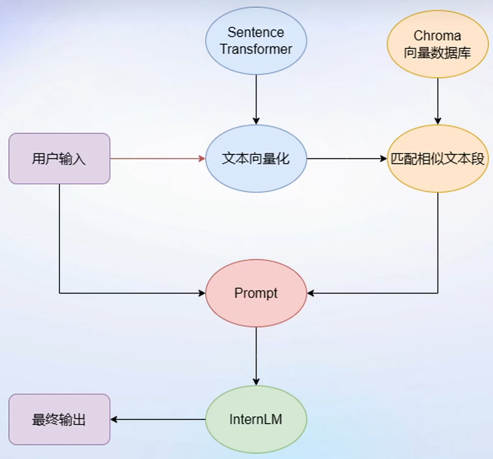
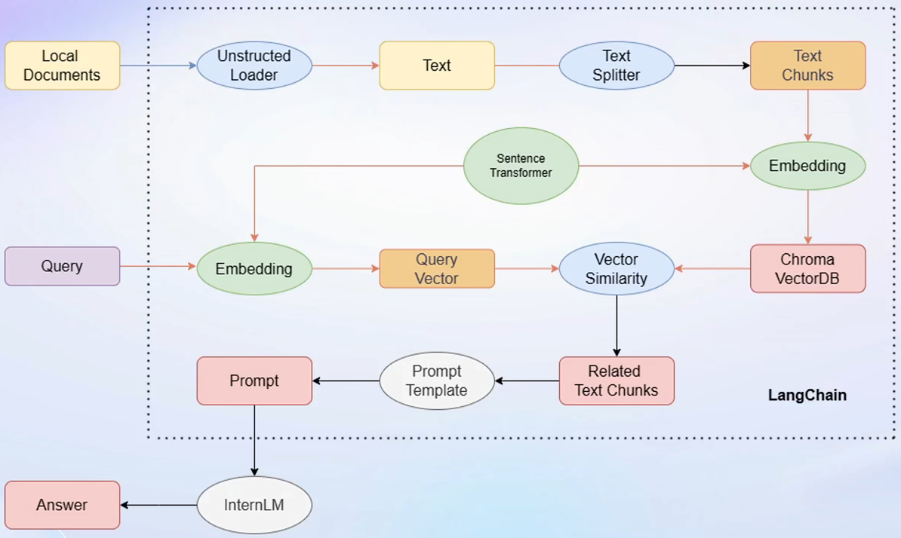
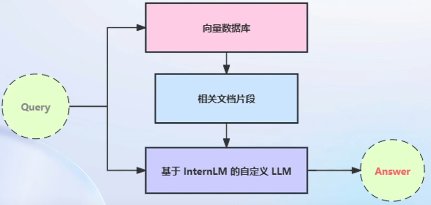

# 基于 LLM 和 LangChain 搭建知识库

## 大模型开发范式

### RAG

- RAG：检索增强生成
  - 低成本、可实时更新
  - 受基座模型影响大
  - 单次回答知识有限

### Finetune

- Finetune：微调
  - 可个性更新微调
  - 知识覆盖面广
  - 成本高昂
  - 无法实时更新

## RAG



### 优化

- RAG性能核心受限于：
  - 检索精度
  - Prompt性能
- 检索方面
  - 基于语义进行分割，保证每一个chunk语义完整
  - 每一个chunk生成概括性索引，检索时匹配索引

## LangChain

### 概述

- LangChain：开源框架，为各种LLM提供通用接口简化LLM应用程序开发流程
- 核心组成模块：
  - Chains：链，将组件组合实现端到端应用，通过一个对象封装实现一系列LLM操作

### 流程



- Unstructed Loader：将不同格式本地文档转化为纯文本格式
- Text Splitter：将提取出来的纯文本分割为Chunks
- Sentence Transformer：将文本段转化为向量格式
- Chroma：向量数据库
- Vector Similarity：Query向量在向量数据库中进行相似度匹配，找到相似的文本段
- Related Text Chunks嵌入到Prompt Template

### 检索问答链



- 检索问答链：通过一个对象完成检索增强问答（即RAG）的全流程
- LangChain提供检索问答链模板，可自动实现知识检索、Prompt嵌入、LLM问答全流程
- 将LLM和构建完成的向量数据库接入到检索问答链上游
- 调用检索问答链

## 构建向量数据库

### 流程

1. 加载源文件
2. 文档分块
3. 文档向量化

### 加载源文件

- 确定源文件类型，针对不同类型源文件选用不同的加载器
  - 带格式文本转化为无格式字符串

### 文档分块

- 单个文档可能超过模型上下文上限，对加载的文档进行切分
  - 按字符串长度进行切分
  - 控制分割块的长短和重叠区间长度

### 文档向量化

- 采用Embedding模型进行向量化
- 采用支持语义检索的向量数据库
  - Chroma

## 构建LLM+RAG

### 环境配置

```
# jupyter lab需要输入bash进入conda环境
bash
conda create -n InternLM --clone=/root/share/conda_envs/internlm-base

conda activate InternLM

# 升级pip
python -m pip install --upgrade pip

pip install modelscope==1.9.5
pip install transformers==4.35.2
pip install streamlit==1.24.0
pip install sentencepiece==0.1.99
pip install accelerate==0.24.1

# LangChain 相关环境配置
pip install langchain==0.0.292
pip install gradio==4.4.0
pip install chromadb==0.4.15
pip install sentence-transformers==2.2.2
pip install unstructured==0.10.30
pip install markdown==3.3.7
```

### 模型下载

```
mkdir -p /root/data/model/Shanghai_AI_Laboratory
cp -r /root/share/temp/model_repos/internlm-chat-7b /root/data/model/Shanghai_AI_Laboratory/internlm-chat-7b

# or modelscope下载如下
import torch
from modelscope import snapshot_download, AutoModel, AutoTokenizer
import os

model_dir = snapshot_download('Shanghai_AI_Laboratory/internlm-chat-7b', cache_dir='/root/data/model', revision='v1.0.3')

# 下载sentence transformer模型
pip install -U huggingface_hub

# /root/data 目录下新建python文件 download_hf.py，填入
import os

# 下载模型
# resume-download：断点续下
# local-dir：本地存储路径。（linux环境下需要填写绝对路径）
os.system('huggingface-cli download --resume-download sentence-transformers/paraphrase-multilingual-MiniLM-L12-v2 --local-dir /root/data/model/sentence-transformer')

# 镜像下载
import os

# 设置环境变量
os.environ['HF_ENDPOINT'] = 'https://hf-mirror.com'

# 下载模型
os.system('huggingface-cli download --resume-download sentence-transformers/paraphrase-multilingual-MiniLM-L12-v2 --local-dir /root/data/model/sentence-transformer')

# 执行
python download_hf.py
```

### 下载 NLTK 相关资源

使用开源词向量模型构建开源词向量需要用到第三方库 `nltk` 的一些资源。

```
cd /root
git clone https://gitee.com/yzy0612/nltk_data.git  --branch gh-pages
cd nltk_data
mv packages/*  ./
cd tokenizers
unzip punkt.zip
cd ../taggers
unzip averaged_perceptron_tagger.zip
```

### 下载项目代码

```
cd /root/data
git clone https://github.com/InternLM/tutorial
```

### 知识库搭建

#### 数据收集

选择由上海人工智能实验室开源的一系列大模型工具开源仓库作为语料库来源，包括：

- [OpenCompass](https://gitee.com/open-compass/opencompass)：面向大模型评测的一站式平台
- [IMDeploy](https://gitee.com/InternLM/lmdeploy)：涵盖了 LLM 任务的全套轻量化、部署和服务解决方案的高效推理工具箱
- [XTuner](https://gitee.com/InternLM/xtuner)：轻量级微调大语言模型的工具库
- [InternLM-XComposer](https://gitee.com/InternLM/InternLM-XComposer)：浦语·灵笔，基于书生·浦语大语言模型研发的视觉-语言大模型
- [Lagent](https://gitee.com/InternLM/lagent)：一个轻量级、开源的基于大语言模型的智能体（agent）框架
- [InternLM](https://gitee.com/InternLM/InternLM)：一个开源的轻量级训练框架，旨在支持大模型训练而无需大量的依赖

#### 远程开源仓库 Clone 到本地

```
# 进入到数据库盘
cd /root/data
# clone 上述开源仓库
git clone https://gitee.com/open-compass/opencompass.git
git clone https://gitee.com/InternLM/lmdeploy.git
git clone https://gitee.com/InternLM/xtuner.git
git clone https://gitee.com/InternLM/InternLM-XComposer.git
git clone https://gitee.com/InternLM/lagent.git
git clone https://gitee.com/InternLM/InternLM.git
```

#### 找出满足条件的文件路径

- 该函数将递归指定文件夹路径，返回其中所有满足条件（即后缀名为 .md 或者 .txt 的文件）的文件路径：

```
import os 
def get_files(dir_path):
    # args：dir_path，目标文件夹路径
    file_list = []
    for filepath, dirnames, filenames in os.walk(dir_path):
        # os.walk 函数将递归遍历指定文件夹
        for filename in filenames:
            # 通过后缀名判断文件类型是否满足要求
            if filename.endswith(".md"):
                # 如果满足要求，将其绝对路径加入到结果列表
                file_list.append(os.path.join(filepath, filename))
            elif filename.endswith(".txt"):
                file_list.append(os.path.join(filepath, filename))
    return file_list
```

#### 加载数据

- 使用 LangChain 提供的 FileLoader 对象来加载目标文件，得到由目标文件解析出的纯文本内容
- 不同类型的文件需要对应不同的 FileLoader，判断目标文件类型，针对性调用对应类型的 FileLoader
- 调用 FileLoader 对象的 load 方法得到加载之后的纯文本对象
- 最终得到的 `docs` 为一个纯文本对象对应的列表。

```
from tqdm import tqdm
from langchain.document_loaders import UnstructuredFileLoader
from langchain.document_loaders import UnstructuredMarkdownLoader

def get_text(dir_path):
    # args：dir_path，目标文件夹路径
    # 首先调用上文定义的函数得到目标文件路径列表
    file_lst = get_files(dir_path)
    # docs 存放加载之后的纯文本对象
    docs = []
    # 遍历所有目标文件
    for one_file in tqdm(file_lst):
        file_type = one_file.split('.')[-1]
        if file_type == 'md':
            loader = UnstructuredMarkdownLoader(one_file)
        elif file_type == 'txt':
            loader = UnstructuredFileLoader(one_file)
        else:
            # 如果是不符合条件的文件，直接跳过
            continue
        docs.extend(loader.load())
    return docs
```

#### 构建向量数据库

- 得到该列表之后，将它引入到 LangChain 框架中构建向量数据库
- 先对文本进行分块，接着对文本块进行向量化
- LangChain 提供了多种文本分块工具，此处使用字符串递归分割器，并选择分块大小为 500，块重叠长度为 150
  - LangChain教程 [《LangChain - Chat With Your Data》](https://github.com/datawhalechina/prompt-engineering-for-developers/blob/9dbcb48416eb8af9ff9447388838521dc0f9acb0/content/LangChain Chat with Your Data/1.简介 Introduction.md)

```
from langchain.text_splitter import RecursiveCharacterTextSplitter

text_splitter = RecursiveCharacterTextSplitter(
    chunk_size=500, chunk_overlap=150)
split_docs = text_splitter.split_documents(docs)
```

#### 文本向量化

- 开源词向量模型 [Sentence Transformer](https://huggingface.co/sentence-transformers/paraphrase-multilingual-MiniLM-L12-v2) 进行文本向量化

```
from langchain.embeddings.huggingface import HuggingFaceEmbeddings

embeddings = HuggingFaceEmbeddings(model_name="/root/data/model/sentence-transformer")
```

#### 持久化数据库

- Chroma 作为向量数据库
- 基于上文分块后的文档以及加载的开源向量化模型，将语料加载到指定路径下的向量数据库

```
from langchain.vectorstores import Chroma

# 定义持久化路径
persist_directory = 'data_base/vector_db/chroma'
# 加载数据库
vectordb = Chroma.from_documents(
    documents=split_docs,
    embedding=embeddings,
    persist_directory=persist_directory  # 允许我们将persist_directory目录保存到磁盘上
)
# 将加载的向量数据库持久化到磁盘上
vectordb.persist()
```

#### 整体脚本

- 在 `/root/data` 下新建一个 `demo`目录，将该脚本和后续脚本均放在该目录下运行
- 运行脚本，即可在本地构建已持久化的向量数据库，后续直接导入该数据库即可

```
# 首先导入所需第三方库
from langchain.document_loaders import UnstructuredFileLoader
from langchain.document_loaders import UnstructuredMarkdownLoader
from langchain.text_splitter import RecursiveCharacterTextSplitter
from langchain.vectorstores import Chroma
from langchain.embeddings.huggingface import HuggingFaceEmbeddings
from tqdm import tqdm
import os

# 获取文件路径函数
def get_files(dir_path):
    # args：dir_path，目标文件夹路径
    file_list = []
    for filepath, dirnames, filenames in os.walk(dir_path):
        # os.walk 函数将递归遍历指定文件夹
        for filename in filenames:
            # 通过后缀名判断文件类型是否满足要求
            if filename.endswith(".md"):
                # 如果满足要求，将其绝对路径加入到结果列表
                file_list.append(os.path.join(filepath, filename))
            elif filename.endswith(".txt"):
                file_list.append(os.path.join(filepath, filename))
    return file_list

# 加载文件函数
def get_text(dir_path):
    # args：dir_path，目标文件夹路径
    # 首先调用上文定义的函数得到目标文件路径列表
    file_lst = get_files(dir_path)
    # docs 存放加载之后的纯文本对象
    docs = []
    # 遍历所有目标文件
    for one_file in tqdm(file_lst):
        file_type = one_file.split('.')[-1]
        if file_type == 'md':
            loader = UnstructuredMarkdownLoader(one_file)
        elif file_type == 'txt':
            loader = UnstructuredFileLoader(one_file)
        else:
            # 如果是不符合条件的文件，直接跳过
            continue
        docs.extend(loader.load())
    return docs

# 目标文件夹
tar_dir = [
    "/root/data/InternLM",
    "/root/data/InternLM-XComposer",
    "/root/data/lagent",
    "/root/data/lmdeploy",
    "/root/data/opencompass",
    "/root/data/xtuner"
]

# 加载目标文件
docs = []
for dir_path in tar_dir:
    docs.extend(get_text(dir_path))

# 对文本进行分块
text_splitter = RecursiveCharacterTextSplitter(
    chunk_size=500, chunk_overlap=150)
split_docs = text_splitter.split_documents(docs)

# 加载开源词向量模型
embeddings = HuggingFaceEmbeddings(model_name="/root/data/model/sentence-transformer")

# 构建向量数据库
# 定义持久化路径
persist_directory = 'data_base/vector_db/chroma'
# 加载数据库
vectordb = Chroma.from_documents(
    documents=split_docs,
    embedding=embeddings,
    persist_directory=persist_directory  # 允许我们将persist_directory目录保存到磁盘上
)
# 将加载的向量数据库持久化到磁盘上
vectordb.persist()
```

### InternLM 接入 LangChain

- 基于本地部署的 InternLM，继承 LangChain 的 LLM 类自定义一个 InternLM LLM 子类，从而实现将 InternLM 接入到 LangChain 框架中
  - 完成 LangChain 的自定义 LLM 子类之后，以完全一致的方式调用 LangChain 的接口，无需考虑底层模型调用的不一致

- 从 LangChain.llms.base.LLM 类继承一个子类，并重写构造函数与 `_call` 函数
  - 对于构造函数，在对象实例化的一开始加载本地部署的 InternLM 模型，从而避免每一次调用都需要重新加载模型带来的时间过长
  - `_call` 函数是 LLM 类的核心函数，LangChain 会调用该函数来调用 LLM，在该函数中，调用已实例化模型的 chat 方法，从而实现对模型的调用并返回调用结果
  - 整体项目中，将上述代码封装为 LLM.py，后续将直接从该文件中引入自定义的 LLM 类

```
from langchain.llms.base import LLM
from typing import Any, List, Optional
from langchain.callbacks.manager import CallbackManagerForLLMRun
from transformers import AutoTokenizer, AutoModelForCausalLM
import torch

class InternLM_LLM(LLM):
    # 基于本地 InternLM 自定义 LLM 类
    tokenizer : AutoTokenizer = None
    model: AutoModelForCausalLM = None

    def __init__(self, model_path :str):
        # model_path: InternLM 模型路径
        # 从本地初始化模型
        super().__init__()
        print("正在从本地加载模型...")
        self.tokenizer = AutoTokenizer.from_pretrained(model_path, trust_remote_code=True)
        self.model = AutoModelForCausalLM.from_pretrained(model_path, trust_remote_code=True).to(torch.bfloat16).cuda()
        self.model = self.model.eval()
        print("完成本地模型的加载")

    def _call(self, prompt : str, stop: Optional[List[str]] = None,
                run_manager: Optional[CallbackManagerForLLMRun] = None,
                **kwargs: Any):
        # 重写调用函数
        system_prompt = """You are an AI assistant whose name is InternLM (书生·浦语).
        - InternLM (书生·浦语) is a conversational language model that is developed by Shanghai AI Laboratory (上海人工智能实验室). It is designed to be helpful, honest, and harmless.
        - InternLM (书生·浦语) can understand and communicate fluently in the language chosen by the user such as English and 中文.
        """
        
        messages = [(system_prompt, '')]
        response, history = self.model.chat(self.tokenizer, prompt , history=messages)
        return response
        
    @property
    def _llm_type(self) -> str:
        return "InternLM"
```

### 构建检索问答链

- LangChain 通过提供检索问答链对象来实现对于 RAG 全流程的封装
  - 进一步了解[《LLM Universe》](https://github.com/datawhalechina/llm-universe/tree/main)
- 调用LangChain 提供的 `RetrievalQA` 对象，通过初始化时填入已构建的数据库和自定义 LLM 作为参数，来简便地完成检索增强问答的全流程
- LangChain 会自动完成基于用户提问进行检索、获取相关文档、拼接为合适的 Prompt 并交给 LLM 问答的全部流程

#### 加载向量数据库

- 导入构建的向量数据库
- 通过 Chroma 以及词向量模型来加载已构建的数据库
-  `vectordb` 对象即为已构建的向量数据库对象
  - 该对象可以针对用户的 `query` 进行语义向量检索，得到与用户提问相关的知识片段

```
from langchain.vectorstores import Chroma
from langchain.embeddings.huggingface import HuggingFaceEmbeddings
import os

# 定义 Embeddings
embeddings = HuggingFaceEmbeddings(model_name="/root/data/model/sentence-transformer")

# 向量数据库持久化路径
persist_directory = 'data_base/vector_db/chroma'

# 加载数据库
vectordb = Chroma(
    persist_directory=persist_directory, 
    embedding_function=embeddings
)
```

#### 实例化自定义 LLM 与 Prompt Template

- 实例化一个基于 InternLM 自定义的 LLM 对象

```
from LLM import InternLM_LLM
llm = InternLM_LLM(model_path = "/root/data/model/Shanghai_AI_Laboratory/internlm-chat-7b")
llm.predict("你是谁")
```

- 构建 Prompt Template
- Template 基于一个带变量的字符串，在检索之后，LangChain 会将检索到的相关文档片段填入到 Template 的变量中，从而实现带知识的 Prompt 构建
  - 基于 LangChain 的 Template 基类来实例化一个 Template 对象

```
from langchain.prompts import PromptTemplate

# 我们所构造的 Prompt 模板
template = """使用以下上下文来回答用户的问题。如果你不知道答案，就说你不知道。总是使用中文回答。
问题: {question}
可参考的上下文：
···
{context}
···
如果给定的上下文无法让你做出回答，请回答你不知道。
有用的回答:"""

# 调用 LangChain 的方法来实例化一个 Template 对象，该对象包含了 context 和 question 两个变量，在实际调用时，这两个变量会被检索到的文档片段和用户提问填充
QA_CHAIN_PROMPT = PromptTemplate(input_variables=["context","question"],template=template)
```

#### 构建检索问答链

- 调用 LangChain 提供的检索问答链构造函数，基于自定义 LLM、Prompt Template 和向量知识库来构建一个基于 InternLM 的检索问答链

```
from langchain.chains import RetrievalQA

qa_chain = RetrievalQA.from_chain_type(llm,retriever=vectordb.as_retriever(),return_source_documents=True,chain_type_kwargs={"prompt":QA_CHAIN_PROMPT})
```

- `qa_chain` 对象即可以实现的核心功能
  - 基于 InternLM 模型的专业知识库助手

```
# 检索问答链回答效果
question = "什么是InternLM"
result = qa_chain({"query": question})
print("检索问答链回答 question 的结果：")
print(result["result"])

# 仅 LLM 回答效果
result_2 = llm(question)
print("大模型回答 question 的结果：")
print(result_2)
```

### 部署 Web Demo

- 基于 Gradio 框架将其部署到 Web 网页
- 将上文的代码内容封装为一个返回构建的检索问答链对象的函数，并在启动 Gradio 的第一时间调用该函数得到检索问答链对象，后续直接使用该对象进行问答对话，从而避免重复加载模型

```
from langchain.vectorstores import Chroma
from langchain.embeddings.huggingface import HuggingFaceEmbeddings
import os
from LLM import InternLM_LLM
from langchain.prompts import PromptTemplate
from langchain.chains import RetrievalQA

def load_chain():
    # 加载问答链
    # 定义 Embeddings
    embeddings = HuggingFaceEmbeddings(model_name="/root/data/model/sentence-transformer")

    # 向量数据库持久化路径
    persist_directory = 'data_base/vector_db/chroma'

    # 加载数据库
    vectordb = Chroma(
        persist_directory=persist_directory,  # 允许我们将persist_directory目录保存到磁盘上
        embedding_function=embeddings
    )

    # 加载自定义 LLM
    llm = InternLM_LLM(model_path = "/root/data/model/Shanghai_AI_Laboratory/internlm-chat-7b")

    # 定义一个 Prompt Template
    template = """使用以下上下文来回答最后的问题。如果你不知道答案，就说你不知道，不要试图编造答
    案。尽量使答案简明扼要。总是在回答的最后说“谢谢你的提问！”。
    {context}
    问题: {question}
    有用的回答:"""

    QA_CHAIN_PROMPT = PromptTemplate(input_variables=["context","question"],template=template)

    # 运行 chain
    qa_chain = RetrievalQA.from_chain_type(llm,retriever=vectordb.as_retriever(),return_source_documents=True,chain_type_kwargs={"prompt":QA_CHAIN_PROMPT})
    
    return qa_chain
```

- 定义一个类，该类负责加载并存储检索问答链，并响应 Web 界面里调用检索问答链进行回答的动作

```
class Model_center():
    """
    存储检索问答链的对象 
    """
    def __init__(self):
        # 构造函数，加载检索问答链
        self.chain = load_chain()

    def qa_chain_self_answer(self, question: str, chat_history: list = []):
        """
        调用问答链进行回答
        """
        if question == None or len(question) < 1:
            return "", chat_history
        try:
            chat_history.append(
                (question, self.chain({"query": question})["result"]))
            # 将问答结果直接附加到问答历史中，Gradio 会将其展示出来
            return "", chat_history
        except Exception as e:
            return e, chat_history
```

- 按照 Gradio 的框架使用方法，实例化一个 Web 界面并将点击动作绑定到上述类的回答方法即可

```
import gradio as gr

# 实例化核心功能对象
model_center = Model_center()
# 创建一个 Web 界面
block = gr.Blocks()
with block as demo:
    with gr.Row(equal_height=True):   
        with gr.Column(scale=15):
            # 展示的页面标题
            gr.Markdown("""<h1><center>InternLM</center></h1>
                <center>书生浦语</center>
                """)

    with gr.Row():
        with gr.Column(scale=4):
            # 创建一个聊天机器人对象
            chatbot = gr.Chatbot(height=450, show_copy_button=True)
            # 创建一个文本框组件，用于输入 prompt。
            msg = gr.Textbox(label="Prompt/问题")

            with gr.Row():
                # 创建提交按钮。
                db_wo_his_btn = gr.Button("Chat")
            with gr.Row():
                # 创建一个清除按钮，用于清除聊天机器人组件的内容。
                clear = gr.ClearButton(
                    components=[chatbot], value="Clear console")
                
        # 设置按钮的点击事件。当点击时，调用上面定义的 qa_chain_self_answer 函数，并传入用户的消息和聊天历史记录，然后更新文本框和聊天机器人组件。
        db_wo_his_btn.click(model_center.qa_chain_self_answer, inputs=[
                            msg, chatbot], outputs=[msg, chatbot])

    gr.Markdown("""提醒：<br>
    1. 初始化数据库时间可能较长，请耐心等待。
    2. 使用中如果出现异常，将会在文本输入框进行展示，请不要惊慌。 <br>
    """)
gr.close_all()
# 直接启动
demo.launch()
```

- 将上述代码封装为 run_gradio.py 脚本，直接通过 python 命令运行
  - 在本地启动知识库助手的 Web Demo，默认 7860 端口运行
  - 将服务器端口映射到本地端口即可访问

