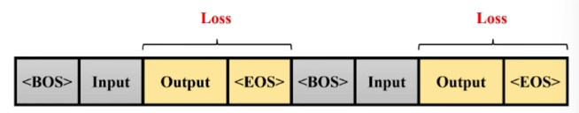

# Finetune

## 模式


- 增量预训练
- 指令跟随

## 增量预训练

- 使用场景：基座模型学习一些新的知识
  - 垂类领域
- 训练数据：文章、书籍、代码等

### Loss


- 训练过程需要添加起始符（BOS）和结束符（EOS），通常使用`<s>作为起始符，</s>作为结束符`
  - 模型可以学会何时停止
- System和User制空，只有Assistant
  - 

## 指令跟随微调

- 使用场景：模型学会对话模板，根据人类指令进行对话
- 训练数据：高质量的对话、问答数据


### 概述

- 指令跟随微调是为了能够得到实际对话的LLM

### 角色

- System：上下文信息，通常固定
  - 如：你是一个安全的AI助手
- User：实际用户，提出的问题
  - 如：世界的第一高峰
- Assistant：根据User输入，结合System的上下文信息，做出回答的答案
  - 如：珠穆朗玛峰

### 模板

- System：模板自动添加


#### LIama 2

```
<<SYS>>: System上下文开始
<</SYS>>: System上下文结束
[INST]: User指令开始
[/INST]: User指令结束

eg:
[INST]<<SYS>>
你是一个安全的AI助手
<</SYS>>

世界最高的峰是？[/INST]
珠穆朗玛峰
```

#### InternLM

```
<|System|>: System上下文开始
<|User|>: User指令开始
<eoh>: end of human User指令结束
<|Bot|>: Assistant开始回答
<eoa>: end of assistant Assistant回答结束

eg:
<|System|>:你是一个安全的AI助手
<|User|>:世界最高的峰是？<eoh>
<|Bot|>:珠穆朗玛峰<eoa>
```

### Loss



- 对Output计算Loss
- 训练过程和推理过程保持一致，对数据添加相应的对话模板
  - eg：

## LoRA & QLoRA

- LoRA: low-rank adaptation of large language model


- LLM参数量主要集中在模型的Linear，需要耗费大量显存
- LoRA通过在原本的Linear旁，新增一个支路，包含两个连续的小Linear，新增的这个支路通常叫做Adapter
  - 基座模型不改动
- Adapter参数量远小于原本的Linear，大幅度降低训练的显存消耗

### compare


`Full Finetuning、LoRA、QLoRA`均可在CPU和GPU间调度

#### Full Finetuning

- Base Model参与训练并更新参数
- 需要保存Base Model中参数的优化器状态
- 没有Adapters

#### LoRA

- Base Model只参与Forward
- 只有Adapter部分Backward更新参数
- 只需要保存Adapter中参数的优化器状态

#### QLoRA

- Base Model量化为4-bit，只参与Forward
- 优化器状态在CPU与GPU间offload
- 只有Adapter部分Backward更新参数
- 只需要保存Adapter中参数的优化器状态


# XTuner

## 简介

### 功能

- 多种微调算法：多种微调策略与算法，覆盖各类SFT场景
- 适配多种开源生态：支持加载HuggingFace、ModelScope模型或数据集
- 自动优化加速：开发者无需关注复杂的显存优化与计算加速细节

### 硬件

- 最低8GB显存微调7B模型
- 20系列以上消费级显卡和数据中心
  - 

## 使用

### 安装

```bash
pip install xtuner
```

### 选择配置模板

```bash
xtuner list-cfg -p internlm_20b
```

### 训练

```bash
xtuner train internlm_20b_qlora_oasst1_512_e3
```

### config命名规则

```
模型名: internlm_20b  无chat表示基座模型
使用算法: qlora
微调数据集: oasst1
数据长度: 512
Epoch: e3, epoch3
```

### 自定义训练


```bash
1.拷贝配置模板
# 将internlm_20b_qlora_oasst1_512_e3配置模板拷贝到当前路径
xtuner copy-dfg internlm_20b_qlora_oasst1_512_e3 ./

2.修改配置模板
vi internlm_20b_qlora_oasst1_512_e3_copy.py

3.训练
xtuner train internlm_20b_qlora_oasst1_512_e3_copy.py
```

#### 常用超参

| 参数                | 说明                                             |
| ------------------- | ------------------------------------------------ |
| data_path           | 数据路径或HuggingFace仓库名                      |
| max_length          | 单条数据最大Token数，超过截断                    |
| pack_to_max_length  | 是否将多条短数据拼接到max_length，提高GPU利用率  |
| accumulative_counts | 梯度累积，每多少次backward更新一次参数           |
| evaluation_inputs   | 训练过程中，根据给定的问题进行推理，观测训练状态 |
| evaluation_freq     | evaluation评测间隔iter数（backward数）           |

- 显卡的显存吃满，充分利用显卡资源，可以将 `max_length` 和 `batch_size` 参数调大

### 对话

- Float 16模型对话：xtuner chat internlm/internlm-chat-20b
- 4bit模型对话：xtuner chat internlm/internlm-chat-20b --bits 4
- 加载Adapter模型对话：xtuner chat internlm/internlm-chat-20b --adapater $ADAPTER_DIR

## 数据引擎

### 数据处理流程

1. 原始问答对 --> 格式化问答对：数据集映射函数
2. 格式化问答对 --> 可训练预料：对话模板映射函数

### 数据集映射函数

- alpaca_map_fn：Alpaca格式数据集处理函数
- oassti_map_fn：OpenAssistant格式数据处理函数
- openai_map_fn：OpenAI Finetune格式数据处理函数
- wizardlm：微软WizardLm系列数据集梳理函数
- ...

### 对话模板映射函数

- chatglm
- llama2_chat
- code_llama_chat
- baichuan_chat & baichuan2_chat
- qwen_chat

### 多数据样本拼接


## 加速

### Flash Attention


- Flash Attention将Attention计算并行化，避免计算过程中Attention Score N×N显存占用
  - 训练过程中N都比较大

### DeepSpeed ZeRO


- ZeRO优化，通过将训练过程中的参数、梯度和优化器状态切片保存，能够在多GPU训练时显著节省显存
- DeepSpeed采用FP16权重，比Pytorch的AMP训练，在单GPU上也能大幅节省显存
- xtuner需要在添加`--deepspeed deepspeed_zero2`
  - xtuner train internlm_20b_qlora_oasst1_512_e3 --deepspeed deepspeed_zero2


# 实例

## 平台

Ubuntu + Anaconda + CUDA/CUDNN + 8GB nvidia显卡

## 安装

```bash
# InternStudio 平台，本地 clone 一个已有 pytorch 2.0.1 的环境：
/root/share/install_conda_env_internlm_base.sh xtuner0.1.9

# 其他平台：
conda create --name xtuner0.1.9 python=3.10 -y

# 激活环境
conda activate xtuner0.1.9

# 进入家目录 （~的意思是 “当前用户的home路径”）
cd ~

# 创建版本文件夹并进入
mkdir xtuner019 && cd xtuner019

# 拉取 0.1.9 的版本源码
git clone -b v0.1.9  https://github.com/InternLM/xtuner
# 或gitee 拉取:
# git clone -b v0.1.9 https://gitee.com/Internlm/xtuner

# 进入源码目录
cd xtuner

# 从源码安装 XTuner，安装到conda环境
pip install -e '.[all]'
```

- 准备工作

```bash
# 创建一个微调 oasst1 数据集的工作路径，进入
mkdir ~/ft-oasst1 && cd ~/ft-oasst1
```

## 微调

### 配置文件

```bash
# 列出所有内置配置
xtuner list-cfg

# 拷贝一个配置文件到当前目录
# xtuner copy-cfg ${CONFIG_NAME} ${SAVE_PATH}
cd ~/ft-oasst1
xtuner copy-cfg internlm_chat_7b_qlora_oasst1_e3 .
```

### 模型下载

```bash
# InternStudio 平台，直接复制模型
cp -r /root/share/temp/model_repos/internlm-chat-7b ~/ft-oasst1/

# modelscope 下载模型
# 创建一个目录，放模型文件，防止散落一地
mkdir ~/ft-oasst1/internlm-chat-7b

# 装一下拉取模型文件要用的库
pip install modelscope

# 从 modelscope 下载下载模型文件
cd ~/ft-oasst1
apt install git git-lfs -y
git lfs install
git lfs clone https://modelscope.cn/Shanghai_AI_Laboratory/internlm-chat-7b.git -b v1.0.3
```

### 数据集下载

```bash
# InternStudio 平台
cd ~/ft-oasst1
# ...-guanaco 后面有个空格和英文句号啊
cp -r /root/share/temp/datasets/openassistant-guanaco .
```

### 修改配置文件

```bash
cd ~/ft-oasst1
vim internlm_chat_7b_qlora_oasst1_e3_copy.py

"""
在vim界面完成修改后，输入:wq退出，:q!退出且不保存
或者打开python文件直接修改，修改完后需要按下Ctrl+S进行保存
"""
```

- 修改内容
- 减号代表要删除的行，加号代表要增加的行

```bash
# 修改模型为本地路径
- pretrained_model_name_or_path = 'internlm/internlm-chat-7b'
+ pretrained_model_name_or_path = './internlm-chat-7b'

# 修改训练数据集为本地路径
- data_path = 'timdettmers/openassistant-guanaco'
+ data_path = './openassistant-guanaco'
```

### 微调

- 微调得到的 PTH 模型文件和其他文件都默认在当前的 `./work_dirs` 中

```bash
xtuner train ${CONFIG_NAME_OR_PATH} (--deepspeed deepspeed_zero2)

# 单卡
## 用刚才改好的config文件训练
xtuner train ./internlm_chat_7b_qlora_oasst1_e3_copy.py

# 多卡
NPROC_PER_NODE=${GPU_NUM} xtuner train ./internlm_chat_7b_qlora_oasst1_e3_copy.py

# 若要开启 deepspeed 加速，增加 --deepspeed deepspeed_zero2
```

- 训练完成后，路径

  ```
  |-- internlm-chat-7b
  |-- internlm_chat_7b_qlora_oasst1_e3_copy.py
  |-- openassistant-guanaco
  |   |-- openassistant_best_replies_eval.jsonl
  |   `-- openassistant_best_replies_train.jsonl
  `-- work_dirs
      `-- internlm_chat_7b_qlora_oasst1_e3_copy
          |-- 20231101_152923
          |   |-- 20231101_152923.log
          |   `-- vis_data
          |       |-- 20231101_152923.json
          |       |-- config.py
          |       `-- scalars.json
          |-- epoch_1.pth
          |-- epoch_2.pth
          |-- epoch_3.pth
          |-- internlm_chat_7b_qlora_oasst1_e3_copy.py
          `-- last_checkpoint
  ```

### PTH模型转换为HuggingFace 模型

- 生成 Adapter 文件夹
  - xtuner convert pth_to_hf `${CONFIG_NAME_OR_PATH}` `${PTH_file_dir}` `${SAVE_PATH}`

```bash
mkdir hf
export MKL_SERVICE_FORCE_INTEL=1

xtuner convert pth_to_hf ./internlm_chat_7b_qlora_oasst1_e3_copy.py ./work_dirs/internlm_chat_7b_qlora_oasst1_e3_copy/epoch_1.pth ./hf
```

- 处理后路径

```
|-- internlm-chat-7b
|-- internlm_chat_7b_qlora_oasst1_e3_copy.py
|-- openassistant-guanaco
|   |-- openassistant_best_replies_eval.jsonl
|   `-- openassistant_best_replies_train.jsonl
|-- hf
|   |-- README.md
|   |-- adapter_config.json
|   |-- adapter_model.bin
|   `-- xtuner_config.py
`-- work_dirs
    `-- internlm_chat_7b_qlora_oasst1_e3_copy
        |-- 20231101_152923
        |   |-- 20231101_152923.log
        |   `-- vis_data
        |       |-- 20231101_152923.json
        |       |-- config.py
        |       `-- scalars.json
        |-- epoch_1.pth
        |-- epoch_2.pth
        |-- epoch_3.pth
        |-- internlm_chat_7b_qlora_oasst1_e3_copy.py
        `-- last_checkpoint
```

- hf 文件夹：LoRA 模型文件夹
  - adapter_model.safetensors：lora模型
  - 简单理解：LoRA 模型文件 = Adapter

## 部署和测试

### HuggingFace adapter 合并到大语言模型

```bash
# xtuner convert merge \
#     ${NAME_OR_PATH_TO_LLM} \
#     ${NAME_OR_PATH_TO_ADAPTER} \
#     ${SAVE_PATH} \
#     --max-shard-size 2GB（分块保存，每块2GB）
xtuner convert merge ./internlm-chat-7b ./hf ./merged --max-shard-size 2GB
```

### 对话

```bash
# 加载 Adapter 模型对话（Float 16）
xtuner chat ./merged --prompt-template internlm_chat
# 两次回车才能回复

# 查看帮助
xtuner chat --help

# 4 bit 量化加载
# xtuner chat ./merged --bits 4 --prompt-template internlm_chat
```

### Demo

- 修改 `cli_demo.py` 中的模型路径

```bash
- model_name_or_path = "/root/model/Shanghai_AI_Laboratory/internlm-chat-7b"
+ model_name_or_path = "merged"
```

- 运行 `cli_demo.py` 以目测微调效果

```bash
python ./cli_demo.py
```

### xtuner chat启动参数

| 启动参数              | 说明                                                         |
| --------------------- | ------------------------------------------------------------ |
| **--prompt-template** | 指定对话模板                                                 |
| --system              | 指定SYSTEM文本                                               |
| --system-template     | 指定SYSTEM模板                                               |
| -**-bits**            | LLM位数                                                      |
| --bot-name            | bot名称                                                      |
| --with-plugins        | 指定要使用的插件                                             |
| **--no-streamer**     | 是否启用流式传输                                             |
| **--lagent**          | 是否使用lagent                                               |
| --command-stop-word   | 命令停止词                                                   |
| --answer-stop-word    | 回答停止词                                                   |
| --offload-folder      | 存放模型权重的文件夹（或者已经卸载模型权重的文件夹）         |
| --max-new-tokens      | 生成文本中允许的最大 `token` 数量                            |
| **--temperature**     | 温度值，越高越活泼，生成越发散内容；越低生成越稳定内容       |
| --top-k               | 保留用于顶k筛选的最高概率词汇标记数                          |
| --top-p               | 如果设置为小于1的浮点数，仅保留概率相加高于 `top_p` 的最小一组最有可能的标记 |
| --seed                | 用于可重现文本生成的随机种子                                 |


# 自定义微调

## 概述

- 基于 InternLM-chat-7B 模型，用 MedQA 数据集进行微调，将其往`医学问答`领域对齐

## 数据

- **[Medication QA](https://github.com/abachaa/Medication_QA_MedInfo2019)** 数据集

### 格式

- .xlsx

| **问题** | 药物类型 | 问题类型 | **回答** | 主题 | URL  |
| -------- | -------- | -------- | -------- | ---- | ---- |
| aaa      | bbb      | ccc      | ddd      | eee  | fff  |

### 目标格式

- .jsonL

```
[{
    "conversation":[
        {
            "system": "xxx",
            "input": "xxx",
            "output": "xxx"
        }
    ]
},
{
    "conversation":[
        {
            "system": "xxx",
            "input": "xxx",
            "output": "xxx"
        }
    ]
}]
```

### xlsx转jsonL

- 将 `.xlsx` 中的问题和回答两列 提取出来，再放入 `.jsonL` 文件的每个 conversation 的 input 和 output 中

- ```bash
  python xlsx2jsonl.py
  ```

### 划分训练集和测试集

```
python split2train_and_test.py
```

## 微调

- 新建一个文件夹微调自定义数据集

```bash
mkdir ~/ft-medqa && cd ~/ft-medqa
```

- 拷贝模型

```bash
cp -r ~/ft-oasst1/internlm-chat-7b .
```

- 上传数据集

```bash
git clone https://github.com/InternLM/tutorial
cp ~/tutorial/xtuner/MedQA2019-structured-train.jsonl .
```

### 配置文件

```bash
# 复制配置文件到当前目录
xtuner copy-cfg internlm_chat_7b_qlora_oasst1_e3 .
# 改个文件名
mv internlm_chat_7b_qlora_oasst1_e3_copy.py internlm_chat_7b_qlora_medqa2019_e3.py

# 修改配置文件内容
vim internlm_chat_7b_qlora_medqa2019_e3.py
```

- 减号代表要删除的行，加号代表要增加的行

```
# 修改import部分
- from xtuner.dataset.map_fns import oasst1_map_fn, template_map_fn_factory
+ from xtuner.dataset.map_fns import template_map_fn_factory

# 修改模型为本地路径
- pretrained_model_name_or_path = 'internlm/internlm-chat-7b'
+ pretrained_model_name_or_path = './internlm-chat-7b'

# 修改训练数据为 MedQA2019-structured-train.jsonl 路径
- data_path = 'timdettmers/openassistant-guanaco'
+ data_path = 'MedQA2019-structured-train.jsonl'

# 修改 train_dataset 对象
train_dataset = dict(
    type=process_hf_dataset,
-   dataset=dict(type=load_dataset, path=data_path),
+   dataset=dict(type=load_dataset, path='json', data_files=dict(train=data_path)),
    tokenizer=tokenizer,
    max_length=max_length,
-   dataset_map_fn=alpaca_map_fn,
+   dataset_map_fn=None,
    template_map_fn=dict(
        type=template_map_fn_factory, template=prompt_template),
    remove_unused_columns=True,
    shuffle_before_pack=True,
    pack_to_max_length=pack_to_max_length)
```

### 训练

```bash
xtuner train internlm_chat_7b_qlora_medqa2019_e3.py --deepspeed deepspeed_zero2
```

### pth转huggingface

### 部署和测试


# MS-Agent数据集赋予LLM以Agent能力

## 概述

MSAgent 数据集每条样本包含一个对话列表（conversations），其里面包含了 system、user、assistant 三种字段

- system: 表示给模型前置的人设输入，其中有告诉模型如何调用插件以及生成请求
- user: 表示用户的输入 prompt，分为两种，通用生成的prompt和调用插件需求的 prompt
- assistant: 为模型的回复。其中会包括插件调用代码和执行代码，调用代码是需要 LLM 生成，而执行代码是调用服务来生成结果的

## 微调

```bash
# 准备工作
mkdir ~/ft-msagent && cd ~/ft-msagent
cp -r ~/ft-oasst1/internlm-chat-7b .

# 查看配置文件
xtuner list-cfg | grep msagent

# 复制配置文件到当前目录
xtuner copy-cfg internlm_7b_qlora_msagent_react_e3_gpu8 .

# 修改配置文件中的模型为本地路径
vim ./internlm_7b_qlora_msagent_react_e3_gpu8_copy.py 

- pretrained_model_name_or_path = 'internlm/internlm-chat-7b'
+ pretrained_model_name_or_path = './internlm-chat-7b'

xtuner train ./internlm_7b_qlora_msagent_react_e3_gpu8_copy.py --deepspeed deepspeed_zero2
```

## 直接使用

### 下载Adapter

- modelScope 拉取已经微调好了的 Adapter

```bash
cd ~/ft-msagent
apt install git git-lfs
git lfs install
git lfs clone https://www.modelscope.cn/xtuner/internlm-7b-qlora-msagent-react.git
```

- 加 --lagent 以调用来自 lagent 的代理功能

### 添加 serper 环境变量

-  serper.dev 注册一个账号，生成api key
- api key：给lagent 获取 google 搜索的结果
  - serper.dev 去访问 google，而不是本地去访问 google

- 添加 serper api key 到环境变量：

```bash
export SERPER_API_KEY=${key}
```

### 启动

```bash
xtuner chat ./internlm-chat-7b --adapter internlm-7b-qlora-msagent-react --lagent
```

### 报错处理

- xtuner chat 增加 --lagent 参数后，报错 `TypeError: transfomers.modelsauto.auto factory. BaseAutoModelClass.from pretrained() got multiple values for keyword argument "trust remote code"`
- 注释掉已安装包中的代码：

```python
vim /root/xtuner019/xtuner/xtuner/tools/chat.py
```


# 注意事项

- 环境

```
torch                         2.1.1
transformers                  4.34.0
transformers-stream-generator 0.0.4

pip install torch==2.1.1
pip install transformers==4.34.0
pip install transformers-stream-generator=0.0.4

CUDA 相关（出现报错检查）：
NVIDIA-SMI 535.54.03              
Driver Version: 535.54.03    
CUDA Version: 12.2

nvidia-cuda-cupti-cu12        12.1.105
nvidia-cuda-nvrtc-cu12        12.1.105
nvidia-cuda-runtime-cu12      12.1.105
```


# tmux

- 中断ssh连接，微调工作不中断

## 安装

```bash
apt update -y
apt install tmux -y
```

## 使用

```bash
# 进入conda环境后
tmux new -s ${name}

# 退出tmux session回到bash
ctrl+B、D

# 进入tmux session
tmux attach -t ${name}
# 输入执行的command
```

