# LLM量化部署

## 概述

### 模型部署

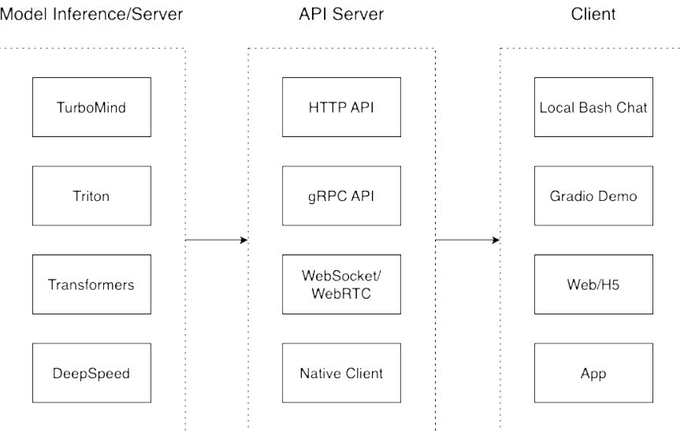

- 模型推理/服务：主要提供模型本身的推理，一般来说可以和具体业务解耦，专注模型推理本身性能的优化。可以以模块、API等多种方式提供
- Client：前端，与用户交互的地方
- API Server：一般作为前端的后端，提供与产品和服务相关的数据和功能支持
- PS：模型推理和API Server可合并、三个流程可打包提供服务、按照实际

#### 定义

- 将训练好的模型在特定软硬件环境中启动的过程，使模型能够接收输入并返回预测结果
- 满足性能和效率的需求，需要对模型进行优化
  - eg：模型压缩和硬件加速

#### 产品形态

- 云端、边缘计算端、移动端

#### 计算设备

- CPU、GPT、TPU、NPU等

### LLM特点

#### 内存开销大

- 参数量庞大
  - 7B模型采用FP16（半精度，2字节）需要14+G内存
- 采用自回归生成token，需要缓存Attention的k/v（巨大 内存开销）

#### 动态shape

- 请求数不固定
  - batch_size
- token逐个生成，数量不确定
  - 输入 / 出token不一样

#### 结构简单

- Transformers结构，大部分为decoder-only
  - token by token：一个一个生成

### 挑战

#### 设备

- 如何应对巨大的存储问题；低存储设备（消费级显卡、手机）如何部署

#### 推理

- 如何加速token生成速度
- 如何解决动态shape，推理不间断
- 如何有效管理和利用内存    

#### 服务

- 如何提升系统整体吞吐量
- 个体用户，如何降低响应时间

### 方案

#### 技术

- 模型并行
- transformer计算和访存优化
- 低比特量化
- continuous batch
- page attention
- ...

#### 方案

- huggingface transformers
- 专门推理加速框架

#### 云端

- Imdeploy
- vllm
- tensorrt-llm
- deepspeed
- ...

#### 移动端

- llama.cpp
- mlc-llm
- ...

## LMDeploy

### 简介

- LMDeploy：LLM在英伟达设备上部署的全流程解决方案
  - 轻量化
    - 4bit权重（awq）
    - 8bit k / v
  - 推理引擎
    - turbomind（特有）
    - pytorch
  - 服务
    - api server
    - gradio（演示）
    - triton inference server
- 接口
  - python、gRPC、RESTful

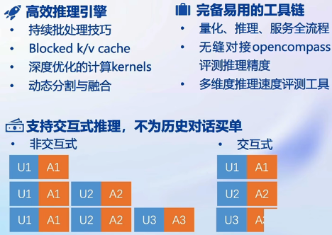

### 量化

#### 效果


- 24GB显存
  - 量化前：7B model，并发8，max length 2k
  - 量化后：7B model，并发8，max length 8k
- 80GB显存
  - 量化前：70B model，oom
  - 量化后：70B model，并发8，max length 32k

#### 原因

##### 概念

- 计算密集（compute-bound）：推理的绝大部分时间消耗在数值计算上；针对计算密集场景，可以通过使用更快的硬件计算单元来提升计算速度，如量化为W8A8使用INT8 Tensor Core加速计算
- 访存密集（memory-bound）：推理的绝大部分时间消耗在数据读取上；针对访存密集型场景，一般是通过提高计算访存比来提升性能

##### LLM

- 常见LLM模型是Decoder Only架构。推理时大部分时间消耗在逐token生成阶段（Decoding阶段），属于典型的访存密集型场景
- 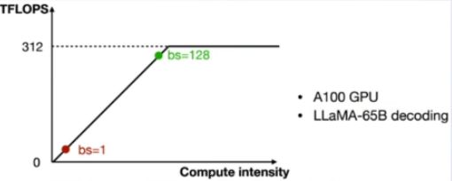
  - A100的FP16峰值算力为312TFLOPS，当Batch Size达到128时候，计算成为推理的瓶颈，实际很难达到
    - LLM本身大，推理时的KV Cache占用很多显存，还存在一些其他因素的影响（eg：Persistent Batch）

##### weight only量化

- 4bit weight only量化：FP16模型权重量化为INT4，访存量降低为FP16模型的1/4，大幅降低访存成本，提高Decoding速度，计算过程反量化为FP16计算
  - 4bit Weight 量化，将 FP16 的模型权重量化为 INT4，Kernel 计算时，访存量直接降为 FP16 模型的 1/4，大幅降低了访存成本
  - Weight Only 是指仅量化权重，数值计算依然采用 FP16（需要将 INT4 权重反量化）
- KV Cache 量化：逐 Token（Decoding）生成过程中的上下文 K 和 V 中间结果进行 INT8 量化（计算时再反量化），以降低生成过程中的显存占用
- 加速同时节省显存，同样的设备能够支持更大的模型以及更长的对话长度

#### 方法

- LMDeploy采用MIT HAN LAB开源 `AWQ`算法，量化为4bit模型
- 推理时，先把4bit权重反量化回FP16（Kernel内部进行，从Global Memory读取时是4bit），使用FP16计算
- `AWQ` 相较于 `GPTQ` ，推理速度更快，量化时间更短
  - AWQ：观察到模型推理时矩阵/长老计算存在少量一部分参数重要，不进行量化，量化其他参数，保持性能的同时节省显存
- KV Cache INT8：k v进行 INT8量化

### 推理引擎

#### TurboMind

##### 持续批处理

- 请求可以及时加入batch中推理
- batch中已经完成的推理请求及时退出

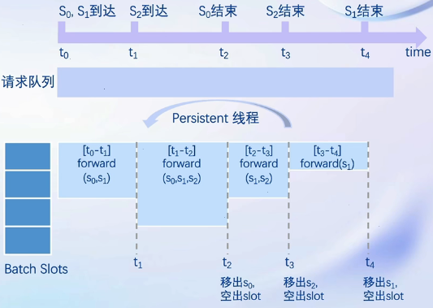

###### 请求队列

- 推理请求首先加入请求队列

###### Persistent线程

1. 当batch中有空闲槽位，从队列拉取请求，尽量填满空闲槽位。若无继续对当前batch中的请求进行forward
2. batch每forward一次，判断是否有request推理结束，结束的request发送结果、释放槽位
3. 转步骤1

##### 有状态的推理

- 对话token被缓存在推理侧
- 用户侧请求无需携带历史对话记录

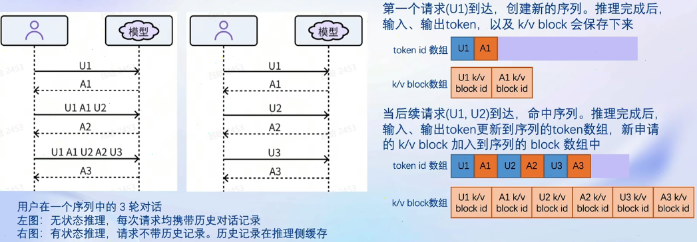

##### Blocked k/v cache

- Attention支持不连续的k/v
- block（Page Attention）

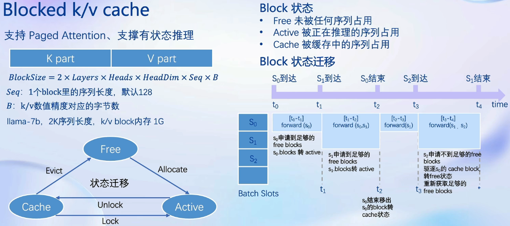

##### 高性能cuda kernel

- Flash Attention2
- Solit-K decoding
- Fast w4a16，kv8反量化kernel
- 算子融合

### 推理服务

```bash
lmdeploy serve api_server InternLM/internlm-chat-7b --model-name internlm-chat-7b --server-port 8080

# swagger地址: http://0.0.0.0:8080
```

- 4个api，前3个和openai接口一致，最后一个特有


## 实践

### 环境配置

- 配置lmdeploy环境

```bash
conda create -n lmdeploy --clone /share/conda_envs/internlm-base

conda env list

conda activate lmdeploy
```

- lmdeploy没有安装问题

```bash
# 解决 ModuleNotFoundError: No module named 'packaging' 问题
pip install packaging
# 使用 flash_attn 的预编译包解决安装过慢问题
pip install /root/share/wheels/flash_attn-2.4.2+cu118torch2.0cxx11abiTRUE-cp310-cp310-linux_x86_64.whl

# 默认安装的是 runtime 依赖包，但是还需要部署和量化，所以，这里选择 [all]
pip install 'lmdeploy[all]==v0.1.0'
```

### 服务部署

- TurboMind 推理模型需要先将模型转化为 TurboMind 的格式
  - 支持在线转换和离线转换两种形式
    - 在线转换可以直接加载 Huggingface 模型
    - 离线转换需需要先保存模型再加载

### 在线转换

- 直接读取 Huggingface 模型权重
  - 在 huggingface.co 上面通过 lmdeploy 量化的模型，如 [llama2-70b-4bit](https://huggingface.co/lmdeploy/llama2-chat-70b-4bit), [internlm-chat-20b-4bit](https://huggingface.co/internlm/internlm-chat-20b-4bit)
  - huggingface.co 上面其他 LM 模型，如 Qwen/Qwen-7B-Chat

```
# 需要能访问 Huggingface 的网络环境
# 加载使用 lmdeploy 量化的版本
lmdeploy chat turbomind internlm/internlm-chat-20b-4bit --model-name internlm-chat-20b
# 加载其他 LLM 模型
lmdeploy chat turbomind Qwen/Qwen-7B-Chat --model-name qwen-7b

# 加载本地模型
lmdeploy chat turbomind /share/temp/model_repos/internlm-chat-7b/  --model-name internlm-chat-7b
```

- 以上命令都会启动一个本地对话界面，通过 Bash 可以与 LLM 进行对话

### 离线转换

- 离线转换需要在启动服务之前，将模型转为 lmdeploy TurboMind 的格式

```
# 转换模型（FastTransformer格式） TurboMind
lmdeploy convert internlm-chat-7b /path/to/internlm-chat-7b

# 使用官方提供的模型文件，就在用户根目录执行
lmdeploy convert internlm-chat-7b  /root/share/temp/model_repos/internlm-chat-7b/
```

- 执行完成后将会在当前目录生成一个 `workspace` 的文件夹
  - 包含的就是 TurboMind 和 Triton “模型推理”需要到的文件
  - `weights` 和 `tokenizer` 目录分别放的是拆分后的参数和 Tokenizer

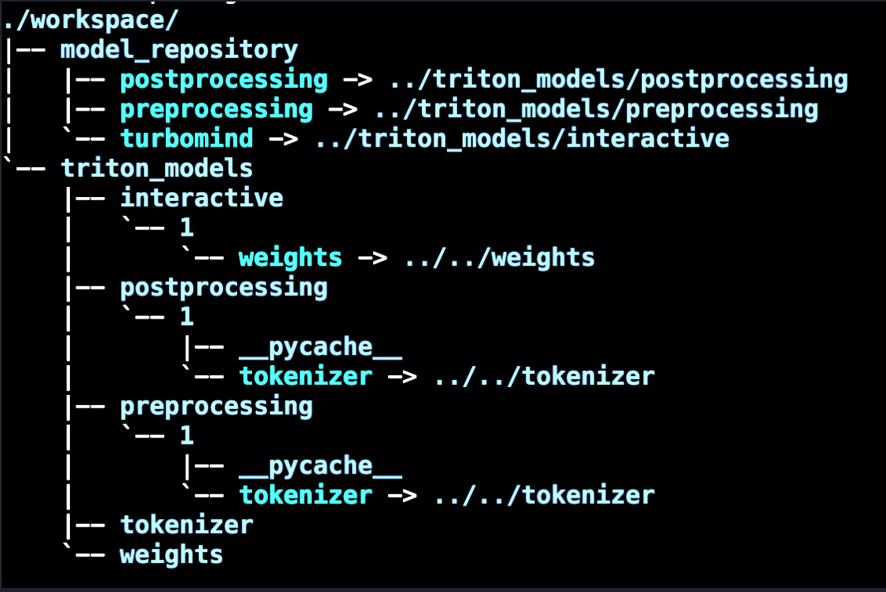

-  `weights` 的目录参数是按层和模块拆开
  - 每一份参数第一个 0 表示“层”的索引，后面的0表示 Tensor 并行的索引，因为只有一张卡，所以被拆分成 1 份。如果有两张卡可以用来推理，则会生成0和1两份。也就是说，会把同一个参数拆成两份。比如 `layers.0.attention.w_qkv.0.weight` 会变成 `layers.0.attention.w_qkv.0.weight` 和 `layers.0.attention.w_qkv.1.weight`
  - 执行 `lmdeploy convert` 命令时，可以通过 `--tp` 指定（tp 表示 tensor parallel），该参数默认值为1（一张卡）。

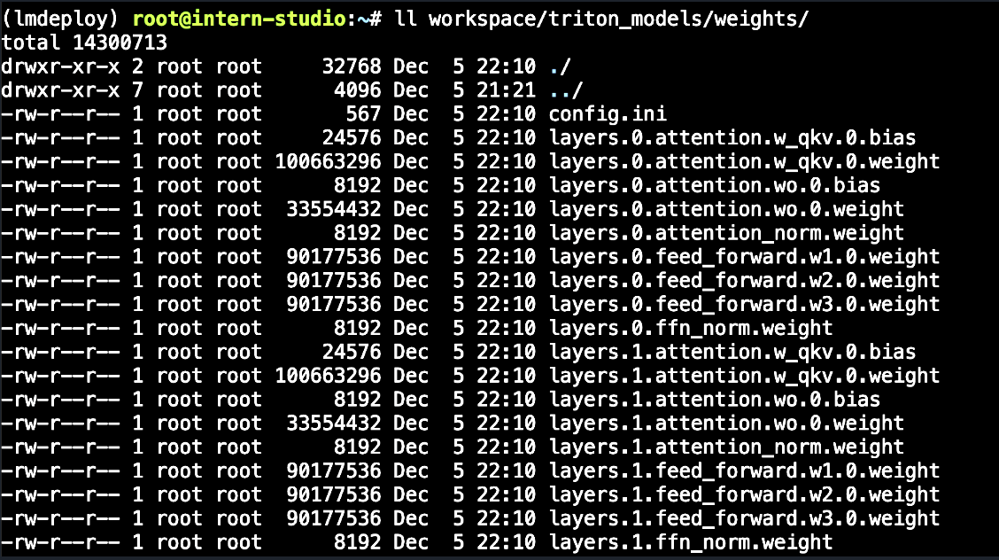

### Tensor并行

- Tensor并行一般分为行并行或列并行
- 把一个大的张量（参数）分到多张卡上，分别计算各部分的结果，然后再同步汇总

#### 列并行

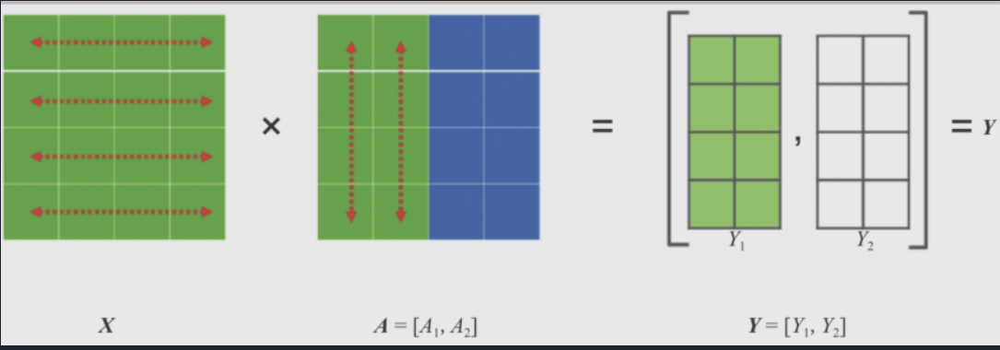

#### 行并行

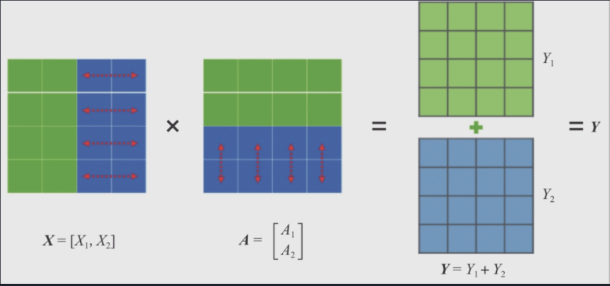

## TurboMind 推理+命令行本地对话

- 模型转换完成后，才具备了使用模型推理的条件
- 命令行代码直接执行 TurboMind
- 支持多种方式运行，比如：Turbomind、PyTorch、DeepSpeed
  - PyTorch 和 DeepSpeed 调用的都是 Huggingface 的 Transformers 包
  - PyTorch表示原生的 Transformer 包
  - DeepSpeed 表示使用了 DeepSpeed 作为推理框架
  - Pytorch/DeepSpeed 目前功能都比较弱，不具备生产能力，不推荐使用

```
# Turbomind + Bash Local Chat
lmdeploy chat turbomind ./workspace
```

- 输入后两次回车，退出时输入`exit` 回车两次即可
- Server 就是本地跑起来的模型（TurboMind），命令行可以看作是前端

## TurboMind推理+API服务

- lmdepoy 进行服务化

- ”模型推理/服务“目前提供 Turbomind 和 TritonServer 两种服务化方式
- Server 是 TurboMind 或 TritonServer
- API Server 可以提供对外的 API 服务
- 推荐使用 TurboMind

```
# ApiServer+Turbomind   api_server => AsyncEngine => TurboMind
# 启动服务
lmdeploy serve api_server ./workspace \
	--server_name 0.0.0.0 \
	--server_port 23333 \
	--instance_num 64 \
	--tp 1
```

-  `server_name` 和 `server_port` 分别表示服务地址和端口，`tp` 表示 Tensor 并行，`instance_num` 表示实例数，可以理解成 Batch 的大小

- 新开一个窗口，执行下面的 Client 命令

```
# ChatApiClient+ApiServer（注意是http协议，需要加http）
# client段，bash下使用
lmdeploy serve api_client http://localhost:port(23333)
```

-  `http://{host}:port` ：API Swagger文档
  - ssh -CNg -L port:127.0.0.1:port[root@ssh.intern-ai.org.cn](mailto:root@ssh.intern-ai.org.cn) -p <ssh端口号>

## 网页 Demo

- Gradio 作为前端 Demo
- 不执行 `api_client` 或 `triton_client`，执行 `gradio`

> 由于 Gradio 需要本地访问展示界面，因此也需要通过 ssh 将数据转发到本地
>
> ssh -CNg -L 6006:127.0.0.1:6006 [root@ssh.intern-ai.org.cn](mailto:root@ssh.intern-ai.org.cn) -p <ssh 端口号>

### 方式1：TurboMind 服务作为后端

启动API Server和作为前端的 Gradio

```
# Gradio+ApiServer 必须先开启 Server，此时 Gradio 为 Client
# 开启API Server
lmdeploy serve api_server ./workspace --server_name 0.0.0.0--server_port 23333 --instance_num 64 --tp 1

# 启动gradio，相当于调用http
lmdeploy serve gradio http://0.0.0.0:23333 --server_name 0.0.0.0 --server_port 6006 --restful_api True
```

### 方式2：TurboMind 推理作为后端

- Gradio 也可以直接和 TurboMind 连接

```
# Gradio+Turbomind(local)
# 直接执行
# gradio默认是6006端口，远程服务器需要转发到本地
lmdeploy serve gradio ./workspace
```

## TurboMind 推理 + Python 代码集成

- lmdeploy 支持 Python 直接与 TurboMind 进行交互
- 首先加载模型，然后构造输入，最后执行推理
- 加载模型可以显式指定模型路径，也可以直接指定 Huggingface 的 repo_id，还可以使用上面生成过的 `workspace`
  -  `tm.TurboMind` 其实是对 C++ TurboMind 的封装。
- 构造输入主要是把用户的 query 构造成 InternLLM 支持的输入格式
- Prompt 其实就是增加了 `<|System|>` 消息和 `<|User|>` 消息（即用户的 `query`），以及一个 `<|Bot|>` 的标记，表示接下来该模型输出响应

```
from lmdeploy import turbomind as tm

# load model
model_path = "/root/share/temp/model_repos/internlm-chat-7b/"
tm_model = tm.TurboMind.from_pretrained(model_path, model_name='internlm-chat-20b')
generator = tm_model.create_instance()

# process query
query = "你好啊兄嘚"
prompt = tm_model.model.get_prompt(query)
input_ids = tm_model.tokenizer.encode(prompt)

# inference
for outputs in generator.stream_infer(
        session_id=0,
        input_ids=[input_ids]):
    res, tokens = outputs[0]

response = tm_model.tokenizer.decode(res.tolist())
print(response)
```

## 最佳实践

### 方案实践

 “模型推理/服务”：推荐使用 TurboMind，使用简单，性能良好

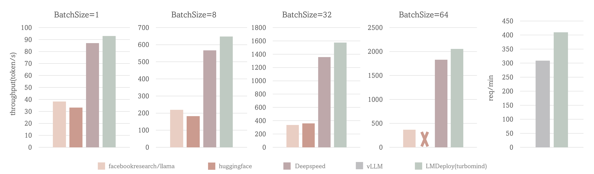

- 场景一（前4张图）：固定的输入、输出 token 数（分别1和2048），测试Token输出吞吐量（output token throughput）
  - BatchSize=64时，TurboMind 的吞吐量超过 2000 token/s，整体比 DeepSpeed 提升约 5% - 15%；BatchSize=32时，比 Huggingface 的Transformers 提升约 3 倍；其他BatchSize时 TurboMind 也表现出优异的性能
- 场景二（第5张图）：使用真实数据，测试吞吐量（request throughput）
  - 对比了 TurboMind 和 vLLM 在真实数据上的吞吐量（request throughput）指标，TurboMind 的效率比 vLLM 高 30%

- `infer_compare.py` 脚本是对比脚本

```
# 执行 Huggingface 的 Transformer
python infer_compare.py hf
# 执行LMDeploy
python infer_compare.py lmdeploy
```


- 提供类似 OpenAI 那样的 HTTP 接口服务：推荐使用 TurboMind推理 + API 服务
- 演示 Demo：Gradio，推荐使用 TurboMind 推理作为后端的Gradio进行演示
- 我想直接在自己的 Python 项目中使用大模型功能。推荐使用 TurboMind推理 + Python
- 非 Python 项目中使用大模型功能：推荐直接通过 HTTP 接口调用服务
  - 先启动一个 HTTP API 服务，然后在项目中直接调用接口
- C++ 项目：直接用 TurboMind 的 C++ 接口

### 模型配置实践

-   `weights` 的目录的 `config.ini` 存的主要是模型相关的配置信息

```
[llama]
model_name = internlm-chat-7b
tensor_para_size = 1
head_num = 32
kv_head_num = 32
vocab_size = 103168
num_layer = 32
inter_size = 11008
norm_eps = 1e-06
attn_bias = 0
start_id = 1
end_id = 2
session_len = 2056
weight_type = fp16
rotary_embedding = 128
rope_theta = 10000.0
size_per_head = 128
group_size = 0
max_batch_size = 64
max_context_token_num = 1
step_length = 1
cache_max_entry_count = 0.5
cache_block_seq_len = 128
cache_chunk_size = 1
use_context_fmha = 1
quant_policy = 0
max_position_embeddings = 2048
rope_scaling_factor = 0.0
use_logn_attn = 0
```

#### 模型属性参数

- 不可更改

```
model_name = llama2
head_num = 32
kv_head_num = 32
vocab_size = 103168
num_layer = 32
inter_size = 11008
norm_eps = 1e-06
attn_bias = 0
start_id = 1
end_id = 2
rotary_embedding = 128
rope_theta = 10000.0
size_per_head = 128
```

#### 数据类型相关参数

- 不可更改

```
weight_type = fp16
group_size = 0
```

- `weight_type` 表示权重的数据类型，支持 fp16 和 int4
- int4 表示 4bit 权重
- 当 `weight_type` 为 4bit 权重时，`group_size` 表示 `awq` 量化权重时使用的 group 大小

#### 可修改参数

```
tensor_para_size = 1
session_len = 2056
max_batch_size = 64
max_context_token_num = 1
step_length = 1
cache_max_entry_count = 0.5
cache_block_seq_len = 128
cache_chunk_size = 1
use_context_fmha = 1
quant_policy = 0
max_position_embeddings = 2048
rope_scaling_factor = 0.0
use_logn_attn = 0
```

- 一般情况下，不需要对这些参数进行修改，但有时候为了满足特定需要，可能需要调整其中一部分配置值

#### 三个可能需要调整的参数

- KV int8 开关：
  - 对应参数为 `quant_policy`，默认值为 0，表示不使用 KV Cache，如果需要开启，则将该参数设置为 4
  - KV Cache 是对序列生成过程中的 K 和 V 进行量化，用以节省显存
  - 当显存不足，或序列比较长时，打开此开关
- 外推能力开关：
  - 对应参数为 `rope_scaling_factor`，默认值为 0.0，表示不具备外推能力，设置为 1.0，可以开启 RoPE 的 Dynamic NTK 功能，支持长文本推理。use_logn_attn` 参数表示 Attention 缩放，默认值为 0，如果要开启，可以将其改为 1
  - 外推能力是指推理时上下文的长度超过训练时的最大长度时模型生成的能力。如果没有外推能力，当推理时上下文长度超过训练时的最大长度，效果会急剧下降。相反，则下降不那么明显，当然如果超出太多，效果也会下降的厉害
  - 当推理文本非常长（明显超过了训练时的最大长度）时，开启外推能力
- 批处理大小：
  - 对应参数为 `max_batch_size`，默认为 64，也就是我们在 API Server 启动时的 `instance_num` 参数
  - 该参数值越大，吞度量越大（同时接受的请求数），但也会占用更多显存
  - 根据请求量和最大的上下文长度，按实际情况调整

## KV Cache 量化

### 量化步骤

KV Cache 量化是将已经生成序列的 KV 变成 Int8

第一步：计算 minmax

主要思路：通过计算给定输入样本在每一层不同位置处计算结果的统计情况

- 对于 Attention 的 K 和 V：取每个 Head 各自维度在所有Token的最大、最小和绝对值最大值。对每一层来说，上面三组值都是 `(num_heads, head_dim)` 的矩阵。统计结果将用于 KV Cache
- 对于模型每层的输入：取对应维度的最大、最小、均值、绝对值最大和绝对值均值。每一层每个位置的输入都有对应的统计值，它们大多是 `(hidden_dim, )` 的一维向量， FFN 层由于结构是先变宽后恢复，因此恢复的位置维度并不相同。统计结果用于模型参数量化，主要用在缩放环节

第一步执行命令如下：

```bash
# 计算 minmax
"""
生成统计结果
在这个命令行中，会选择 128 条输入样本，每条样本长度为 2048，数据集选择 C4，输入模型后就会得到上面的各种统计值
如果显存不足，可以适当调小 samples 的数量或 sample 的长度
"""

lmdeploy lite calibrate --model  /root/share/temp/model_repos/internlm-chat-7b/ --calib_dataset "c4" --calib_samples 128 --calib_seqlen 2048 --work_dir ./quant_output
```

> 由于默认需要从 Huggingface 下载数据集
>
> - 第一步：复制 `calib_dataloader.py` 到安装目录替换该文件：`cp /root/share/temp/datasets/c4/calib_dataloader.py  /root/.conda/envs/lmdeploy/lib/python3.10/site-packages/lmdeploy/lite/utils/`
> - 第二步：将用到的数据集（c4）复制到下面的目录：`cp -r /root/share/temp/datasets/c4/ /root/.cache/huggingface/datasets/`

第二步：通过 minmax 获取量化参数

主要就是利用下面这个公式，获取每一层的 K V 中心值（zp）和缩放值（scale），对历史的 K 和 V 存储 quant 后的值，使用时在 dequant

```
zp = (min+max) / 2
scale = (max-min) / 255
quant: q = round( (f-zp) / scale)
dequant: f = q * scale + zp
```

第二步的执行命令如下：

```
# 通过 minmax 获取量化参数，量化过程
lmdeploy lite kv_qparams --work_dir ./quant_output(上个阶段生成统计数据的目录)  --turbomind_dir workspace/triton_models/weights/ --kv_sym False --num_tp 1
```

- `num_tp` 表示 Tensor 的并行数，每一层的中心值和缩放值会存储到 `workspace` 的参数目录中以便后续使用
- `kv_sym` 为 `True` 时会使用另一种（对称）量化方法，它用到了第一步存储的绝对值最大值，而不是最大值和最小值

第三步：修改配置

修改 `weights/config.ini` 文件，只需要把 `quant_policy` 改为 4 即可

如果用的是 TurboMind1.0，还需要修改参数 `use_context_fmha`，将其改为 0

### 量化效果

| batch_size | fp16 memory(MiB) | int8 memory(MiB) | diff(MiB) |
| ---------- | ---------------- | ---------------- | --------- |
| 8          | 22337            | 18241            | -4096     |
| 16         | 30593            | 22369            | -8224     |
| 32         | 47073            | 30625            | -16448    |
| 48         | 63553            | 38881            | -24672    |

- KV Cache 可以节约大约 20% 的显存

- [opencompass](https://github.com/open-compass/opencompass) 平台上测试了量化前后的精准度（Accuracy）对比情况

| task          | dataset         | metric        | int8  | fp16  | diff  |
| ------------- | --------------- | ------------- | ----- | ----- | ----- |
| Language      | winogrande      | accuracy      | 60.77 | 61.48 | -0.71 |
| Knowledge     | nq              | score         | 2.69  | 2.60  | +0.09 |
| Reasoning     | gsm8k           | accuracy      | 33.28 | 34.72 | -1.44 |
| Reasoning     | bbh             | naive_average | 20.12 | 20.51 | -0.39 |
| Understanding | openbookqa_fact | accuracy      | 82.40 | 82.20 | +0.20 |
| Understanding | eprstmt-dev     | accuracy      | 90.62 | 88.75 | +1.87 |
| Safety        | crows_pairs     | accuracy      | 32.56 | 31.43 | +1.13 |

- 精度不仅没有明显下降，相反在不少任务上还有一定的提升
- 可能得原因
  - 量化会导致一定的误差，有时候这种误差可能会减少模型对训练数据的拟合，从而提高泛化性能
  - 量化可以被视为引入轻微噪声的正则化方法。或者，也有可能量化后的模型正好对某些数据集具有更好的性能
- KV Cache 量化既能明显降低显存占用，还有可能同时带来精准度（Accuracy）的提升

## W4A16 量化

### 量化步骤

W4A16中的A是指Activation，保持FP16，只对参数进行 4bit 量化

第一步：同上面KV Cache量化第一步，获取统计结果

第二步：量化权重模型

利用第一步得到的统计值对参数进行量化

具体又包括两小步：

- 缩放参数
  - 性能上的考虑
- 整体量化

第二步的执行命令如下：

```
# 量化权重模型，量化后的模型存放在 ./quant_output 
lmdeploy lite auto_awq --model  /root/share/temp/model_repos/internlm-chat-7b/ --w_bits 4 --w_group_size 128  --work_dir ./quant_output 
```

 `w_bits` 表示量化的位数，`w_group_size` 表示量化分组统计的尺寸，`work_dir` 是量化后模型输出的位置

因为没有 `torch.int4`，所以实际存储时，8个 4bit 权重会被打包到一个 int32 值中。

所以，这部分量化后的参数加载进来是 int32 类型的


最后一步：转换成 TurboMind 格式

```
# 转换模型的layout，存放在默认路径 ./workspace 下
lmdeploy convert  internlm-chat-7b ./quant_output --model-format awq --group-size 128
```

 `group-size` 就是第二步的 `w_group_size`

如果不和之前的 `workspace` 重复，可以指定输出目录：`--dst_path`

```
lmdeploy convert  internlm-chat-7b ./quant_output  --model-format awq --group-size 128 --dst_path ./workspace_quant
```

量化模型和 KV Cache 量化也可以一起使用，以达到最大限度节省显存

### 量化效果

官方在 NVIDIA GeForce RTX 4090 上测试了 4-bit 的 Llama-2-7B-chat 和 Llama-2-13B-chat 模型的 token 生成速度。测试配置为 BatchSize = 1，prompt_tokens=1，completion_tokens=512，结果如下表所示

| model            | llm-awq | mlc-llm | turbomind |
| ---------------- | ------- | ------- | --------- |
| Llama-2-7B-chat  | 112.9   | 159.4   | 206.4     |
| Llama-2-13B-chat | N/A     | 90.7    | 115.8     |

TurboMind 相比其他框架速度优势非常显著，比 mlc-llm 快了将近 30%

另外，也测试了 TurboMind 在不同精度和上下文长度下的显存占用情况

| model(context length) | 16bit(2048) | 4bit(2048) | 16bit(4096) | 4bit(4096) |
| --------------------- | ----------- | ---------- | ----------- | ---------- |
| Llama-2-7B-chat       | 15.1        | 6.3        | 16.2        | 7.5        |
| Llama-2-13B-chat      | OOM         | 10.3       | OOM         | 12.0       |

4bit 模型可以降低 50-60% 的显存占用，效果非常明显

W4A16 参数量化后能极大地降低显存，同时相比其他框架推理速度具有明显优势

**先进行量化W4A16，然后KV Cache量化**

## 最佳实践

- 针对《模型量化》部分的最佳实践

- 服务部署和量化是没有直接关联的，量化的最主要目的是降低显存占用，主要包括两方面的显存：模型参数和中间过程计算结果。前者对应《W4A16 量化》，后者对应《KV Cache 量化》

- 量化在降低显存的同时，一般还能带来性能的提升，因为更小精度的浮点数要比高精度的浮点数计算效率高，而整型要比浮点数高很多

- 在各种配置下尝试，看效果能否满足需要。这一般需要在自己的数据集上进行测试

  - Step1：优先尝试正常（非量化）版本，评估效果

    - 如果效果不行，需要尝试更大参数模型或者微调
    - 如果效果可以，跳到下一步

    - Step2：尝试正常版本+KV Cache 量化，评估效果
      - 如果效果不行，回到上一步
      - 如果效果可以，跳到下一步

    - Step3：尝试量化版本，评估效果
      - 如果效果不行，回到上一步
      - 如果效果可以，跳到下一步

  - Step4：尝试量化版本+ KV Cache 量化，评估效果
    - 如果效果不行，回到上一步
      - 如果效果可以，使用方案
  - 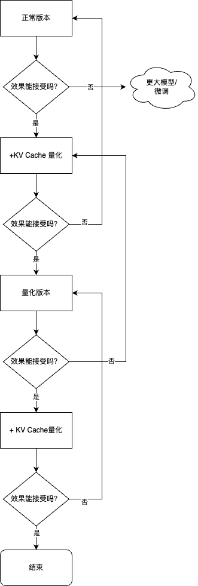

- **还需要考虑框架、显卡的支持情况**，比如有些框架可能不支持 W4A16 的推理，即便转换好了也用不了

### 经验

#### 项目开发

- 精度越高，显存占用越多，推理效率越低，但一般效果较好
- Server 端推理一般用非量化版本或半精度、BF16、Int8 等精度的量化版本，比较少使用更低精度的量化版本
- 端侧推理一般都使用量化版本，且大多是低精度的量化版本
  - 主要是因为计算资源所限

#### 自己使用

- 如果资源足够（有GPU卡很重要），非量化的正常版本
- 如果没有 GPU 卡，只有 CPU（不管什么芯片），量化版本
- 如果生成文本长度很长，显存不够，就开启 KV Cache

## 参考资料

- [InternLM/lmdeploy: LMDeploy is a toolkit for compressing, deploying, and serving LLMs.](https://github.com/InternLM/lmdeploy/)
- [仅需一块 3090 显卡，高效部署 InternLM-20B 模型 - 知乎](https://zhuanlan.zhihu.com/p/665725861)