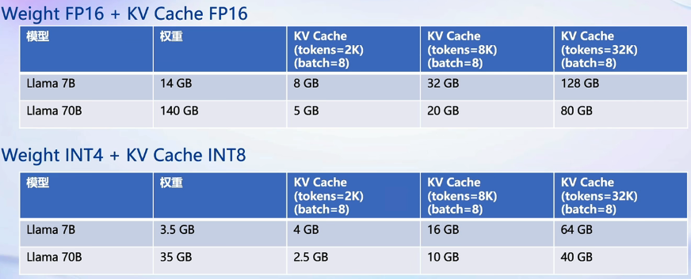

# LLM量化部署

## 概述

### 模型部署

#### 定义

- 将训练好的模型在特定软硬件环境中启动的过程，使模型能够接收输入并返回预测结果
- 满足性能和效率的需求，需要对模型进行优化
  - eg：模型压缩和硬件加速

#### 产品形态

- 云端、边缘计算端、移动端

#### 计算设备

- CPU、GPT、TPU、NPU等

### LLM特点

#### 内存开销大

- 参数量庞大
  - 7B模型采用FP16（半精度，2字节）需要14+G内存
- 采用自回归生成token，需要缓存Attention的k/v（巨大 内存开销）

#### 动态shape

- 请求数不固定
  - batch_size
- token逐个生成，数量不确定
  - 输入 / 出token不一样

#### 结构简单

- Transformers结构，大部分为decoder-only
  - token by token：一个一个生成

### 挑战

#### 设备

- 如何应对巨大的存储问题；低存储设备（消费级显卡、手机）如何部署

#### 推理

- 如何加速token生成速度
- 如何解决动态shape，推理不间断
- 如何有效管理和利用内存    

#### 服务

- 如何提升系统整体吞吐量
- 个体用户，如何降低响应时间

### 方案

#### 技术

- 模型并行
- transformer计算和访存优化
- 低比特量化
- continuous batch
- page attention
- ...

#### 方案

- huggingface transformers
- 专门推理加速框架

#### 云端

- Imdeploy
- vllm
- tensorrt-llm
- deepspeed
- ...

#### 移动端

- llama.cpp
- mlc-llm
- ...

## LMDeploy

### 简介

- LMDeploy：LLM在英伟达设备上部署的全流程解决方案
  - 轻量化
    - 4bit权重（awq）
    - 8bit k / v
  - 推理引擎
    - turbomind（特有）
    - pytorch
  - 服务
    - api server
    - gradio（演示）
    - triton inference server
- 接口
  - python、gRPC、RESTful


### 量化

#### 效果



- 24GB显存
  - 量化前：7B model，并发8，max length 2k
  - 量化后：7B model，并发8，max length 8k
- 80GB显存
  - 量化前：70B model，oom
  - 量化后：70B model，并发8，max length 32k

#### 原因

##### 概念

- 计算密集（compute-bound）：推理的绝大部分时间消耗在数值计算上；针对计算密集场景，可以通过使用更快的硬件计算单元来提升计算速度，如量化为W8A8使用INT8 Tensor Core加速计算
- 访存密集（memory-bound）：推理的绝大部分时间消耗在数据读取上；针对访存密集型场景，一般是通过提高计算访存比来提升性能

##### LLM

- 常见LLM模型是Decoder Only架构。推理时大部分时间消耗在逐token生成阶段（Decoding阶段），属于典型的访存密集型场景
- 
  - A100的FP16峰值算力为312TFLOPS，当Batch Size达到128时候，计算成为推理的瓶颈，实际很难达到
    - LLM本身大，推理时的KV Cache占用很多显存，还存在一些其他因素的影响（eg：Persistent Batch）

##### weight only量化

- 4bit weight only量化：FP16模型权重量化为INT4，访存量降低为FP16模型的1/4，大幅降低访存成本，提高Decoding速度，计算过程反量化为FP16计算
- 加速同时节省显存，同样的设备能够支持更大的模型以及更长的对话长度

#### 方法

- LMDeploy采用MIT HAN LAB开源 `AWQ`算法，量化为4bit模型
- 推理时，先把4bit权重反量化回FP16（Kernel内部进行，从Global Memory读取时是4bit），使用FP16计算
- `AWQ` 相较于 `GPTQ` ，推理速度更快，量化时间更短
  - AWQ：观察到模型推理时矩阵/长老计算存在少量一部分参数重要，不进行量化，量化其他参数，保持性能的同时节省显存
- KV Cache INT8：k v进行 INT8量化

### 推理引擎

#### TurboMind

##### 持续批处理

- 请求可以及时加入batch中推理
- batch中已经完成的推理请求及时退出


###### 请求队列

- 推理请求首先加入请求队列

###### Persistent线程

1. 当batch中有空闲槽位，从队列拉取请求，尽量填满空闲槽位。若无继续对当前batch中的请求进行forward
2. batch每forward一次，判断是否有request推理结束，结束的request发送结果、释放槽位
3. 转步骤1

##### 有状态的推理

- 对话token被缓存在推理侧
- 用户侧请求无需携带历史对话记录


##### Blocked k/v cache

- Attention支持不连续的k/v
- block（Page Attention）


##### 高性能cuda kernel

- Flash Attention2
- Solit-K decoding
- Fast w4a16，kv8反量化kernel
- 算子融合

### 推理服务

```bash
lmdeploy serve api_server InternLM/internlm-chat-7b --model-name internlm-chat-7b --server-port 8080

# swagger地址: http://0.0.0.0:8080
```

- 4个api，前3个和openai接口一致，最后一个特有


## 实践

### 环境配置


### 服务部署


### 模型量化