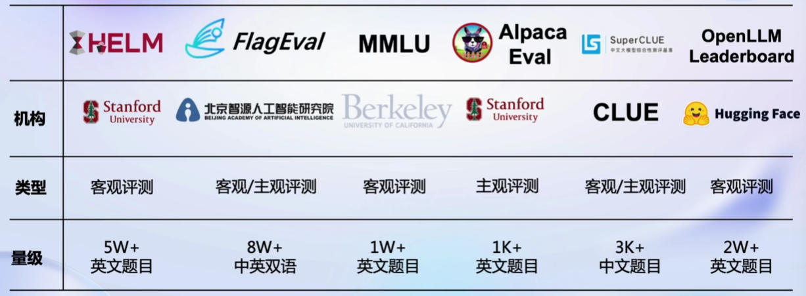
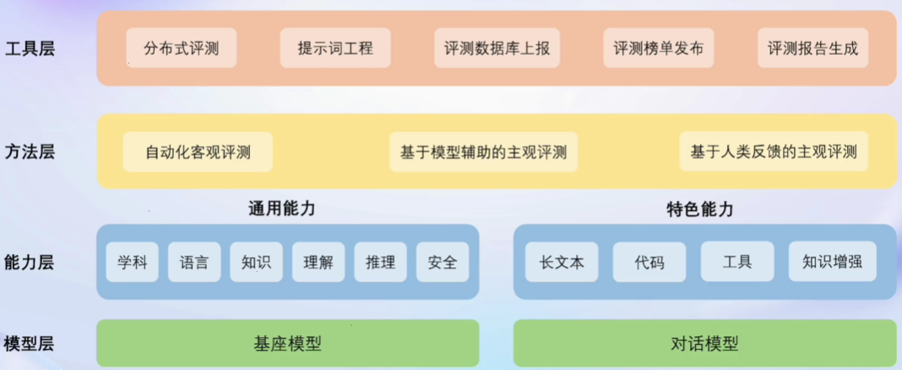
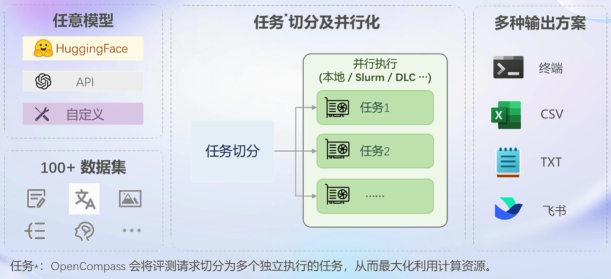
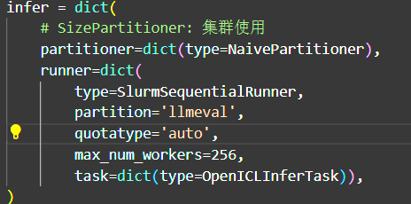
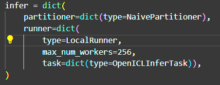
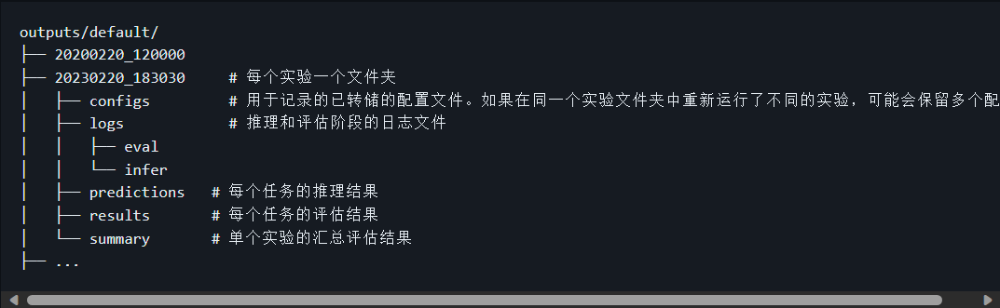

# LLM评测

## 概述

- 国内外机构在大模型评测上开展了大量的尝试和探索，斯坦福大学提出了较为系统的评测框架HELM，从准确性，安全性，鲁棒性和公平性等维度开展模型评测；纽约大学联合谷歌和Meta提出了SuperGLUE评测集，从推理能力，常识理解，问答能力等方面入手，构建了包括8个子任务的大语言模型评测数据集；加州大学伯克利分校提出了MMLU测试集，构建了涵盖高中和大学的多项考试，来评估模型的知识能力和推理能力；谷歌也提出了包含数理科学，编程代码，阅读理解，逻辑推理等子任务的评测集Big-Bench，涵盖200多个子任务，对模型能力进行系统化的评估；在中文评测方面，国内的学术机构也提出了如CLUE,CUGE等评测数据集，从文本分类，阅读理解，逻辑推理等方面评测语言模型的中文能力
- 随着大模型的蓬勃发展，如何全面系统地评估大模型的各项能力成为了亟待解决的问题。由于大语言模型和多模态模型的能力强大，应用场景广泛，目前学术界和工业界的评测方案往往只关注模型的部分能力维度，缺少系统化的能力维度框架与评测方案
- OpenCompass提供设计一套全面、高效、可拓展的大模型评测方案，对模型能力、性能、安全性等进行全方位的评估。OpenCompass提供分布式自动化的评测系统，支持对(语言/多模态)大模型开展全面系统的能力评估

## 动机

- 开发者：监控模型能力变化，指导优化模型生产
- 产业界：找出最适合产业应用的模型，赋能真实场景

## 如何评测

- 基座模型和对话模型（指令微调）
- 客观评测
  - 问答题、多选题、判断分类题...
- 主观评测
  - 人类评价、模型评价
    - GPT-4作为裁判评价
- 提示词工程：prompt敏感性，鲁棒性

## 评测框架



- MMLU、Hugging Face

## OpenCompass

### 评测对象

主要评测对象为语言大模型与多模态大模型

- **基座模型**：一般是经过海量的文本数据以自监督学习的方式进行训练获得的模型（如OpenAI的GPT-3，Meta的LLaMA），往往具有强大的文字续写能力
- **对话模型**：一般是在的基座模型的基础上，经过指令微调或人类偏好对齐获得的模型（如OpenAI的ChatGPT、上海人工智能实验室的书生·浦语），能理解人类指令，具有较强的对话能力

### 工具架构



- 模型层：大模型评测所涉及的主要模型种类，OpenCompass以基座模型和对话模型作为重点评测对象
- 能力层：OpenCompass从本方案从通用能力和特色能力两个方面来进行评测维度设计
  - 在模型通用能力方面，从语言、知识、理解、推理、安全等多个能力维度进行评测
  - 在特色能力方面，从长文本、代码、工具、知识增强等维度进行评测
- 方法层：OpenCompass采用客观评测与主观评测两种评测方式
  - 客观评测能便捷地评估模型在具有确定答案（如选择，填空，封闭式问答等）的任务上的能力
  - 主观评测能评估用户对模型回复的真实满意度
  - OpenCompass采用基于模型辅助的主观评测和基于人类反馈的主观评测两种方式
- 工具层：OpenCompass提供丰富的功能支持自动化地开展大语言模型的高效评测
  - 包括分布式评测技术，提示词工程，对接评测数据库，评测榜单发布，评测报告生成等诸多功能

## 能力维度

### 设计思路

- 为准确、全面、系统化地评估大语言模型的能力，OpenCompass从通用人工智能的角度出发，结合学术界的前沿进展和工业界的最佳实践，提出一套面向实际应用的模型能力评价体系。OpenCompass能力维度体系涵盖通用能力和特色能力两大部分
- 通用能力涵盖学科综合能力、知识能力、语言能力、理解能力、推理能力、安全能力，共计六大维度构造立体全面的模型能力评价体系

## 评测方法

- OpenCompass采取客观评测与主观评测相结合的方法
- 针对具有确定性答案的能力维度和场景，通过构造丰富完善的评测集，对模型能力进行综合评价
- 针对体现模型能力的开放式或半开放式的问题、模型安全问题等，采用主客观相结合的评测方式

### 客观评测

- 针对具有标准答案的客观问题，通过使用定量指标比较模型的输出与标准答案的差异，并根据结果衡量模型的性能。同时，由于大语言模型输出自由度较高，在评测阶段，需要对其输入和输出作一定的规范和设计，尽可能减少噪声输出在评测阶段的影响，才能对模型的能力有更加完整和客观的评价

- 为了更好地激发出模型在题目测试领域的能力，并引导模型按照一定的模板输出答案，OpenCompass采用提示词工程 （prompt engineering）和语境学习（in-context learning）进行客观评测

- 通常采用下列两种方式进行模型输出结果的评测：

  - **判别式评测**：该评测方式基于将问题与候选答案组合在一起，计算模型在所有组合上的困惑度（perplexity），并选择困惑度最小的答案作为模型的最终输出。例如，若模型在 `问题? 答案1` 上的困惑度为 0.1，在 `问题? 答案2` 上的困惑度为 0.2，最终我们会选择 `答案1` 作为模型的输出

  - **生成式评测**：该评测方式主要用于生成类任务，如语言翻译、程序生成、逻辑分析题等。具体实践时，使用问题作为模型的原始输入，并留白答案区域待模型进行后续补全。通常还需要对其输出进行后处理，以保证输出满足数据集的要求

### 主观评测

- 语言表达生动精彩，变化丰富，大量的场景和能力无法凭借客观指标进行评测
- 针对如模型安全和模型语言能力的评测，以人的主观感受为主的评测更能体现模型的真实能力，并更符合大模型的实际使用场景
- OpenCompass采取的主观评测方案是指借助受试者的主观判断对具有对话能力的大语言模型进行能力评测
- 模型推理结果后经过额外模型进行推理评测
- 在具体实践中，提前基于模型的能力维度构建主观测试问题集合，并将不同模型对于同一问题的不同回复展现给受试者，收集受试者基于主观感受的评分
  - 由于主观测试成本高昂，本方案同时也采用使用性能优异的大语言模拟人类进行主观打分
  - 在实际评测中，本文将采用真实人类专家的主观评测与基于模型打分的主观评测相结合的方式开展模型能力评估
- 具体开展主观评测时，OpenComapss采用**单模型回复满意度统计**和**多模型满意度比较**两种方式开展具体的评测工作

### quick start



- OpenCompass 中评估一个模型通常包括以下几个阶段：**配置** -> **推理** -> **评估** -> **可视化**

#### 配置

- 整个工作流的起点
- 需要配置整个评估过程，选择要评估的模型和数据集
- 还可以选择评估策略、计算后端等，并定义显示结果的方式

#### 推理与评估

- 在这个阶段，OpenCompass 将会开始对模型和数据集进行并行推理和评估
- 推理阶段主要是让模型从数据集产生输出
- 评估阶段则是衡量这些输出与标准答案的匹配程度
- 两个过程会被拆分为多个同时运行的“任务”以提高效率
  - 如果计算资源有限，这种策略可能会使评测变得更慢

#### 可视化

- 评估完成后，OpenCompass 将结果整理成易读的表格，并将其保存为 CSV 和 TXT 文件
- 激活飞书状态上报功能，此后可以在飞书客户端中及时获得评测状态报告

## 挑战


# 实战

## 安装

```
conda create --name opencompass --clone=/root/share/conda_envs/internlm-base
source activate opencompass
git clone https://github.com/open-compass/opencompass
cd opencompass
pip install -e .
```

- 有部分第三方功能，如代码能力基准测试 Humaneval 以及 Llama格式的模型评测,可能需要额外步骤才能正常运行，详细步骤请参考[安装指南](https://opencompass.readthedocs.io/zh_CN/latest/get_started/installation.html)

## 数据准备

```
# 解压评测数据集到 data/ 处
cp /share/temp/datasets/OpenCompassData-core-20231110.zip /root/opencompass/
unzip OpenCompassData-core-20231110.zip

# 将会在opencompass下看到data文件夹

# 列出所有跟 internlm 及 ceval 相关的配置
python tools/list_configs.py internlm ceval
```

## 启动评测

- 通过以下命令评测 InternLM-Chat-7B 模型在 C-Eval 数据集上的性能
- OpenCompass 默认并行启动评估过程，在第一次运行时以 `--debug` 模式启动评估，并检查是否存在问题
  - 在 `--debug` 模式下，任务将按顺序执行，并实时打印输出

```
python run.py --datasets ceval_gen --hf-path /share/temp/model_repos/internlm-chat-7b/ --tokenizer-path /share/temp/model_repos/internlm-chat-7b/ --tokenizer-kwargs padding_side='left' truncation='left' trust_remote_code=True --model-kwargs trust_remote_code=True device_map='auto' --max-seq-len 2048 --max-out-len 16 --batch-size 4 --num-gpus 1 --debug
```

### bash启动

- **推荐**
- 新建test.sh
- bash -i test.sh

```bash
cd ~/opencompass
conda activate opencompass

# 一种写法
python run.py configs/eval_subjective_alignbench.py

# 另外一种写法
python run.py --datasets ceval_gen --hf-path /share/temp/model_repos/internlm-chat-7b/ --tokenizer-path /share/temp/model_repos/internlm-chat-7b/ --tokenizer-kwargs padding_side='left' truncation='left' trust_remote_code=True --model-kwargs trust_remote_code=True device_map='auto' --max-seq-len 2048 --max-out-len 16 --batch-size 4 --num-gpus 1 --debug
```

### 命令解析

```
--datasets ceval_gen \ # 数据集
--hf-path /share/temp/model_repos/internlm-chat-7b/ \  # HuggingFace 模型路径 开发机路径
--tokenizer-path /share/temp/model_repos/internlm-chat-7b/ \  # HuggingFace tokenizer 路径（如果与模型路径相同，可以省略）
--tokenizer-kwargs padding_side='left' truncation='left' trust_remote_code=True \  # 构建 tokenizer 的参数
--model-kwargs device_map='auto' trust_remote_code=True \  # 构建模型的参数
# 下面四个一般需要修改
--max-seq-len 2048 \  # 模型可以接受的最大序列长度 模型读入
--max-out-len 16 \  # 生成的最大 token 数 客观题不用生成过多，提高指令跟随能力
--batch-size 4  \  # 批量大小
--num-gpus 1  # 运行模型所需的 GPU 数量
--debug  # 所有打印到控制台，不开启则保存到outputs/default/时间戳/logs下
--reuse latest # 断点继续跑，而不是重新跑 latest是最新时间戳 
```

- 有关 `run.py` 支持的所有与 HuggingFace 相关的参数，阅读 [评测任务发起](https://opencompass.readthedocs.io/zh-cn/latest/user_guides/experimentation.html#id2)

- 除了通过命令行配置实验外，OpenCompass 允许用户在配置文件中编写实验的完整配置，并通过 `run.py` 直接运行配置文件

  - ```
    python run.py configs/eval_demo.py
    ```

  - 配置文件是以 Python 格式组织的，并且必须包括 `datasets` 和 `models` 字段

- 示例测试配置在 [configs/eval_demo.py](https://github.com/open-compass/opencompass/blob/main/configs/eval_demo.py) 中

- 此配置通过 [继承机制](https://github.com/InternLM/tutorial/blob/main/user_guides/config.md#继承机制) 引入所需的数据集和模型配置，并以所需格式组合 `datasets` 和 `models` 字段

- OpenCompass 提供了一系列预定义的模型配置，位于 `configs/models` ，通过命令行参数 `--models` 指定相关文件，或使用继承机制将模型配置导入到配置文件中的 `models` 列表中

- 数据集的配置文件也提供在 `configs/datasets`，在命令行中使用 `--datasets`，或通过继承在配置文件中导入相关配置

  - 数据集配置通常有两种类型：'ppl' 和 'gen'，分别指示使用的评估方法
  -  `ppl` 表示辨别性评估，`gen` 表示生成性评估

- configs/datasets/collections收录了各种数据集集合，方便进行综合评估，OpenCompass 通常使用 `base_medium.py` 进行全面的模型测试

  - 要复制结果，只需导入该文件，例如：

  - ```
    python run.py --models hf_llama_7b --datasets base_medium
    ```

### configs

- 目录是整体config
- 主要是read_base

#### models

- 各种模型文件夹
- 存放模型配置文件
  - models

### ceval_gen_5f30c7.py

- 具体配置文件解释
- 都有ceval_infer_cfg、ceval_eval_cfg、ceval_datasets
- ceval_eval_cfg
  - 指定evaluator
    - AccEvaluator or others，根据评测类型
  - pred_postprocessor
    - 比如模型评测客观题为A...，需要提取出来A

### 主观评测

- eval_subjective_alignbench.py：主观评测配置文件

- 修改模型路径和tokenizer路径

- max_out_len and max_seq_len 修改

  - **max_out_len如果dataset和model均指定，以dataset为准**

- infer的partitioner

  - NaivePartitioner：单GPU
  - SizePartitioner：集群上使用，分片推理
    - 指定size_num

- infer的runner

  - SlurmSequentialRunner：集群使用
    - 
  - LocalRunner：单个GPU
    - 

- work_dir：指定评测结果输出文件夹

- **客观评测默认模型使用gride推理：模型推理可复现，失去模型回复多样性**

  - **主观评测需要在model的dict里面开启**

    ```
    # 参考huggingface默认dict里面参数值
    gengration_kwargs=dict(do_sample=True, temperature=xx, top_K=xx, top_p=xx)
    ```

## 可视化评估结果

- 所有运行输出将定向到 `outputs/demo/` 目录
  - 
- 打印评测结果的过程可被进一步定制化，用于输出一些数据集的平均分 (例如 MMLU, C-Eval 等)
- 关于评测结果输出的更多介绍可阅读 [结果展示](https://github.com/InternLM/tutorial/blob/main/user_guides/summarizer.md)

## 总结

- bash脚本评测

- ```
  python run.py 完整config.py脚本 --reuse latest
  ```

- dataset和model修改
- 分片操作，集群多GPU同时评测
- --debug and --reuse
- 主观需要指定`judge_model`
  - eval：相当于推理
  - eval的mode
    - singlescore：打分模式
    - m2n：对战模式
  - eval的models
    - 需要评价的models
  - summarizer
    - eval后处理

# 更多教程

- https://opencompass.readthedocs.io/zh-cn/latest/