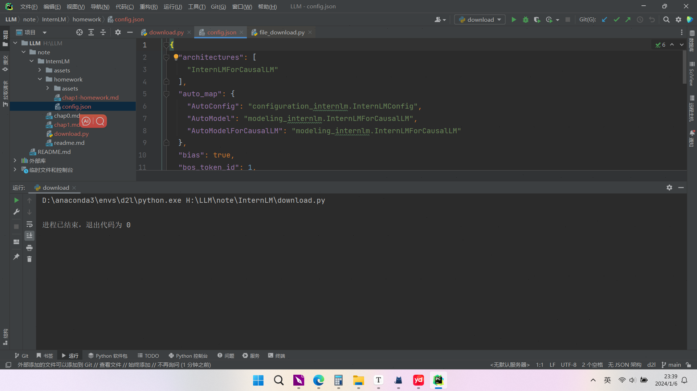

# 作业

**基础作业：**

- 使用 InternLM-Chat-7B 模型生成 300 字的小故事（需截图）
- 熟悉 hugging face 下载功能，使用 `huggingface_hub` python 包，下载 `InternLM-20B` 的 config.json 文件到本地（需截图下载过程）

**进阶作业（可选做）**

- 完成浦语·灵笔的图文理解及创作部署（需截图）
- 完成 Lagent 工具调用 Demo 创作部署（需截图）

**整体实训营项目：**

时间周期：即日起致课程结束

即日开始可以在班级群中随机组队完成一个大作业项目，一些可提供的选题如下：

- 人情世故大模型：一个帮助用户撰写新年祝福文案的人情事故大模型
- 中小学数学大模型：一个拥有一定数学解题能力的大模型
- 心理大模型：一个治愈的心理大模型
- 工具调用类项目：结合 Lagent 构建数据集训练 InternLM 模型，支持对 MMYOLO 等工具的调用

其他基于书生·浦语工具链的小项目都在范围内，欢迎大家充分发挥想象力


# 基础作业

## 使用 InternLM-Chat-7B 模型生成 300 字的小故事


## 下载InternLM-20B的config.json文件到本地

```
# 下载流程
# 安装huggingface hub
!pip install -U huggingface_hub

# 新建download.py代码，指定下载到本地的路径local_dir
import os
from huggingface_hub import hf_hub_download  # Load model directly
# filename：文件名称
hf_hub_download(repo_id="internlm/internlm-7b", filename="config.json", local_dir='./')
```

### 下载前


### 下载后



## 完成浦语·灵笔的图文理解及创作部署

### 创作


##  完成 Lagent 工具调用 Demo 创作部署


