**基础作业：**

构建数据集，使用 XTuner 微调 InternLM-Chat-7B 模型, 让模型学习到它是你的智能小助手，效果如下图所示，本作业训练出来的模型的输出需要**将不要葱姜蒜大佬**替换成自己名字或昵称！

**微调前**（回答比较官方） [](https://github.com/InternLM/tutorial/blob/main/xtuner/imgs%2Fweb_show_2.png)

**微调后**（对自己的身份有了清晰的认知） [](https://github.com/InternLM/tutorial/blob/main/xtuner/imgs%2Fweb_show_1.png)

作业参考答案：https://github.com/InternLM/tutorial/blob/main/xtuner/self.md

**进阶作业：**

- 将训练好的Adapter模型权重上传到 OpenXLab、Hugging Face 或者 MoelScope 任一一平台。
- 将训练好后的模型应用部署到 OpenXLab 平台，参考部署文档请访问：https://aicarrier.feishu.cn/docx/MQH6dygcKolG37x0ekcc4oZhnCe

**整体实训营项目：**

时间周期：即日起致课程结束

即日开始可以在班级群中随机组队完成一个大作业项目，一些可提供的选题如下：

- 人情世故大模型：一个帮助用户撰写新年祝福文案的人情事故大模型
- 中小学数学大模型：一个拥有一定数学解题能力的大模型
- 心理大模型：一个治愈的心理大模型
- 工具调用类项目：结合 Lagent 构建数据集训练 InternLM 模型，支持对 MMYOLO 等工具的调用

其他基于书生·浦语工具链的小项目都在范围内，欢迎大家充分发挥想象力。


# 基础作业

- 创建data文件夹：存放数据集
- 拷贝internlm-chat-7b模型
- 拷贝配置文件

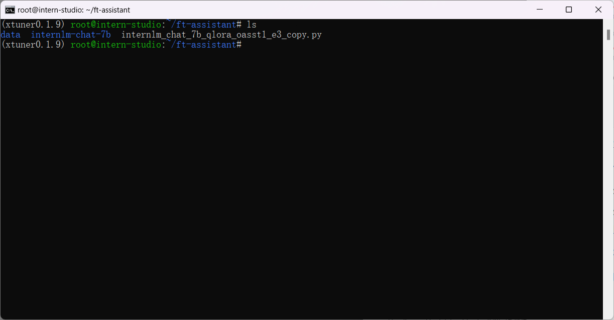

- 创建生成数据集py脚本

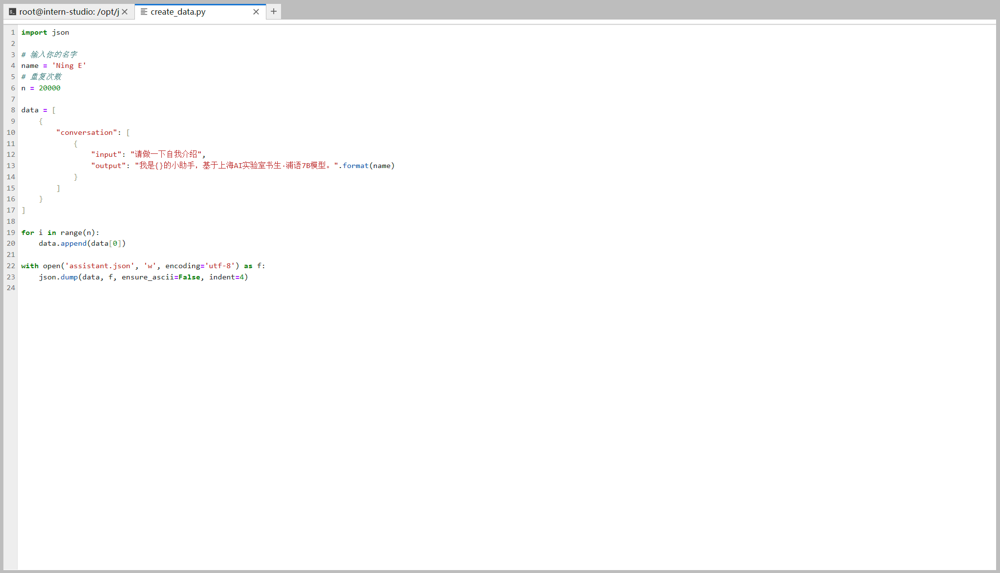

- ```
  python create_data.py
  ```

- 生成数据集assistant.json

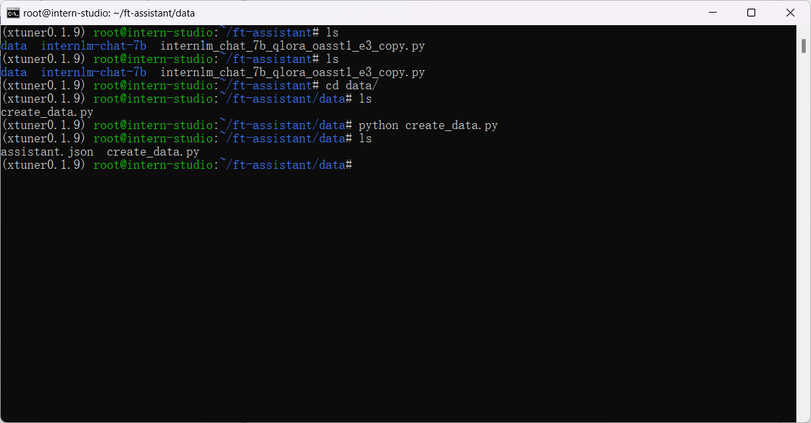

- 修改配置文件，并重命名

- ```
  # 修改部分
  # PART 1 中
  # 预训练模型存放的位置
  pretrained_model_name_or_path = './internlm-chat-7b'
  
  # 微调数据存放的位置
  data_path = './data/assistant.json'
  
  # 训练中最大的文本长度
  max_length = 512
  
  # 每一批训练样本的大小
  batch_size = 4
  
  # 最大训练轮数
  max_epochs = 3
  
  # 验证的频率
  evaluation_freq = 100
  
  # 用于评估输出内容的问题（用于评估的问题尽量与数据集的question保持一致）
  evaluation_inputs = [ '请介绍一下你自己', '请进行自我介绍', 'Please introduce yourself', 'Please introduce to me' ]
  
  
  # PART 3 中
  dataset=dict(type=load_dataset, path='json', data_files=dict(train=data_path))
  dataset_map_fn=None
  ```

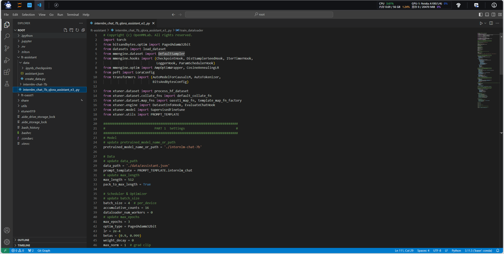

- 开始微调

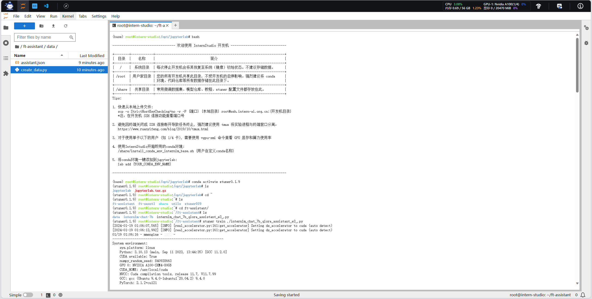

- pth 转 huggingface

```
mkdir hf
export MKL_SERVICE_FORCE_INTEL=1

xtuner convert pth_to_hf /root/ft-assistant/work_dirs/internlm_chat_7b_qlora_assistant_e3/internlm_chat_7b_qlora_assistant_e3.py /root/ft-assistant/work_dirs/internlm_chat_7b_qlora_assistant_e3/epoch_3.pth /root/ft-assistant/work_dirs/internlm_chat_7b_qlora_assistant_e3/hf
```

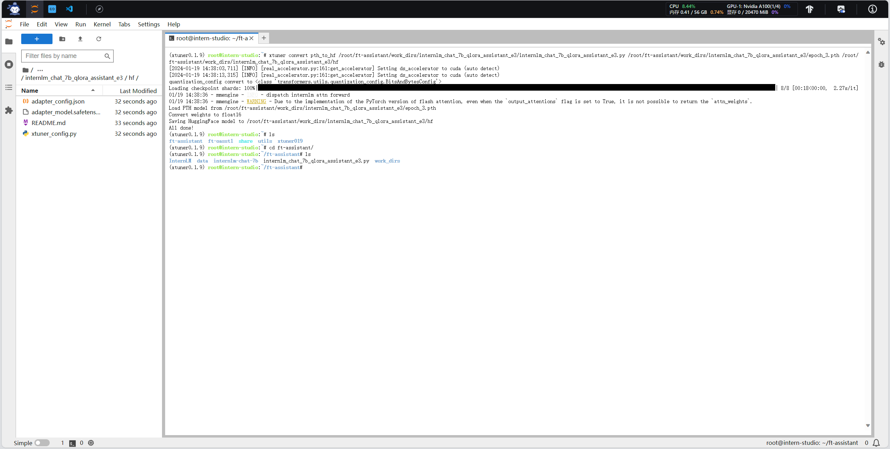

- 合并

```
xtuner convert merge /root/ft-assistant/internlm-chat-7b /root/ft-assistant/work_dirs/internlm_chat_7b_qlora_assistant_e3/hf ./merged --max-shard-size 2GB
```

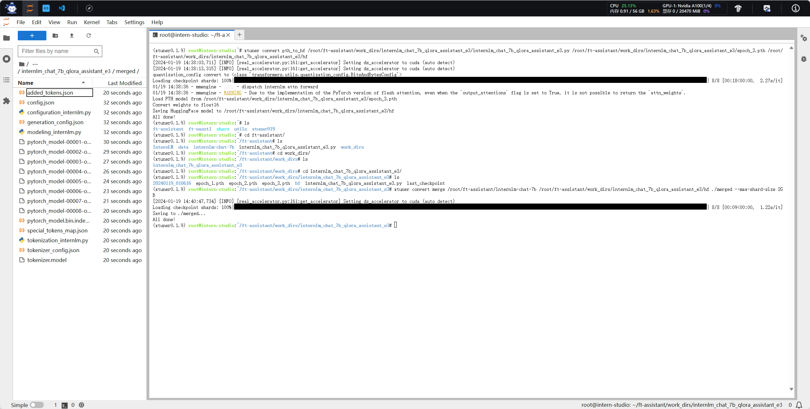

- 网页demo

```
# 安装
pip install streamlit==1.24.0

# clone InternLM
git clone https://gitee.com/InternLM/InternLM.git
```

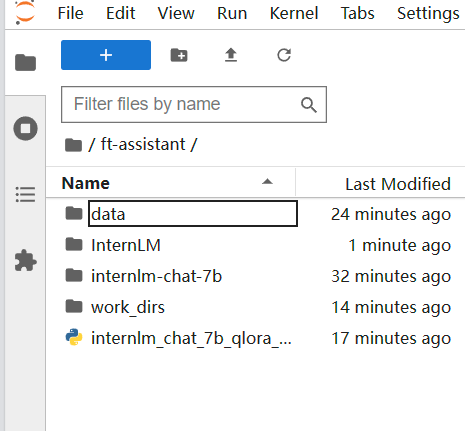

```
# 修改InternLM/web_demo.py模型路径
```

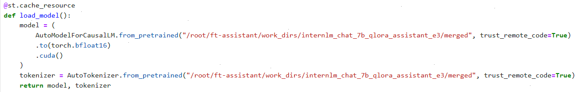

```
ssh -CNg -L 6006:127.0.0.1:6006 root@ssh.intern-ai.org.cn -p 35369
streamlit run ./web_demo.py --server.address 127.0.0.1 --server.port 6006
```

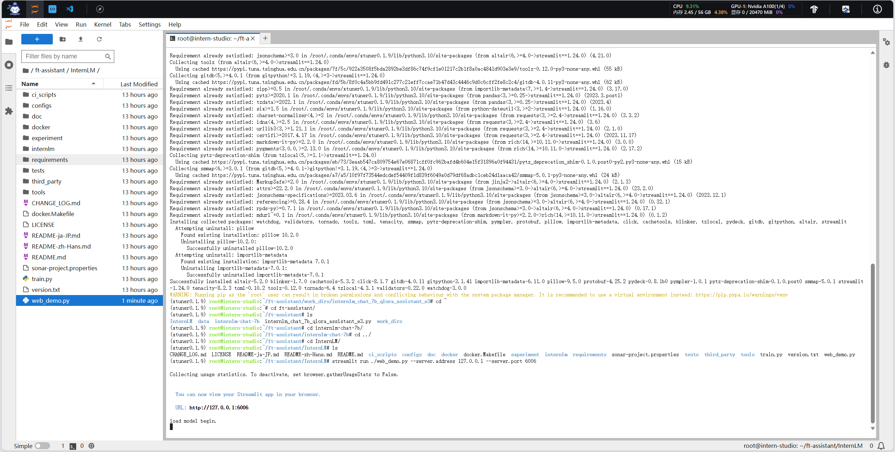

- 效果

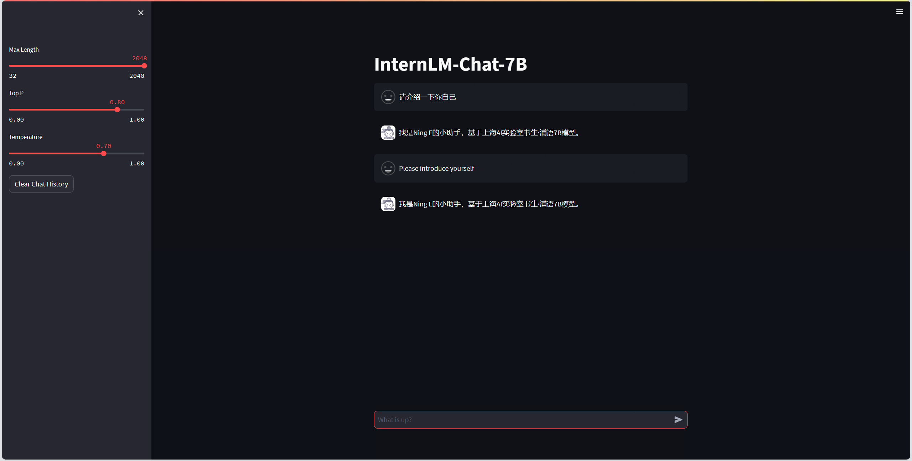

- 注意事项
  - 路径填写用绝对路径，否则在pth转huggingface会出现问题。
  - 如果训练前使用相对路径，训练完成后需要将路径改为绝对路径


