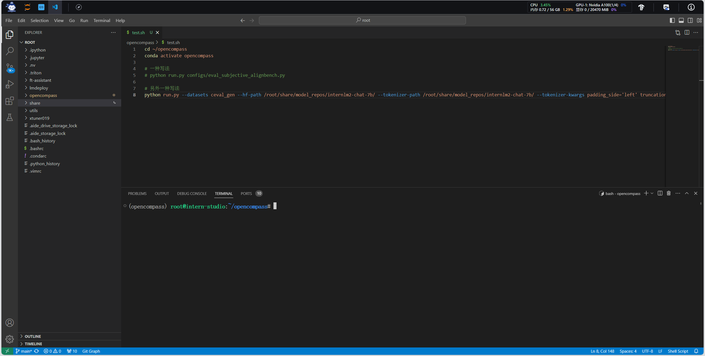
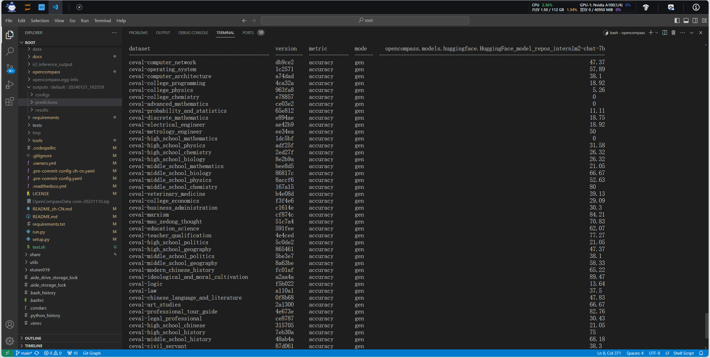
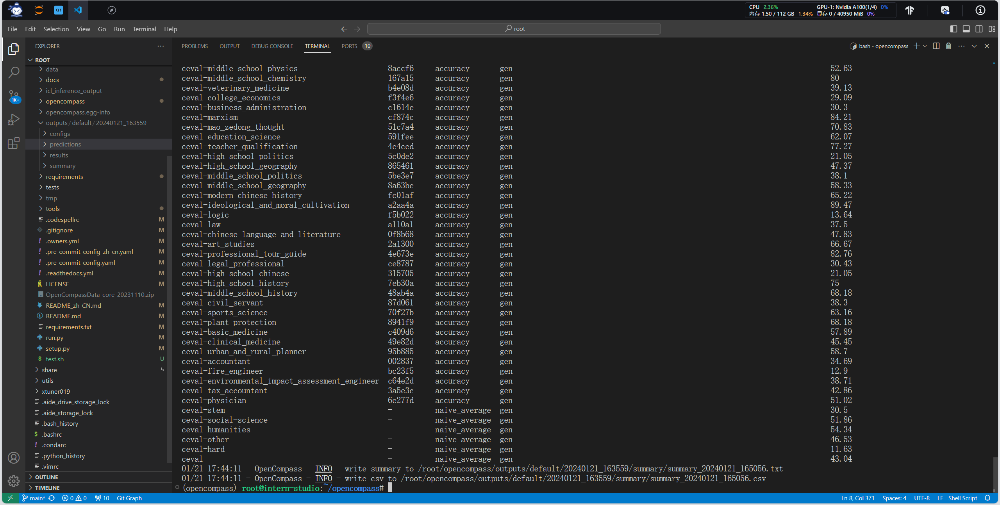
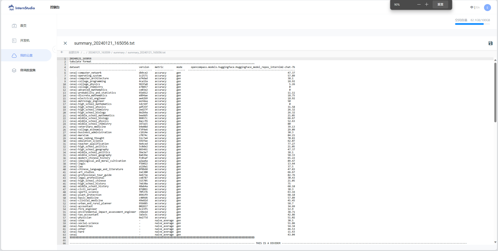

## 作业

**基础作业**

- 使用 OpenCompass 评测 InternLM2-Chat-7B 模型在 C-Eval 数据集上的性能

**进阶作业**

- 使用 OpenCompass 评测 InternLM2-Chat-7B 模型使用 LMDeploy 0.2.0 部署后在 C-Eval 数据集上的性能

备注：**由于进阶作业较难，完成基础作业之后就可以先提交作业了，在后续的大作业项目中使用这些技术将作为重要的加分点！**

**整体实训营项目：**

时间周期：即日起致课程结束

即日开始可以在班级群中随机组队完成一个大作业项目，一些可提供的选题如下：

- 人情世故大模型：一个帮助用户撰写新年祝福文案的人情事故大模型
- 中小学数学大模型：一个拥有一定数学解题能力的大模型
- 心理大模型：一个治愈的心理大模型
- 工具调用类项目：结合 Lagent 构建数据集训练 InternLM 模型，支持对 MMYOLO 等工具的调用

其他基于书生·浦语工具链的小项目都在范围内，欢迎大家充分发挥想象力。


# 基础作业

```bash
# 进入opencompass文件夹，新建test.sh，输入
cd ~/opencompass
conda activate opencompass

python run.py --datasets ceval_gen --hf-path /root/share/model_repos/internlm2-chat-7b/ --tokenizer-path /root/share/model_repos/internlm2-chat-7b/ --tokenizer-kwargs padding_side='left' truncation='left' trust_remote_code=True --model-kwargs trust_remote_code=True device_map='auto' --max-seq-len 2048 --max-out-len 16 --batch-size 4 --num-gpus 1 --debug

# 在终端执行
bash -i test.sh
```









- 遇到的问题：out of memory
- 解决办法：选择 A100(1/4) * 2配置
  - 原因：显存不够
