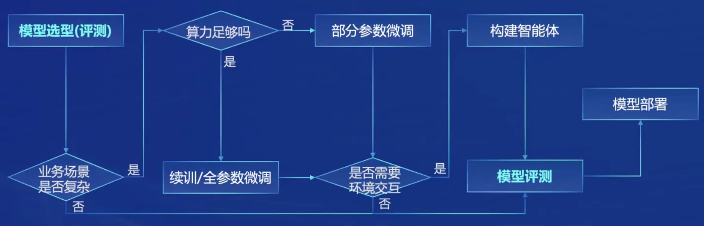
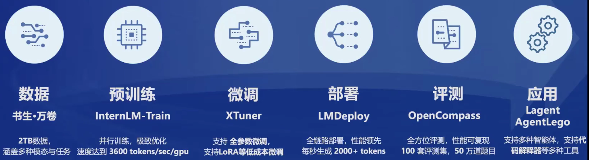
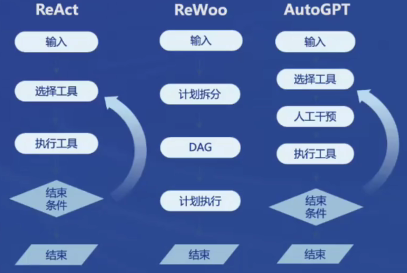
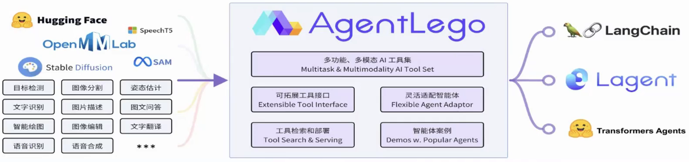

## 模型

- 专用模型：针对特定任务，一个模型解决一个问题
- 通用模型：一个模型应对多种任务和模态

## InternLM2

### 尺寸

- 7B：轻量级，轻便性能可以
- 20B：综合能力更强，有效支持更加复杂的实用场景

### 版本

- InternLM2-Base：高质量具有可塑性的模型基座，模型进行深度领域适配的高质量起点
- InternLM2：Base基础上，多个能力方向进行强化，评测成绩好，并保持很好的通用语言能力，大部分应用**优秀基座**
- InternLM2-Chat：Base基础上，经过SFT和RLHF，面向对话交换进行优化，具有很好的指令循环、共情聊天和调用工具等的能力

### 数据清洗过滤技术

- 多维度数据价值评估：基于文本质量、信息质量、信息密度等维度对数据价值进行综合评估与提升
- 高质量语料驱动的数据富集：利用高质量语料的特征从物理世界、互联网以及语料库中进一步富集更多类似的语料
- 针对性数据补齐：针对性补充语料，重点加强世界知识、数理、代码等核心能力

## 应用

### 流程

- 环境交互：存在外部API，构建智能体

### 开发体系

### 轻量智能体框架

- Lagent

#### 智能体能力支持

- 流程

#### 工具

- AI工具：文生图、文生语音、图片描述等
- 能力拓展：搜索、计算器、代码解释器等
- Rapid API：xx API等

### 多模态智能体工具箱

- AgentLego
  - 提供大量视觉、多模态相关领域的前沿算法和工具集合
  - 支持多个主流智能体系统，如：LangChain、Transformers Agent等
  - 支持各类输入输出格式工具函数，提供多模态工具调用接口
  - 支持远程工具部署，使用调用大模型智能体