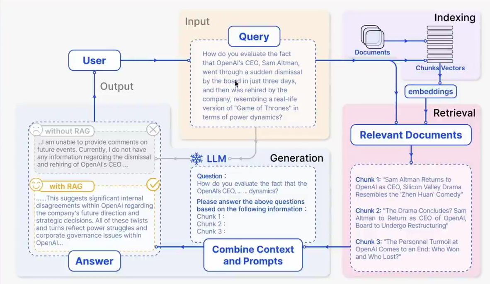
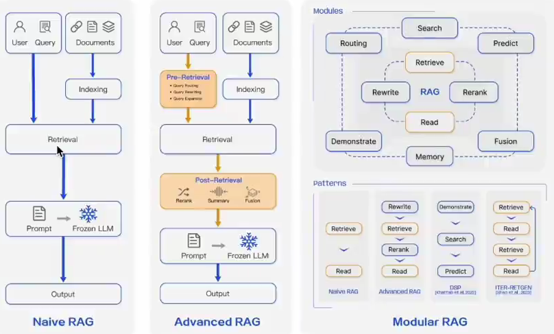
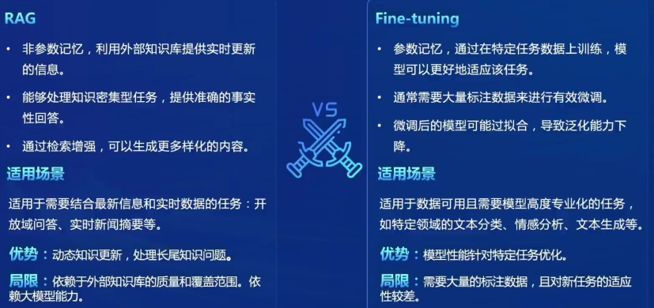
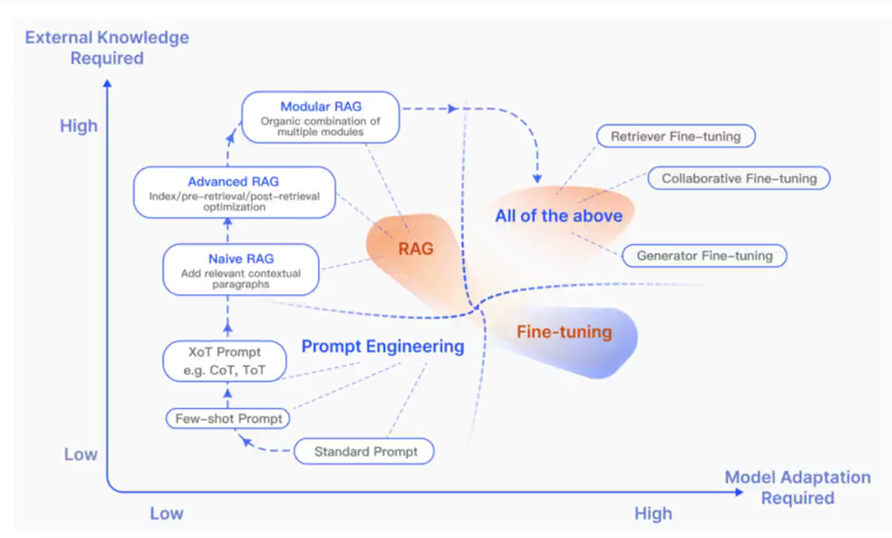

## RAG

-  RAG（Retrieval Augmented Generation）：通过检索与用户输入相关的信息片段，并结合***外部知识库***来生成更准确、更丰富的回答
  - 解决 LLMs 在处理知识密集型任务时可能遇到的挑战，提供更准确的回答、降低推理成本、实现外部记忆
    - 幻觉、知识过时和缺乏透明、可追溯的推理过程等
  - 应用：QA系统、文本生成、信息检索、图片描述



### 向量数据库

- 数据存储：文本及其他数据通过预训练模型转换为固定长度的向量表示，捕捉文本的语义信息
- 相似性检索：根据用户的查询向量，从向量数据库找出最相关的向量，检索结果根据相似度得分进行排序
  - 计算方式：余弦相似度、点积等
- 向量表示优化：采用更高级的文本编码技术（句子嵌入或段落嵌入）、数据库优化支出大规模向量搜索

### 范式



- Naive RAG：问答系统、信息检索
- Advanced RAG：摘要生成、内容推荐
- Modular RAG：多模态任务、对话系统

### 优化

- 嵌入优化：结合稀疏和密集检索、多任务
- 索引优化：细粒度分割（Chunk）、元数据
- 查询优化：查询扩展，转换、多查询
- 上下文管理：重排、上下文选择/压缩
- 迭代检索：根据初始查询和至今为止生成的文本进行重复搜索
- 递归检索：迭代细化搜索查询、链式推理（Chain-of-Thought）指导检索过程
- 自适应检索：Flare、self-RAG、LLMs主动决定检索的最佳时机和内容
- LLM微调：检索、、生成、双重微调

### 对比





### 评测

- 经典评估指标：准确率、召回率、F1分数、BLEU分数（机器翻译/文本生成）、ROUGE分数（文本生成）
- RAG评测框架
  - 基准测试：RGB、RECALL、CRUD
  - 评测工具：RAGAS、ARES、TruLens


## 茴香豆

### 环境配置

```
# 复制运行 InternLM 的基础环境
studio-conda -o internlm-base -t InternLM2_Huixiangdou
conda env list
conda activate InternLM2_Huixiangdou
```

### 下载基础文件

```
# 创建模型文件夹
cd /root && mkdir models

# 复制BCE模型
ln -s /root/share/new_models/maidalun1020/bce-embedding-base_v1 /root/models/bce-embedding-base_v1
ln -s /root/share/new_models/maidalun1020/bce-reranker-base_v1 /root/models/bce-reranker-base_v1

# 复制大模型参数（下面的模型，根据作业进度和任务进行**选择一个**就行）
ln -s /root/share/new_models/Shanghai_AI_Laboratory/internlm2-chat-7b /root/models/internlm2-chat-7b
```

### 下载茴香豆

```
# 安装 python 依赖
# pip install -r requirements.txt

pip install protobuf==4.25.3 accelerate==0.28.0 aiohttp==3.9.3 auto-gptq==0.7.1 bcembedding==0.1.3 beautifulsoup4==4.8.2 einops==0.7.0 faiss-gpu==1.7.2 langchain==0.1.14 loguru==0.7.2 lxml_html_clean==0.1.0 openai==1.16.1 openpyxl==3.1.2 pandas==2.2.1 pydantic==2.6.4 pymupdf==1.24.1 python-docx==1.1.0 pytoml==0.1.21 readability-lxml==0.8.1 redis==5.0.3 requests==2.31.0 scikit-learn==1.4.1.post1 sentence_transformers==2.2.2 textract==1.6.5 tiktoken==0.6.0 transformers==4.39.3 transformers_stream_generator==0.0.5 unstructured==0.11.2

## 因为 Intern Studio 不支持对系统文件的永久修改，在 Intern Studio 安装部署的同学不建议安装 Word 依赖，后续的操作和作业不会涉及 Word 解析。
## 想要自己尝试解析 Word 文件的同学，uncomment 掉下面这行，安装解析 .doc .docx 必需的依赖
# apt update && apt -y install python-dev python libxml2-dev libxslt1-dev antiword unrtf poppler-utils pstotext tesseract-ocr flac ffmpeg lame libmad0 libsox-fmt-mp3 sox libjpeg-dev swig libpulse-dev


cd /root
# 克隆代码仓库
git clone https://github.com/internlm/huixiangdou && cd huixiangdou
git checkout 63f2eef0e6e4ac113b05ede0316b193948a42cda
```

### 修改配置文件

```
下载模型的路径替换 /root/huixiangdou/config.ini 文件中的默认模型

3处修改

向量数据库和词嵌入的模型
sed -i '6s#.*#embedding_model_path = "/root/models/bce-embedding-base_v1"#' /root/huixiangdou/config.ini

用于检索的重排序模型
sed -i '7s#.*#reranker_model_path = "/root/models/bce-reranker-base_v1"#' /root/huixiangdou/config.ini

选用的大模型
sed -i '29s#.*#local_llm_path = "/root/models/internlm2-chat-7b"#' /root/huixiangdou/config.ini
```

### 创建知识库

```
使用 InternLM 的 Huixiangdou 文档作为新增知识数据检索来源，在不重新训练的情况下，打造一个 Huixiangdou 技术问答助手

# 下载 Huixiangdou 语料
cd /root/huixiangdou && mkdir repodir

git clone https://github.com/internlm/huixiangdou --depth=1 repodir/huixiangdou


# 提取知识库特征，创建向量数据库
# 数据库向量化的过程应用到了 LangChain 的相关模块，默认嵌入和重排序模型调用的网易 BCE 双语模型，如果没有在 config.ini 文件中指定本地模型路径，茴香豆将自动从 HuggingFace 拉取默认模型
# 除了语料知识的向量数据库，茴香豆建立接受和拒答两个向量数据库，用来在检索的过程中更加精确的判断提问的相关性，这两个数据库的来源分别是

接受问题列表，希望茴香豆助手回答的示例问题
存储在 huixiangdou/resource/good_questions.json 中
拒绝问题列表，希望茴香豆助手拒答的示例问题
存储在 huixiangdou/resource/bad_questions.json 中
其中多为技术无关的主题或闲聊


# 运行下面的命令，增加茴香豆相关的问题到接受问题示例中：

cd /root/huixiangdou
mv resource/good_questions.json resource/good_questions_bk.json

echo '[
    "mmpose中怎么调用mmyolo接口",
    "mmpose实现姿态估计后怎么实现行为识别",
    "mmpose执行提取关键点命令不是分为两步吗，一步是目标检测，另一步是关键点提取，我现在目标检测这部分的代码是demo/topdown_demo_with_mmdet.py demo/mmdetection_cfg/faster_rcnn_r50_fpn_coco.py checkpoints/faster_rcnn_r50_fpn_1x_coco_20200130-047c8118.pth   现在我想把这个mmdet的checkpoints换位yolo的，那么应该怎么操作",
    "在mmdetection中，如何同时加载两个数据集，两个dataloader",
    "如何将mmdetection2.28.2的retinanet配置文件改为单尺度的呢？",
    "1.MMPose_Tutorial.ipynb、inferencer_demo.py、image_demo.py、bottomup_demo.py、body3d_pose_lifter_demo.py这几个文件和topdown_demo_with_mmdet.py的区别是什么，\n2.我如果要使用mmdet是不是就只能使用topdown_demo_with_mmdet.py文件，",
    "mmpose 测试 map 一直是 0 怎么办？",
    "如何使用mmpose检测人体关键点？",
    "我使用的数据集是labelme标注的，我想知道mmpose的数据集都是什么样式的，全都是单目标的数据集标注，还是里边也有多目标然后进行标注",
    "如何生成openmmpose的c++推理脚本",
    "mmpose",
    "mmpose的目标检测阶段调用的模型，一定要是demo文件夹下的文件吗，有没有其他路径下的文件",
    "mmpose可以实现行为识别吗，如果要实现的话应该怎么做",
    "我在mmyolo的v0.6.0 (15/8/2023)更新日志里看到了他新增了支持基于 MMPose 的 YOLOX-Pose，我现在是不是只需要在mmpose/project/yolox-Pose内做出一些设置就可以，换掉demo/mmdetection_cfg/faster_rcnn_r50_fpn_coco.py 改用mmyolo来进行目标检测了",
    "mac m1从源码安装的mmpose是x86_64的",
    "想请教一下mmpose有没有提供可以读取外接摄像头，做3d姿态并达到实时的项目呀？",
    "huixiangdou 是什么？",
    "使用科研仪器需要注意什么？",
    "huixiangdou 是什么？",
    "茴香豆 是什么？",
    "茴香豆 能部署到微信吗？",
    "茴香豆 怎么应用到飞书",
    "茴香豆 能部署到微信群吗？",
    "茴香豆 怎么应用到飞书群",
    "huixiangdou 能部署到微信吗？",
    "huixiangdou 怎么应用到飞书",
    "huixiangdou 能部署到微信群吗？",
    "huixiangdou 怎么应用到飞书群",
    "huixiangdou",
    "茴香豆",
    "茴香豆 有哪些应用场景",
    "huixiangdou 有什么用",
    "huixiangdou 的优势有哪些？",
    "茴香豆 已经应用的场景",
    "huixiangdou 已经应用的场景",
    "huixiangdou 怎么安装",
    "茴香豆 怎么安装",
    "茴香豆 最新版本是什么",
    "茴香豆 支持哪些大模型",
    "茴香豆 支持哪些通讯软件",
    "config.ini 文件怎么配置",
    "remote_llm_model 可以填哪些模型?"
]' > /root/huixiangdou/resource/good_questions.json


# 创建一个测试用的问询列表，用来测试拒答流程是否起效
cd /root/huixiangdou
echo '[
"huixiangdou 是什么？",
"你好，介绍下自己"
]' > ./test_queries.json


# 确定好语料来源后，运行下面的命令，创建 RAG 检索过程中使用的向量数据库
# 创建向量数据库存储目录
cd /root/huixiangdou && mkdir workdir 

# 分别向量化知识语料、接受问题和拒绝问题中后保存到 workdir
python3 -m huixiangdou.service.feature_store --sample ./test_queries.json # 向量数据库的创建需要等待一小段时间，过程约占用 1.6G 显存。
```

- 完成后，Huixiangdou 相关的新增知识就以向量数据库的形式存储在 workdir 文件夹下

- 检索过程中，茴香豆会将输入问题与两个列表中的问题在向量空间进行相似性比较，判断该问题是否应该回答，避免群聊过程中的问答泛滥。确定的回答的问题会利用基础模型提取关键词，在知识库中检索 top K 相似的 chunk，综合问题和检索到的 chunk 生成答案

### 运行

```
# 填入问题
sed -i '74s/.*/    queries = ["huixiangdou 是什么？", "茴香豆怎么部署到微信群", "今天天气怎么样？"]/' /root/huixiangdou/huixiangdou/main.py

# 运行茴香豆
cd /root/huixiangdou/
python3 -m huixiangdou.main --standalone
```

