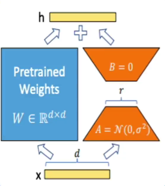
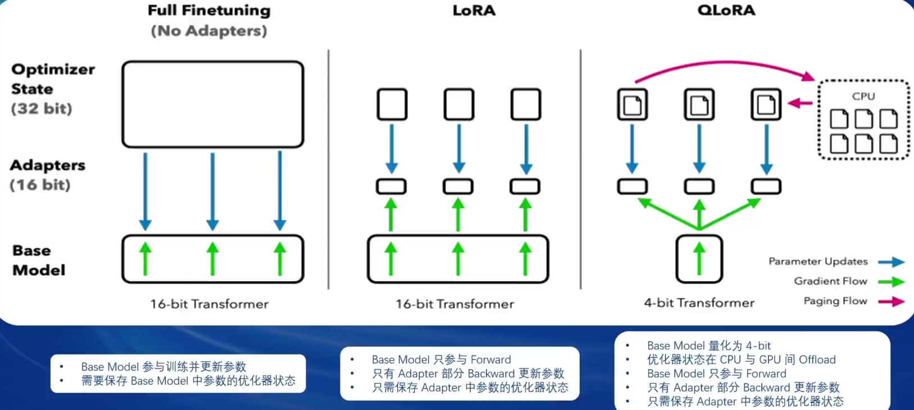
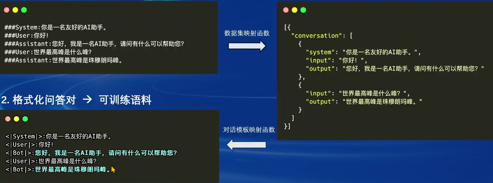
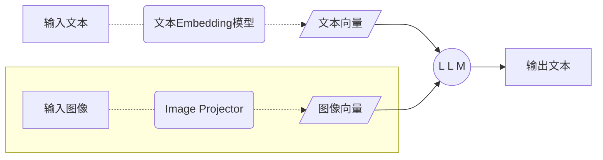
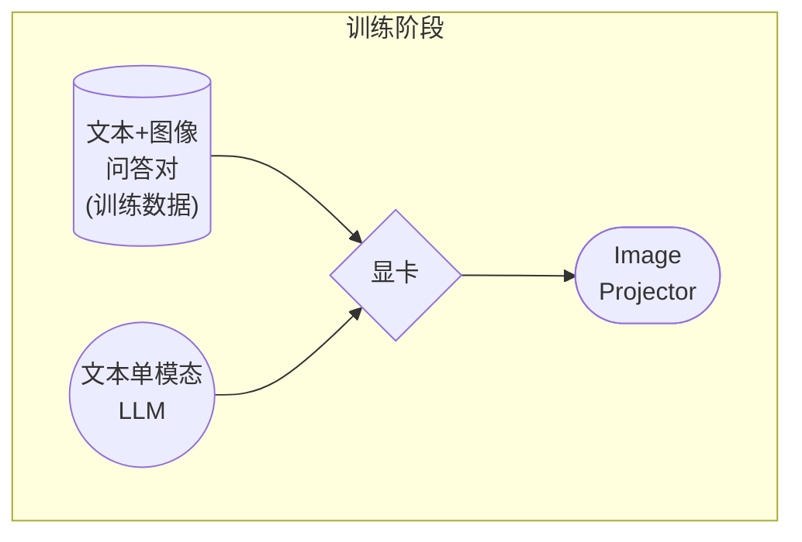
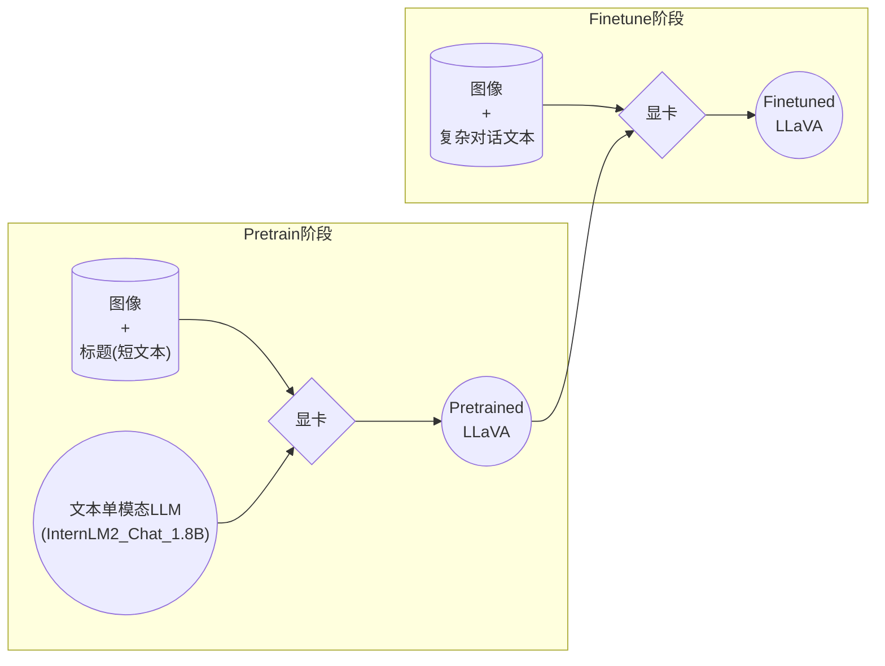

## Finetune

### 范式

- 增量预训练
  - 学习新知识，垂直领域数据
  - 文章、书籍、代码等
- 指令微调
  - 学习对话模板，根据人类指令进行对话
  - 高质量的对话、问答数据

### 数据流程

1. 原始数据
2. 标准格式数据
   - json格式，提示词工程
3. 添加对话模板
   - internlm2、llama2等
4. tokenized数据
5. 添加label
6. 训练

### LoRA & QLoRA



- LoRA通过在原本的Linear旁，新增一个支路，包含两个连续的小Linear，新增的支路是Adapter
- Adapter参数量远小于原本的Linear，大幅度降低训练的显存消耗

#### 对比




## XTuner

### quick start

```
# 安装
pip install xtuner

# 挑选配置模板
xtuner list-cfg -p internlm_20b

# train
xtuner train internlm_20b_qlora_oasst1_512_e3

# chat
xtuner chat internlm/internlm-chat-20b

# 4bit model chat
xtuner chat internlm/internlm-chat-20b --bits 4

# adapter model chat
xtuner chat internlm/internlm-chat-20b --adapter $ADAPTER_DIR
```

### config命名规则

- 模型名：internlm_20b        无chat代表基座模型
- 使用算法：qlora
- 数据集：oasst1
- 数据长度：512
- epoch：e3、epoch3

### 常用超参

- data_path：数据路径或huggingface仓库名
- max_lenght：单条数据最大token数，超过则截断
- pack_to_max_lenght：是否将多条短数据拼接到max_length，提高GPU利用率
- accumulative_counts：梯度积累，每多少次backward更新一次参数
- evaluation_inputs：训练过程中根据给定的问题进行推理，观测训练状态
- evaluation_frep：evaluation评测间隔iter数

### 流程


### 数据引擎

1. 原始问答对 --> 格式化问答对 --> 可训练语料
   - 
2. 数据集映射函数
3. 多样本拼接
   - 增强并行性，提高GPU利用率

 ### 加速优化

#### flash attention

- attention计算并行化，避免计算过程中attention score N×N的显存占用
- 默认开启

#### deepspeed zero

- ZeRO优化，通过将训练过程中的参数、梯度和优化器状态切片保存，能够在多GPU训练时显著节省显存
- 采用FP16权重

### internlm2-1.8B

- internlm2-1.8B：高质量和高适应灵活性的基础模型，为下游深度适应提供良好的起点
- internlm2-chat-1.8B-SFT：internlm2-1.8B上进行监督微调（SFT）后得到的对话模型
- internlm2-chat-1.8B：通过在线RLHF在Internlm2-chat-1.8B-SFT上进一步对其。internlm2-chat-1.8B表现出更好的指令跟随、聊天体验和函数调用，推荐下游应用程序使用（模型大小仅3.78GB）
- 1.8B-FP16：4GB显卡推理，8GB显卡微调


## 多模态LLM




### LLaVA



- Haotian Liu基于GPT-4V对图像数据生成描述构建大量`<question text><image>--<answer text>数据对`
- 基于这些数据对配合文本单模态LLM，得到`Image Projector`
- 单文本模型LLM + Image Projector统称为LLaVA模型
- 类似LoRA使用新数据训练一个新的小文件

### 过程

1. Pretrain

   - `图片+简单文本（caption, 即图片标题）`数据对，使LLM理解图像中的**普遍特征**

   - 模型只会给输入图像写标题

   - 详见[XTuner-LLaVA](https://github.com/InternLM/xtuner/blob/main/docs/zh_cn/user_guides/dataset_prepare.md#llava-dataset)和[LLaVA](https://llava-vl.github.io/)

   - ```
     8卡
     
     NPROC_PER_NODE=8 xtuner train llava_internlm2_chat_1_8b_clip_vit_large_p14_336_e1_gpu8_pretrain --deepspeed deepspeed_zero2
     
     NPROC_PER_NODE=8 xtuner train llava_internlm2_chat_1_8b_qlora_clip_vit_large_p14_336_lora_e1_gpu8_finetune --deepspeed deepspeed_zero2
     ```

2. Finetune

   - `图片+复杂文本`数据对，来对Pretrain得到的Image Projector即iter_2181.pth进行进一步的训练



### 格式

```json
[
    {
        "id": "随便什么字符串",
        "image": "图片文件的相对位置。相对后面config文件里指定的image_folder参数的路径。",
        "conversation": [
            {
                "from": "human",
                "value": "<image>\n第1个问题。"
            },
            {
                "from": "gpt",
                "value": "第1个回答"
            },
            {
                "from": "human",
                "value": "第2个问题。"
            },
            {
                "from": "gpt",
                "value": "第2个回答"
            },
            # ......
            {
                "from": "human",
                "value": "第n个问题。"
            },
            {
                "from": "gpt",
                "value": "第n个回答"
            },
        ]
    },

    # 下面是第....组训练数据
]
```

- 每组训练数据的第1个来自human的问题前，要加上图片占位符，即`<image>`

- 制作数据：效法LLaVA作者的做法，将自己的图片发送给GPT，要求其按照上述格式生成若干条问答对


## Agent


## 实战

### LLM

#### env

```
cuda11.7 30% A100 * 1
```

### xtuner install

```
# 如果你是在 InternStudio 平台，则从本地 clone 一个已有 pytorch 的环境：
# pytorch    2.0.1   py3.10_cuda11.7_cudnn8.5.0_0

studio-conda xtuner0.1.17
# 如果你是在其他平台：
# conda create --name xtuner0.1.17 python=3.10 -y

# 激活环境
conda activate xtuner0.1.17
# 进入家目录 （~的意思是 “当前用户的home路径”）
cd ~
# 创建版本文件夹并进入，以跟随本教程
mkdir -p /root/xtuner0117 && cd /root/xtuner0117

# 拉取 0.1.17 的版本源码
git clone -b v0.1.17  https://github.com/InternLM/xtuner
# 无法访问github的用户请从 gitee 拉取:
# git clone -b v0.1.15 https://gitee.com/Internlm/xtuner

# 进入源码目录
cd /root/xtuner0117/xtuner

# 从源码安装 XTuner
pip install -e '.[all]'
```

### 数据集准备

```
# 前半部分是创建一个文件夹，后半部分是进入该文件夹。
mkdir -p /root/ft && cd /root/ft

# 在ft这个文件夹里再创建一个存放数据的data文件夹
mkdir -p /root/ft/data && cd /root/ft/data

# 创建 `generate_data.py` 文件
touch /root/ft/data/generate_data.py
```

- 打开 generate_data 文件添加

- ```
  import json
  
  # 设置用户的名字
  name = 'name'
  # 设置需要重复添加的数据次数
  n =  10000
  
  # 初始化OpenAI格式的数据结构
  data = [
      {
          "messages": [
              {
                  "role": "user",
                  "content": "请做一下自我介绍"
              },
              {
                  "role": "assistant",
                  "content": "我是{}的小助手，内在是上海AI实验室书生·浦语的1.8B大模型哦".format(name)
              }
          ]
      }
  ]
  
  # 通过循环，将初始化的对话数据重复添加到data列表中
  for i in range(n):
      data.append(data[0])
  
  # 将data列表中的数据写入到一个名为'personal_assistant.json'的文件中
  with open('personal_assistant.json', 'w', encoding='utf-8') as f:
      # 使用json.dump方法将数据以JSON格式写入文件
      # ensure_ascii=False 确保中文字符正常显示
      # indent=4 使得文件内容格式化，便于阅读
      json.dump(data, f, ensure_ascii=False, indent=4)
  ```

- ```
  # 确保先进入该文件夹
  cd /root/ft/data
  
  # 运行代码
  python /root/ft/data/generate_data.py
  ```

### prepare model

```
# 创建目标文件夹，确保它存在。
# -p选项意味着如果上级目录不存在也会一并创建，且如果目标文件夹已存在则不会报错。
mkdir -p /root/ft/model

# 复制内容到目标文件夹。-r选项表示递归复制整个文件夹。
cp -r /root/share/new_models/Shanghai_AI_Laboratory/internlm2-chat-1_8b/* /root/ft/model/

### 存储空间不足，通过符号链接的方式链接到模型文件
# 创建符号链接
ln -s /root/share/new_models/Shanghai_AI_Laboratory/internlm2-chat-1_8b /root/ft/model
```

- `/root/ft/model` 将直接成为一个符号链接，这个链接指向 `/root/share/new_models/Shanghai_AI_Laboratory/internlm2-chat-1_8b` 的位置
- 访问 `/root/ft/model` 时，实际上就是在访问 `/root/share/new_models/Shanghai_AI_Laboratory/internlm2-chat-1_8b` 目录下的内容
- 文件结构多了一些软链接相关的文件

### 配置文件

#### 查看xtuner提供的配置文件

- 前提：能够连接上 Huggingface 以及有足够的显存，其实就可以直接运行这些配置文件，XTuner就能够直接下载好这些模型和数据集然后开始进行微调

```
# 列出所有内置配置文件
# xtuner list-cfg

# 假如我们想找到 internlm2-1.8b 模型里支持的配置文件
xtuner list-cfg -p internlm2_1_8b
```

#### copy config

```
# 创建一个存放 config 文件的文件夹
mkdir -p /root/ft/config

# 使用 XTuner 中的 copy-cfg 功能将 config 文件复制到指定的位置
xtuner copy-cfg internlm2_1_8b_qlora_alpaca_e3 /root/ft/config
```

#### config introduce

1. **PART 1 Settings**：涵盖了模型基本设置，如预训练模型的选择、数据集信息和训练过程中的一些基本参数（如批大小、学习率等）
2. **PART 2 Model & Tokenizer**：指定了用于训练的模型和分词器的具体类型及其配置，包括预训练模型的路径和是否启用特定功能（如可变长度注意力），这是模型训练的核心组成部分
3. **PART 3 Dataset & Dataloader**：描述了数据处理的细节，包括如何加载数据集、预处理步骤、批处理大小等，确保了模型能够接收到正确格式和质量的数据
4. **PART 4 Scheduler & Optimizer**：配置了优化过程中的关键参数，如学习率调度策略和优化器的选择，这些是影响模型训练效果和速度的重要因素
5. **PART 5 Runtime**：定义了训练过程中的额外设置，如日志记录、模型保存策略和自定义钩子等，以支持训练流程的监控、调试和结果的保存

- 需要更改的部分只包括前三部分，修改的主要原因是修改了配置文件中规定的模型、数据集
- 后两部分都是官方帮我们优化好的东西，一般而言只有在魔改的情况下才需要进行修改

#### config update

```python
# Copyright (c) OpenMMLab. All rights reserved.
import torch
from datasets import load_dataset
from mmengine.dataset import DefaultSampler
from mmengine.hooks import (CheckpointHook, DistSamplerSeedHook, IterTimerHook,
                            LoggerHook, ParamSchedulerHook)
from mmengine.optim import AmpOptimWrapper, CosineAnnealingLR, LinearLR
from peft import LoraConfig
from torch.optim import AdamW
from transformers import (AutoModelForCausalLM, AutoTokenizer,
                          BitsAndBytesConfig)

from xtuner.dataset import process_hf_dataset
from xtuner.dataset.collate_fns import default_collate_fn
from xtuner.dataset.map_fns import openai_map_fn, template_map_fn_factory
from xtuner.engine.hooks import (DatasetInfoHook, EvaluateChatHook,
                                 VarlenAttnArgsToMessageHubHook)
from xtuner.engine.runner import TrainLoop
from xtuner.model import SupervisedFinetune
from xtuner.parallel.sequence import SequenceParallelSampler
from xtuner.utils import PROMPT_TEMPLATE, SYSTEM_TEMPLATE

#######################################################################
#                          PART 1  Settings                           #
#######################################################################
# Model
pretrained_model_name_or_path = '/root/ft/model'
use_varlen_attn = False

# Data
alpaca_en_path = '/root/ft/data/personal_assistant.json'
prompt_template = PROMPT_TEMPLATE.default
max_length = 1024
pack_to_max_length = True

# parallel
sequence_parallel_size = 1

# Scheduler & Optimizer
batch_size = 1  # per_device
accumulative_counts = 16
accumulative_counts *= sequence_parallel_size
dataloader_num_workers = 0
max_epochs = 2
optim_type = AdamW
lr = 2e-4
betas = (0.9, 0.999)
weight_decay = 0
max_norm = 1  # grad clip
warmup_ratio = 0.03

# Save
save_steps = 300
save_total_limit = 3  # Maximum checkpoints to keep (-1 means unlimited)

# Evaluate the generation performance during the training
evaluation_freq = 300
SYSTEM = ''
evaluation_inputs = ['请你介绍一下你自己', '你是谁', '你是我的小助手吗']

#######################################################################
#                      PART 2  Model & Tokenizer                      #
#######################################################################
tokenizer = dict(
    type=AutoTokenizer.from_pretrained,
    pretrained_model_name_or_path=pretrained_model_name_or_path,
    trust_remote_code=True,
    padding_side='right')

model = dict(
    type=SupervisedFinetune,
    use_varlen_attn=use_varlen_attn,
    llm=dict(
        type=AutoModelForCausalLM.from_pretrained,
        pretrained_model_name_or_path=pretrained_model_name_or_path,
        trust_remote_code=True,
        torch_dtype=torch.float16,
        quantization_config=dict(
            type=BitsAndBytesConfig,
            load_in_4bit=True,
            load_in_8bit=False,
            llm_int8_threshold=6.0,
            llm_int8_has_fp16_weight=False,
            bnb_4bit_compute_dtype=torch.float16,
            bnb_4bit_use_double_quant=True,
            bnb_4bit_quant_type='nf4')),
    lora=dict(
        type=LoraConfig,
        r=64,
        lora_alpha=16,
        lora_dropout=0.1,
        bias='none',
        task_type='CAUSAL_LM'))

#######################################################################
#                      PART 3  Dataset & Dataloader                   #
#######################################################################
alpaca_en = dict(
    type=process_hf_dataset,
    dataset=dict(type=load_dataset, path='json', data_files=dict(train=alpaca_en_path)),
    tokenizer=tokenizer,
    max_length=max_length,
    dataset_map_fn=openai_map_fn,
    template_map_fn=dict(
        type=template_map_fn_factory, template=prompt_template),
    remove_unused_columns=True,
    shuffle_before_pack=True,
    pack_to_max_length=pack_to_max_length,
    use_varlen_attn=use_varlen_attn)

sampler = SequenceParallelSampler \
    if sequence_parallel_size > 1 else DefaultSampler
train_dataloader = dict(
    batch_size=batch_size,
    num_workers=dataloader_num_workers,
    dataset=alpaca_en,
    sampler=dict(type=sampler, shuffle=True),
    collate_fn=dict(type=default_collate_fn, use_varlen_attn=use_varlen_attn))

#######################################################################
#                    PART 4  Scheduler & Optimizer                    #
#######################################################################
# optimizer
optim_wrapper = dict(
    type=AmpOptimWrapper,
    optimizer=dict(
        type=optim_type, lr=lr, betas=betas, weight_decay=weight_decay),
    clip_grad=dict(max_norm=max_norm, error_if_nonfinite=False),
    accumulative_counts=accumulative_counts,
    loss_scale='dynamic',
    dtype='float16')

# learning policy
# More information: https://github.com/open-mmlab/mmengine/blob/main/docs/en/tutorials/param_scheduler.md  # noqa: E501
param_scheduler = [
    dict(
        type=LinearLR,
        start_factor=1e-5,
        by_epoch=True,
        begin=0,
        end=warmup_ratio * max_epochs,
        convert_to_iter_based=True),
    dict(
        type=CosineAnnealingLR,
        eta_min=0.0,
        by_epoch=True,
        begin=warmup_ratio * max_epochs,
        end=max_epochs,
        convert_to_iter_based=True)
]

# train, val, test setting
train_cfg = dict(type=TrainLoop, max_epochs=max_epochs)

#######################################################################
#                           PART 5  Runtime                           #
#######################################################################
# Log the dialogue periodically during the training process, optional
custom_hooks = [
    dict(type=DatasetInfoHook, tokenizer=tokenizer),
    dict(
        type=EvaluateChatHook,
        tokenizer=tokenizer,
        every_n_iters=evaluation_freq,
        evaluation_inputs=evaluation_inputs,
        system=SYSTEM,
        prompt_template=prompt_template)
]

if use_varlen_attn:
    custom_hooks += [dict(type=VarlenAttnArgsToMessageHubHook)]

# configure default hooks
default_hooks = dict(
    # record the time of every iteration.
    timer=dict(type=IterTimerHook),
    # print log every 10 iterations.
    logger=dict(type=LoggerHook, log_metric_by_epoch=False, interval=10),
    # enable the parameter scheduler.
    param_scheduler=dict(type=ParamSchedulerHook),
    # save checkpoint per `save_steps`.
    checkpoint=dict(
        type=CheckpointHook,
        by_epoch=False,
        interval=save_steps,
        max_keep_ckpts=save_total_limit),
    # set sampler seed in distributed evrionment.
    sampler_seed=dict(type=DistSamplerSeedHook),
)

# configure environment
env_cfg = dict(
    # whether to enable cudnn benchmark
    cudnn_benchmark=False,
    # set multi process parameters
    mp_cfg=dict(mp_start_method='fork', opencv_num_threads=0),
    # set distributed parameters
    dist_cfg=dict(backend='nccl'),
)

# set visualizer
visualizer = None

# set log level
log_level = 'INFO'

# load from which checkpoint
load_from = None

# whether to resume training from the loaded checkpoint
resume = False

# Defaults to use random seed and disable `deterministic`
randomness = dict(seed=None, deterministic=False)

# set log processor
log_processor = dict(by_epoch=False)
```

### 训练

- 添加 `--work-dir` 指定特定的文件保存位置
- 不添加模型训练的过程文件将默认保存在 `./work_dirs/internlm2_1_8b_qlora_alpaca_e3_copy` 的位置

```
# 指定保存路径
xtuner train /root/ft/config/internlm2_1_8b_qlora_alpaca_e3_copy.py --work-dir /root/ft/train
```

#### deepspeed加速

```
# 使用 deepspeed 来加速训练
xtuner train /root/ft/config/internlm2_1_8b_qlora_alpaca_e3_copy.py --work-dir /root/ft/train_deepspeed --deepspeed deepspeed_zero2
```

#### 模型续训

```
# 模型续训
xtuner train /root/ft/config/internlm2_1_8b_qlora_alpaca_e3_copy.py --work-dir /root/ft/train --resume /root/ft/train/iter_600.pth
```

### 模型转换

```
# 创建一个保存转换后 Huggingface 格式的文件夹
mkdir -p /root/ft/huggingface

# 模型转换
# xtuner convert pth_to_hf ${配置文件地址} ${权重文件地址} ${转换后模型保存地址}
xtuner convert pth_to_hf /root/ft/train/internlm2_1_8b_qlora_alpaca_e3_copy.py /root/ft/train/iter_768.pth /root/ft/huggingface
```

- **huggingface 文件夹即为我们平时所理解的所谓 LoRA 模型文件**

  > 可以简单理解：LoRA 模型文件 = Adapter

- 转换过程可额外添加的参数

  - --fp32：代表以fp32的精度开启，假如不输入则默认为fp16
  - --max-shard-size {GB}：代表每个权重文件最大的大小（默认为2GB）

### 模型整合

```
# 创建一个名为 final_model 的文件夹存储整合后的模型文件
mkdir -p /root/ft/final_model

# 解决一下线程冲突的 Bug 
export MKL_SERVICE_FORCE_INTEL=1

# 进行模型整合
# xtuner convert merge  ${NAME_OR_PATH_TO_LLM} ${NAME_OR_PATH_TO_ADAPTER} ${SAVE_PATH} 
xtuner convert merge /root/ft/model /root/ft/huggingface /root/ft/final_model
```

- 可额外添加的参数
  - --max-shard-size {GB}：代表每个权重文件最大的大小（默认为2GB）
  - --device {device_name}：指的就是device的名称，可选择的有cuda、cpu和auto，默认为cuda即使用gpu进行运算
  - --is-clip： 这个参数主要用于确定模型是不是CLIP模型，假如是的话就要加上，不是就不需要添加

CLIP（Contrastive Language–Image Pre-training）模型是 OpenAI 开发的一种预训练模型，它能够理解图像和描述它们的文本之间的关系。CLIP 通过在大规模数据集上学习图像和对应文本之间的对应关系，从而实现了对图像内容的理解和分类，甚至能够根据文本提示生成图像。 在模型整合完成后，我们就可以看到 final_model 文件夹里生成了和原模型文件夹非常近似的内容，包括了分词器、权重文件、配置信息等等。当我们整合完成后，我们就能够正常的调用这个模型进行对话测试

### 模型测试

- XTuner 中直接的提供了一套基于 transformers 的对话代码，可以直接在终端与 Huggingface 格式的模型进行对话操作
- 只需要准备我们刚刚转换好的模型路径并选择对应的提示词模版（prompt-template）即可进行对话
  - 假如 prompt-template 选择有误，很有可能导致模型无法正确的进行回复
  - 了解具体模型的 prompt-template 或者 XTuner 里支持的 prompt-tempolate，到 XTuner 源码中的 `xtuner/utils/templates.py` 文件中进行查找

```
# 与模型进行对话
xtuner chat /root/ft/final_model --prompt-template internlm2_chat
```

#### xtuner chat 参数

| 启动参数            | 解释                                                         |
| ------------------- | ------------------------------------------------------------ |
| --system            | 指定SYSTEM文本，用于在对话中插入特定的系统级信息             |
| --system-template   | 指定SYSTEM模板，用于自定义系统信息的模板                     |
| **--bits**          | 指定LLM运行时使用的位数，决定了处理数据时的精度              |
| --bot-name          | 设置bot的名称，用于在对话或其他交互中识别bot                 |
| --with-plugins      | 指定在运行时要使用的插件列表，用于扩展或增强功能             |
| **--no-streamer**   | 关闭流式传输模式，对于需要一次性处理全部数据的场景           |
| **--lagent**        | 启用lagent，用于特定的运行时环境或优化                       |
| --command-stop-word | 设置命令的停止词，当遇到这些词时停止解析命令                 |
| --answer-stop-word  | 设置回答的停止词，当生成回答时遇到这些词则停止               |
| --offload-folder    | 指定存放模型权重的文件夹，用于加载或卸载模型权重             |
| --max-new-tokens    | 设置生成文本时允许的最大token数量，控制输出长度              |
| **--temperature**   | 设置生成文本的温度值，较高的值会使生成的文本更多样，较低的值会使文本更确定 |
| --top-k             | 设置保留用于顶k筛选的最高概率词汇标记数，影响生成文本的多样性 |
| --top-p             | 设置累计概率阈值，仅保留概率累加高于top-p的最小标记集，影响生成文本的连贯性 |
| --seed              | 设置随机种子，用于生成可重现的文本内容                       |

-  `--adapter` ，这个参数主要的作用就是可以在转化后的 adapter 层与原模型整合之前来对该层进行测试
  - 使用这个额外的参数对话的模型和整合后的模型几乎没有什么太多的区别，因此我们可以通过测试不同的权重文件生成的 adapter 来找到最优的 adapter 进行最终的模型整合工作

### 模型部署

```
pip install streamlit==1.24.0

# 创建存放 InternLM 文件的代码
mkdir -p /root/ft/web_demo && cd /root/ft/web_demo

# 拉取 InternLM 源文件
git clone https://github.com/InternLM/InternLM.git

# 进入该库中
cd /root/ft/web_demo/InternLM
```

- 将 `/root/ft/web_demo/InternLM/chat/web_demo.py` 中的内容替换为以下的代码（与源代码相比，此处修改了模型路径和分词器路径，并且也删除了 avatar 及 system_prompt 部分的内容，同时与 cli 中的超参数进行了对齐）

  - ```python
    """This script refers to the dialogue example of streamlit, the interactive
    generation code of chatglm2 and transformers.
    
    We mainly modified part of the code logic to adapt to the
    generation of our model.
    Please refer to these links below for more information:
        1. streamlit chat example:
            https://docs.streamlit.io/knowledge-base/tutorials/build-conversational-apps
        2. chatglm2:
            https://github.com/THUDM/ChatGLM2-6B
        3. transformers:
            https://github.com/huggingface/transformers
    Please run with the command `streamlit run path/to/web_demo.py
        --server.address=0.0.0.0 --server.port 7860`.
    Using `python path/to/web_demo.py` may cause unknown problems.
    """
    # isort: skip_file
    import copy
    import warnings
    from dataclasses import asdict, dataclass
    from typing import Callable, List, Optional
    
    import streamlit as st
    import torch
    from torch import nn
    from transformers.generation.utils import (LogitsProcessorList,
                                               StoppingCriteriaList)
    from transformers.utils import logging
    
    from transformers import AutoTokenizer, AutoModelForCausalLM  # isort: skip
    
    logger = logging.get_logger(__name__)
    
    
    @dataclass
    class GenerationConfig:
        # this config is used for chat to provide more diversity
        max_length: int = 2048
        top_p: float = 0.75
        temperature: float = 0.1
        do_sample: bool = True
        repetition_penalty: float = 1.000
    
    
    @torch.inference_mode()
    def generate_interactive(
        model,
        tokenizer,
        prompt,
        generation_config: Optional[GenerationConfig] = None,
        logits_processor: Optional[LogitsProcessorList] = None,
        stopping_criteria: Optional[StoppingCriteriaList] = None,
        prefix_allowed_tokens_fn: Optional[Callable[[int, torch.Tensor],
                                                    List[int]]] = None,
        additional_eos_token_id: Optional[int] = None,
        **kwargs,
    ):
        inputs = tokenizer([prompt], padding=True, return_tensors='pt')
        input_length = len(inputs['input_ids'][0])
        for k, v in inputs.items():
            inputs[k] = v.cuda()
        input_ids = inputs['input_ids']
        _, input_ids_seq_length = input_ids.shape[0], input_ids.shape[-1]
        if generation_config is None:
            generation_config = model.generation_config
        generation_config = copy.deepcopy(generation_config)
        model_kwargs = generation_config.update(**kwargs)
        bos_token_id, eos_token_id = (  # noqa: F841  # pylint: disable=W0612
            generation_config.bos_token_id,
            generation_config.eos_token_id,
        )
        if isinstance(eos_token_id, int):
            eos_token_id = [eos_token_id]
        if additional_eos_token_id is not None:
            eos_token_id.append(additional_eos_token_id)
        has_default_max_length = kwargs.get(
            'max_length') is None and generation_config.max_length is not None
        if has_default_max_length and generation_config.max_new_tokens is None:
            warnings.warn(
                f"Using 'max_length''s default ({repr(generation_config.max_length)}) \
                    to control the generation length. "
                'This behaviour is deprecated and will be removed from the \
                    config in v5 of Transformers -- we'
                ' recommend using `max_new_tokens` to control the maximum \
                    length of the generation.',
                UserWarning,
            )
        elif generation_config.max_new_tokens is not None:
            generation_config.max_length = generation_config.max_new_tokens + \
                input_ids_seq_length
            if not has_default_max_length:
                logger.warn(  # pylint: disable=W4902
                    f"Both 'max_new_tokens' (={generation_config.max_new_tokens}) "
                    f"and 'max_length'(={generation_config.max_length}) seem to "
                    "have been set. 'max_new_tokens' will take precedence. "
                    'Please refer to the documentation for more information. '
                    '(https://huggingface.co/docs/transformers/main/'
                    'en/main_classes/text_generation)',
                    UserWarning,
                )
    
        if input_ids_seq_length >= generation_config.max_length:
            input_ids_string = 'input_ids'
            logger.warning(
                f"Input length of {input_ids_string} is {input_ids_seq_length}, "
                f"but 'max_length' is set to {generation_config.max_length}. "
                'This can lead to unexpected behavior. You should consider'
                " increasing 'max_new_tokens'.")
    
        # 2. Set generation parameters if not already defined
        logits_processor = logits_processor if logits_processor is not None \
            else LogitsProcessorList()
        stopping_criteria = stopping_criteria if stopping_criteria is not None \
            else StoppingCriteriaList()
    
        logits_processor = model._get_logits_processor(
            generation_config=generation_config,
            input_ids_seq_length=input_ids_seq_length,
            encoder_input_ids=input_ids,
            prefix_allowed_tokens_fn=prefix_allowed_tokens_fn,
            logits_processor=logits_processor,
        )
    
        stopping_criteria = model._get_stopping_criteria(
            generation_config=generation_config,
            stopping_criteria=stopping_criteria)
        logits_warper = model._get_logits_warper(generation_config)
    
        unfinished_sequences = input_ids.new(input_ids.shape[0]).fill_(1)
        scores = None
        while True:
            model_inputs = model.prepare_inputs_for_generation(
                input_ids, **model_kwargs)
            # forward pass to get next token
            outputs = model(
                **model_inputs,
                return_dict=True,
                output_attentions=False,
                output_hidden_states=False,
            )
    
            next_token_logits = outputs.logits[:, -1, :]
    
            # pre-process distribution
            next_token_scores = logits_processor(input_ids, next_token_logits)
            next_token_scores = logits_warper(input_ids, next_token_scores)
    
            # sample
            probs = nn.functional.softmax(next_token_scores, dim=-1)
            if generation_config.do_sample:
                next_tokens = torch.multinomial(probs, num_samples=1).squeeze(1)
            else:
                next_tokens = torch.argmax(probs, dim=-1)
    
            # update generated ids, model inputs, and length for next step
            input_ids = torch.cat([input_ids, next_tokens[:, None]], dim=-1)
            model_kwargs = model._update_model_kwargs_for_generation(
                outputs, model_kwargs, is_encoder_decoder=False)
            unfinished_sequences = unfinished_sequences.mul(
                (min(next_tokens != i for i in eos_token_id)).long())
    
            output_token_ids = input_ids[0].cpu().tolist()
            output_token_ids = output_token_ids[input_length:]
            for each_eos_token_id in eos_token_id:
                if output_token_ids[-1] == each_eos_token_id:
                    output_token_ids = output_token_ids[:-1]
            response = tokenizer.decode(output_token_ids)
    
            yield response
            # stop when each sentence is finished
            # or if we exceed the maximum length
            if unfinished_sequences.max() == 0 or stopping_criteria(
                    input_ids, scores):
                break
    
    
    def on_btn_click():
        del st.session_state.messages
    
    
    @st.cache_resource
    def load_model():
        model = (AutoModelForCausalLM.from_pretrained('/root/ft/final_model',
                                                      trust_remote_code=True).to(
                                                          torch.bfloat16).cuda())
        tokenizer = AutoTokenizer.from_pretrained('/root/ft/final_model',
                                                  trust_remote_code=True)
        return model, tokenizer
    
    
    def prepare_generation_config():
        with st.sidebar:
            max_length = st.slider('Max Length',
                                   min_value=8,
                                   max_value=32768,
                                   value=2048)
            top_p = st.slider('Top P', 0.0, 1.0, 0.75, step=0.01)
            temperature = st.slider('Temperature', 0.0, 1.0, 0.1, step=0.01)
            st.button('Clear Chat History', on_click=on_btn_click)
    
        generation_config = GenerationConfig(max_length=max_length,
                                             top_p=top_p,
                                             temperature=temperature)
    
        return generation_config
    
    
    user_prompt = '<|im_start|>user\n{user}<|im_end|>\n'
    robot_prompt = '<|im_start|>assistant\n{robot}<|im_end|>\n'
    cur_query_prompt = '<|im_start|>user\n{user}<|im_end|>\n\
        <|im_start|>assistant\n'
    
    
    def combine_history(prompt):
        messages = st.session_state.messages
        meta_instruction = ('')
        total_prompt = f"<s><|im_start|>system\n{meta_instruction}<|im_end|>\n"
        for message in messages:
            cur_content = message['content']
            if message['role'] == 'user':
                cur_prompt = user_prompt.format(user=cur_content)
            elif message['role'] == 'robot':
                cur_prompt = robot_prompt.format(robot=cur_content)
            else:
                raise RuntimeError
            total_prompt += cur_prompt
        total_prompt = total_prompt + cur_query_prompt.format(user=prompt)
        return total_prompt
    
    
    def main():
        # torch.cuda.empty_cache()
        print('load model begin.')
        model, tokenizer = load_model()
        print('load model end.')
    
    
        st.title('InternLM2-Chat-1.8B')
    
        generation_config = prepare_generation_config()
    
        # Initialize chat history
        if 'messages' not in st.session_state:
            st.session_state.messages = []
    
        # Display chat messages from history on app rerun
        for message in st.session_state.messages:
            with st.chat_message(message['role'], avatar=message.get('avatar')):
                st.markdown(message['content'])
    
        # Accept user input
        if prompt := st.chat_input('What is up?'):
            # Display user message in chat message container
            with st.chat_message('user'):
                st.markdown(prompt)
            real_prompt = combine_history(prompt)
            # Add user message to chat history
            st.session_state.messages.append({
                'role': 'user',
                'content': prompt,
            })
    
            with st.chat_message('robot'):
                message_placeholder = st.empty()
                for cur_response in generate_interactive(
                        model=model,
                        tokenizer=tokenizer,
                        prompt=real_prompt,
                        additional_eos_token_id=92542,
                        **asdict(generation_config),
                ):
                    # Display robot response in chat message container
                    message_placeholder.markdown(cur_response + '▌')
                message_placeholder.markdown(cur_response)
            # Add robot response to chat history
            st.session_state.messages.append({
                'role': 'robot',
                'content': cur_response,  # pylint: disable=undefined-loop-variable
            })
            torch.cuda.empty_cache()
    
    
    if __name__ == '__main__':
        main()
    ```

- 端口映射

  - ```
    # 从本地使用 ssh 连接 studio 端口
    # 将下方端口号 38374 替换成自己的端口号
    ssh -CNg -L 6006:127.0.0.1:6006 root@ssh.intern-ai.org.cn -p 38374
    ```

- 输入以下命令运行 `/root/personal_assistant/code/InternLM` 目录下的 `web_demo.py` 文件

  ```
  streamlit run /root/ft/web_demo/InternLM/chat/web_demo.py --server.address 127.0.0.1 --server.port 6006
  ```

  > 注意：要在浏览器打开 `http://127.0.0.1:6006` 页面后，模型才会加载。

- 假如和原来的 InternLM2-Chat-1.8B 模型对话（即在 `/root/ft/model` 这里的模型对话），只需要修改183行和186行的文件地址即可

  ```diff
  # 修改模型地址（第183行）
  - model = (AutoModelForCausalLM.from_pretrained('/root/ft/final_model',
  + model = (AutoModelForCausalLM.from_pretrained('/root/ft/model',
  
  # 修改分词器地址（第186行）
  - tokenizer = AutoTokenizer.from_pretrained('/root/ft/final_model',
  + tokenizer = AutoTokenizer.from_pretrained('/root/ft/model',
  ```

  然后使用上方同样的命令即可运行

  ```
  streamlit run /root/ft/web_demo/InternLM/chat/web_demo.py --server.address 127.0.0.1 --server.port 6006
  ```


### VLM

 #### env

```
cuda11.7 30% A100 * 1
```

#### xtuner install

```
# 如果你是在 InternStudio 平台，则从本地 clone 一个已有 pytorch 的环境：
# pytorch    2.0.1   py3.10_cuda11.7_cudnn8.5.0_0

cd ~ && studio-conda xtuner0.1.17
# 如果你是在其他平台：
# conda create --name xtuner0.1.17 python=3.10 -y

# 激活环境
conda activate xtuner0.1.17
# 进入家目录 （~的意思是 “当前用户的home路径”）
cd ~
# 创建版本文件夹并进入，以跟随本教程
mkdir -p /root/xtuner0117 && cd /root/xtuner0117

# 拉取 0.1.17 的版本源码
git clone -b v0.1.17  https://github.com/InternLM/xtuner
# 无法访问github的用户请从 gitee 拉取:
# git clone -b v0.1.15 https://gitee.com/Internlm/xtuner

# 进入源码目录
cd /root/xtuner0117/xtuner

# 从源码安装 XTuner
pip install -e '.[all]' && cd ~
```

#### 生成数据

- 针对这张示例图片的问答对数据（repeat_data.json），运行下面的脚本（重复200次）
- 

```
cd ~ && git clone https://github.com/InternLM/tutorial -b camp2 && conda activate xtuner0.1.17 && cd tutorial

python /root/tutorial/xtuner/llava/llava_data/repeat.py \
  -i /root/tutorial/xtuner/llava/llava_data/unique_data.json \
  -o /root/tutorial/xtuner/llava/llava_data/repeated_data.json \
  -n 200
```

#### 准备配置文件

```
# 官方提供
cp /root/tutorial/xtuner/llava/llava_data/internlm2_chat_1_8b_llava_tutorial_fool_config.py /root/tutorial/xtuner/llava/llava_internlm2_chat_1_8b_qlora_clip_vit_large_p14_336_lora_e1_gpu8_finetune_copy.py
```

##### owner

```
# 查询xtuner内置配置文件
xtuner list-cfg -p llava_internlm2_chat_1_8b

# 拷贝配置文件到当前目录
xtuner copy-cfg llava_internlm2_chat_1_8b_qlora_clip_vit_large_p14_336_lora_e1_gpu8_finetune /root/tutorial/xtuner/llava
```

#### update

```diff
# Model
- llm_name_or_path = 'internlm/internlm2-chat-1_8b'
+ llm_name_or_path = '/root/share/new_models/Shanghai_AI_Laboratory/internlm2-chat-1_8b'
- visual_encoder_name_or_path = 'openai/clip-vit-large-patch14-336'
+ visual_encoder_name_or_path = '/root/share/new_models/openai/clip-vit-large-patch14-336'

# Specify the pretrained pth
- pretrained_pth = './work_dirs/llava_internlm2_chat_1_8b_clip_vit_large_p14_336_e1_gpu8_pretrain/iter_2181.pth'  # noqa: E501
+ pretrained_pth = '/root/share/new_models/xtuner/iter_2181.pth'

# Data
- data_root = './data/llava_data/'
+ data_root = '/root/tutorial/xtuner/llava/llava_data/'
- data_path = data_root + 'LLaVA-Instruct-150K/llava_v1_5_mix665k.json'
+ data_path = data_root + 'repeated_data.json'
- image_folder = data_root + 'llava_images'
+ image_folder = data_root

# Scheduler & Optimizer
- batch_size = 16  # per_device
+ batch_size = 1  # per_device


# evaluation_inputs
- evaluation_inputs = ['请描述一下这张图片','Please describe this picture']
+ evaluation_inputs = ['Please describe this picture','What is the equipment in the image?']

```

#### fintune

```
cd /root/tutorial/xtuner/llava/
xtuner train /root/tutorial/xtuner/llava/llava_internlm2_chat_1_8b_qlora_clip_vit_large_p14_336_lora_e1_gpu8_finetune_copy.py --deepspeed deepspeed_zero2
```

#### 对比

- fintune前

```
# 解决小bug
export MKL_SERVICE_FORCE_INTEL=1
export MKL_THREADING_LAYER=GNU

# pth转huggingface
xtuner convert pth_to_hf \
  llava_internlm2_chat_1_8b_clip_vit_large_p14_336_e1_gpu8_pretrain \
  /root/share/new_models/xtuner/iter_2181.pth \
  /root/tutorial/xtuner/llava/llava_data/iter_2181_hf

# 启动！
xtuner chat /root/share/new_models/Shanghai_AI_Laboratory/internlm2-chat-1_8b \
  --visual-encoder /root/share/new_models/openai/clip-vit-large-patch14-336 \
  --llava /root/tutorial/xtuner/llava/llava_data/iter_2181_hf \
  --prompt-template internlm2_chat \
  --image /root/tutorial/xtuner/llava/llava_data/test_img/oph.jpg
```

> Q1: Describe this image.
> Q2: What is the equipment in the image?

- fintune后

> **加载 1.8B 和 Fintune阶段产物 到显存**

```
# 解决小bug
export MKL_SERVICE_FORCE_INTEL=1
export MKL_THREADING_LAYER=GNU

# pth转huggingface
xtuner convert pth_to_hf /root/tutorial/xtuner/llava/llava_internlm2_chat_1_8b_qlora_clip_vit_large_p14_336_lora_e1_gpu8_finetune_copy.py /root/tutorial/xtuner/llava/work_dirs/llava_internlm2_chat_1_8b_qlora_clip_vit_large_p14_336_lora_e1_gpu8_finetune_copy/iter_1200.pth /root/tutorial/xtuner/llava/llava_data/iter_1200_hf

# 启动！
xtuner chat /root/share/new_models/Shanghai_AI_Laboratory/internlm2-chat-1_8b --visual-encoder /root/share/new_models/openai/clip-vit-large-patch14-336 --llava /root/tutorial/xtuner/llava/llava_data/iter_1200_hf --prompt-template internlm2_chat --image /root/tutorial/xtuner/llava/llava_data/test_img/oph.jpg
```

> Q1: Describe this image.
> Q2: What is the equipment in the image?


## DeepSpeed

- DeepSpeed是一个深度学习优化库，由微软开发，旨在提高大规模模型训练的效率和速度。它通过几种关键技术来优化训练过程，包括模型分割、梯度累积、以及内存和带宽优化等。DeepSpeed特别适用于需要巨大计算资源的大型模型和数据集

- 在DeepSpeed中，`zero` 代表“ZeRO”（Zero Redundancy Optimizer），是一种旨在降低训练大型模型所需内存占用的优化器。ZeRO 通过优化数据并行训练过程中的内存使用，允许更大的模型和更快的训练速度

  - ZeRO 分为几个不同的级别，主要包括：

  - **deepspeed_zero1**：这是ZeRO的基本版本，它优化了模型参数的存储，使得每个GPU只存储一部分参数，从而减少内存的使用

  - **deepspeed_zero2**：在deepspeed_zero1的基础上，deepspeed_zero2进一步优化了梯度和优化器状态的存储。它将这些信息也分散到不同的GPU上，进一步降低了单个GPU的内存需求

  - **deepspeed_zero3**：这是目前最高级的优化等级，它不仅包括了deepspeed_zero1和deepspeed_zero2的优化，还进一步减少了激活函数的内存占用。这通过在需要时重新计算激活（而不是存储它们）来实现，从而实现了对大型模型极其内存效率的训练

- 选择deepspeed类型主要取决于具体需求，包括模型的大小、可用的硬件资源（特别是GPU内存）以及训练的效率需求

  - 如果模型较小，或者内存资源充足，可能不需要使用最高级别的优化

  - 如果你正在尝试训练非常大的模型，或者你的硬件资源有限，使用deepspeed_zero2或deepspeed_zero3可能更合适，因为它们可以显著降低内存占用，允许更大模型的训练

  - 选择时也要考虑到实现的复杂性和运行时的开销，更高级的优化可能需要更复杂的设置，并可能增加一些计算开销

- 使用 `deepspeed` 则是一个名字带有 .pth 的文件夹，在该文件夹里保存了两个 .pt 文件，可以进行转化并整合


## tool

### 文件结构树代码

- 终端调用该代码的同时在后方输入文件夹路径
- eg： `python /root/tree.py /root/ft/data`

```python
import os
import argparse

def print_dir_tree(startpath, prefix=''):
    """递归地打印目录树结构。"""
    contents = [os.path.join(startpath, d) for d in os.listdir(startpath)]
    directories = [d for d in contents if os.path.isdir(d)]
    files = [f for f in contents if os.path.isfile(f)]

    if files:
        for f in files:
            print(prefix + '|-- ' + os.path.basename(f))
    if directories:
        for d in directories:
            print(prefix + '|-- ' + os.path.basename(d) + '/')
            print_dir_tree(d, prefix=prefix + '    ')

def main():
    parser = argparse.ArgumentParser(description='打印目录树结构')
    parser.add_argument('folder', type=str, help='要打印的文件夹路径')

    args = parser.parse_args()

    print('|-- ' + os.path.basename(args.folder) + '/')
    print_dir_tree(args.folder, '    ')

if __name__ == "__main__":
    main()
```

