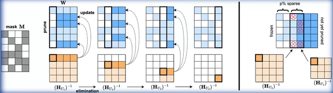

# LMDeploy量化部署

## 模型部署

### 定义

- 软件工程中指开发完毕的软件投入使用的过程
- 人工智能领域是实现深度学习算法落地应用的关键步骤，将训练好的深度学习模型在特定环境中运行的过程

### 场景

- 服务器端：CPU、单CPU/TPU/NPU、多卡/集群部署...
- 移动端/边缘端：机器人、手机...

## LLM特点

### 计算量大

- 参数量巨大，前向推理需要大量计算
  - 20B model生成1个token需要进行406亿次浮点运算
- 前向推理计算量计算公式
  - ${C_{forward}} = 2N + 2n_{layer}n_{ctx}d_{attn}$
  - N：模型参数量，${n_{layer}}$：模型层数，${n_{ctx}}$：上下文长度（默认1024），${d_{attn}}$：注意力输出维度
  - 单位：FLOPs per token

### 内存开销大

- 模型参数占用大量显存
- 推理过程中，为避免重复计算，会将计算注意力得到的KV进行缓存
- KV Cache显存占用估算公式
  - ${M_{kvcache} = 4bn_{layer}n_{attn}(s+n)}$
  - b：batch size，，${n_{layer}}$：模型层数，${d_{attn}}$：注意力输出维度，s：输出序列长度，n：输入序列长度
  - 单位：字节B

### 访存瓶颈

- 访存密集型任务，硬件计算速度远快于显存带宽，存在严重的访存性能瓶颈

- | GPU      | FP16算力    | FP32算力    | FP64算力    | 显存带宽 | FP16算力/显存带宽 |
  | -------- | ----------- | ----------- | ----------- | -------- | ----------------- |
  | RTX4090  | 82.58TFLOPs | 82.58TFLOPs | 1290GFLOPs  | 1008GB/s | 81.92             |
  | A100 80G | 77.97TFLOPs | 19.49TFLOPs | 9.746TFLOPs | 2039GB/s | 38.24             |
  | H100 80G | 267.6TFLOPs | 66.91TFLOPs | 33.45TFLOPs | 1681GB/s | 159.2             |

### 动态请求

- 请求量不确定
- 请求时间不确定
- token逐个生成，生成数量不确定


## 模型部署方法

### 模型剪枝 Pruning



#### 定义

- 剪枝：移除模型中不必要或多余的组件，比如：参数，以使模型更加高效
- 通过对模型中贡献有限的冗余参数进行剪枝，在保证性能最低下降的同时，可减小存储需求、提高计算效率

#### 结构化剪枝

- LLM-Pruner

- 根据预定义规则移除连接或分层结构，同时保持整体网络结构
- 一次性地针对整组权重，降低模型复杂性和内存使用，同时保持整体LLM结构完整

#### 非结构化剪枝

- SparseGPT、LoRAPrune、Wanda

- 移除个别参数，而不是考虑整体网络
- 通过将低于阈值的参数置0的方式对个别权重或神经元进行处理

### 知识蒸馏 KD

- knowledge distillation
- 

#### 定义

- 经典模型压缩方法，通过引导轻量化的学习模型“模仿”性能更好、结构更复杂的教师模型，在不改变学习模型结构的情况下提高性能

#### 方式

- 上下文学习（ICL）：ICL distillation
- 思维链（CoT）：MT-COT、Fine-tune-COT等
- 指令跟随（IF）：LaMini-LM

### 量化

- quantization
- 将传统表示方法中的浮点数转换为整数或其他离散形式，减轻深度学习模型的存储和计算负担

#### 量化感知训练（QAT）

- LLM-QAT
- 量化目标无缝地集成到模型训练过程中，使LLM在训练过程中适应低精度表示

#### 量化感知微调（QAF）

- PEQA、QLORA
- 微调过程中对LLM进行量化，确保经过微调LLM在量化为较低位宽后仍保持性

#### 训练后量化（PTQ）

- LLM.int8、AWQ
- LLM训练阶段完成后对其参数进行量化
- PTQ主要目标是减少LLM的存储和计算复杂性，而无需对LLM架构进行修改或重新训练

#### 通用公式

- ${ZP = \frac{min + max}{2}}$
- ${S = \frac{max - mmin}{255}}$
- 量化：${q = round(\frac{f - ZP}{S})}$，降低访存量
- 反量化：${f = q×S + ZP}$，提高计算精度


## LMDeploy

### 核心功能

- 模型高效推理：

  ```
  lmdeploy chat -h
  ```

  - TurboMind推理引擎

- 模型量化压缩：

  ```
  lmdeploy lite -h
  ```

  - W4A16量化（AWQ）

- 服务化部署：

  ```
  lmdeploy serve -h
  ```

  - LLM封装为HTTP API服务，支持Triton扩展

- 支持多模态大模型llava


## 实践

### env

```
cuda12.2 10% A100 * 1
```

### conda环境

```
studio-conda -t lmdeploy -o pytorch-2.1.2

# 本地安装
conda create -n lmdeploy -y python=3.10
conda activate lmdeploy
pip install lmdeploy[all]==0.3.0
```

### 下载模型

```
ls /root/share/new_models/Shanghai_AI_Laboratory/
cd ~

# 拷贝或者软链接
ln -s /root/share/new_models/Shanghai_AI_Laboratory/internlm2-chat-1_8b /root/
# cp -r /root/share/new_models/Shanghai_AI_Laboratory/internlm2-chat-1_8b /root/
ls

# openxlab下载
cd ~
## root用户
curl -s https://packagecloud.io/install/repositories/github/git-lfs/script.deb.sh | bash
apt update
apt install git-lfs   
git lfs install  --system
## 非root用户
curl -s https://packagecloud.io/install/repositories/github/git-lfs/script.deb.sh | sudo bash
sudo apt update
sudo apt install git-lfs   
sudo git lfs install  --system

git clone https://code.openxlab.org.cn/OpenLMLab/internlm2-chat-1.8b.git
ls
mv /root/internlm2-chat-1.8b /root/internlm2-chat-1_8b
```

### 使用Transformer库运行模型

```
# 打开终端
touch /root/pipeline_transformer.py

# pipeline_transformer.py输入
import torch
from transformers import AutoTokenizer, AutoModelForCausalLM

tokenizer = AutoTokenizer.from_pretrained("/root/internlm2-chat-1_8b", trust_remote_code=True)

# Set `torch_dtype=torch.float16` to load model in float16, otherwise it will be loaded as float32 and cause OOM Error.
model = AutoModelForCausalLM.from_pretrained("/root/internlm2-chat-1_8b", torch_dtype=torch.float16, trust_remote_code=True).cuda()
model = model.eval()

inp = "hello"
print("[INPUT]", inp)
response, history = model.chat(tokenizer, inp, history=[])
print("[OUTPUT]", response)

inp = "please provide three suggestions about time management"
print("[INPUT]", inp)
response, history = model.chat(tokenizer, inp, history=history)
print("[OUTPUT]", response)

conda activate lmdeploy
python /root/pipeline_transformer.py
```

### 使用LMDeploy与模型对话

- lmdeploy chat [HF格式模型路径/TurboMind格式模型路径]
- lmdeploy chat -h：chat相关功能参数查看（-h）

```
conda activate lmdeploy
lmdeploy chat /root/internlm2-chat-1_8b
```


### 模型量化

#### 方式

**KV8量化**：将逐 Token（Decoding）生成过程中的上下文 K 和 V 中间结果进行 INT8 量化（计算时再反量化），以降低生成过程中的显存占用

**W4A16 量化**：将 FP16 的模型权重量化为 INT4，Kernel 计算时，访存量直接降为 FP16 模型的 1/4，大幅降低了访存成本；Weight Only 是指仅量化权重，数值计算依然采用 FP16（需要将 INT4 权重反量化）

#### KV Cache

- KV Cache是一种缓存技术，通过存储键值对的形式来复用计算结果，以达到提高性能和降低内存消耗的目的
- 大规模训练和推理中，KV Cache可以显著减少重复计算量，从而提升模型的推理速度。理想情况下，KV Cache全部存储于显存，以加快访存速度
- 当显存空间不足时，也可以将KV Cache放在内存，通过缓存管理器控制将当前需要使用的数据放入显存
- 模型占用显存：模型参数本身占用的显存、KV Cache占用的显存，以及中间运算结果占用的显存
- LMDeploy的KV Cache管理器可以通过设置`--cache-max-entry-count`参数，控制KV缓存**占用剩余显存**的最大比例。默认的比例为0.8

#### command

```
lmdeploy chat /root/internlm2-chat-1_8b --cache-max-entry-count [百分比]
# 0.01 == 禁止KV Cache占用显存
```


### 使用W4A16量化

- lmdeploy lite -h

```
pip install einops==0.7.0

lmdeploy lite auto_awq \
   /root/internlm2-chat-1_8b \
  --calib-dataset 'ptb' \
  --calib-samples 128 \
  --calib-seqlen 1024 \
  --w-bits 4 \
  --w-group-size 128 \
  --work-dir /root/internlm2-chat-1_8b-4bit
  
lmdeploy chat /root/internlm2-chat-1_8b-4bit --model-format awq
```


### LMDeploy服务(serve)


- 模型推理/服务：提供模型本身的推理，一般来说可以和具体业务解耦，专注模型推理本身性能的优化；可以以模块、API等多种方式提供
- API Server：中间协议层，把后端推理/服务通过HTTP，gRPC或其他形式的接口，供前端调用
- Client：前端，与用户交互的地方，通过通过网页端/命令行去调用API接口，获取模型推理/服务

#### 启动API服务器

```
lmdeploy serve api_server \
    /root/internlm2-chat-1_8b \
    --model-format hf \
    --quant-policy 0 \
    --server-name 0.0.0.0 \
    --server-port 23333 \
    --tp 1

# quant-policy：是否量化
# server-name：ip
# tp：并行数量（GPU数量）
```

- cmd连接api服务器

```
conda activate lmdeploy
lmdeploy serve api_client http://localhost:23333
```

- 网页连接

```
conda activate lmdeploy
lmdeploy serve gradio http://localhost:23333 \
    --server-name 0.0.0.0 \
    --server-port 6006

ssh -CNg -L 6006:127.0.0.1:6006 root@ssh.intern-ai.org.cn -p <你的ssh端口号>
```


### python代码集成

```
conda activate lmdeploy
touch /root/pipeline.py

# 填入内容到pipeline.py
from lmdeploy import pipeline

pipe = pipeline('/root/internlm2-chat-1_8b') # 加载HF模型
response = pipe(['Hi, pls intro yourself', '上海是'])
print(response)


python /root/pipeline.py
```

- 设置 KV Cache

```
touch /root/pipeline_kv.py

# 填入内容到pipeline.py
from lmdeploy import pipeline, TurbomindEngineConfig

# 调低 k/v cache内存占比调整为总显存的 20%
backend_config = TurbomindEngineConfig(cache_max_entry_count=0.2)

pipe = pipeline('/root/internlm2-chat-1_8b',
                backend_config=backend_config)
response = pipe(['Hi, pls intro yourself', '上海是'])
print(response)


python /root/pipeline_kv.py
```


### 部署llava

- 官方的Llava模型对中文支持性不好

```
conda activate lmdeploy

pip install git+https://github.com/haotian-liu/LLaVA.git@4e2277a060da264c4f21b364c867cc622c945874

touch /root/pipeline_llava.py


# 填入内容到pipeline.py
from lmdeploy.vl import load_image
from lmdeploy import pipeline, TurbomindEngineConfig


backend_config = TurbomindEngineConfig(session_len=8192) # 图片分辨率较高时请调高session_len
# pipe = pipeline('liuhaotian/llava-v1.6-vicuna-7b', backend_config=backend_config) 非开发机运行此命令
pipe = pipeline('/share/new_models/liuhaotian/llava-v1.6-vicuna-7b', backend_config=backend_config)

image = load_image('https://raw.githubusercontent.com/open-mmlab/mmdeploy/main/tests/data/tiger.jpeg')
response = pipe(('describe this image', image))
print(response)


python /root/pipeline_llava.py
```

- gradio部署

```
touch /root/gradio_llava.py


# 填入内容到pipeline.py
import gradio as gr
from lmdeploy import pipeline, TurbomindEngineConfig


backend_config = TurbomindEngineConfig(session_len=8192) # 图片分辨率较高时请调高session_len
# pipe = pipeline('liuhaotian/llava-v1.6-vicuna-7b', backend_config=backend_config) 非开发机运行此命令
pipe = pipeline('/share/new_models/liuhaotian/llava-v1.6-vicuna-7b', backend_config=backend_config)

def model(image, text):
    if image is None:
        return [(text, "请上传一张图片。")]
    else:
        response = pipe((text, image)).text
        return [(text, response)]

demo = gr.Interface(fn=model, inputs=[gr.Image(type="pil"), gr.Textbox()], outputs=gr.Chatbot())
demo.launch()   


python /root/gradio_llava.py
ssh -CNg -L 7860:127.0.0.1:7860 root@ssh.intern-ai.org.cn -p <你的ssh端口>
```

