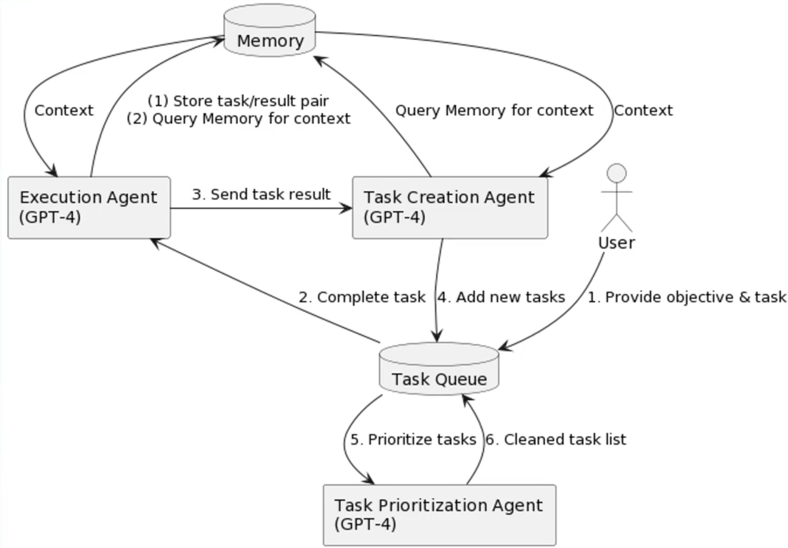
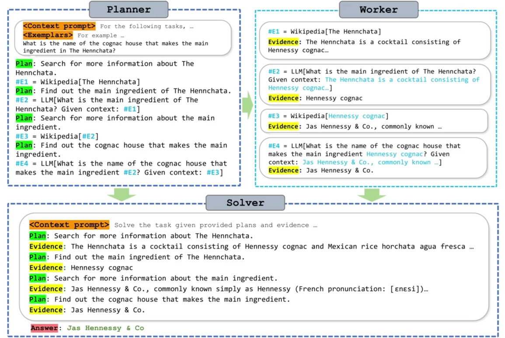
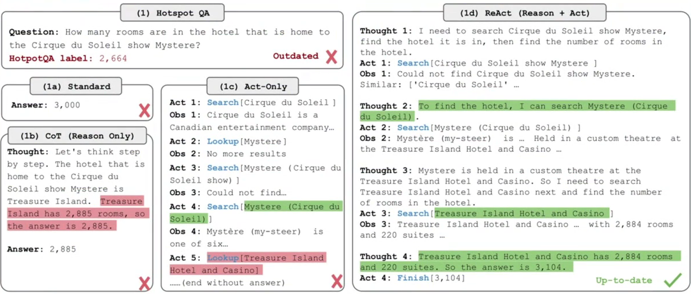
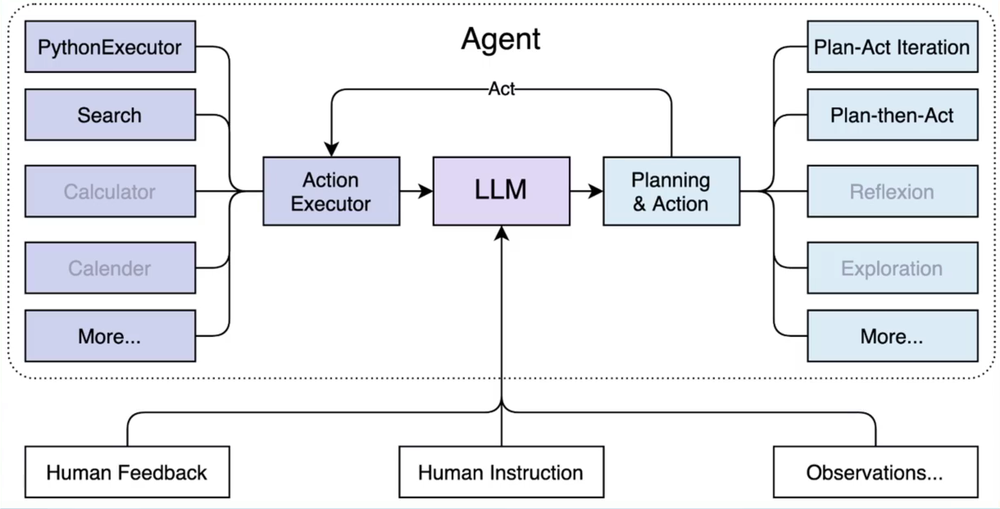
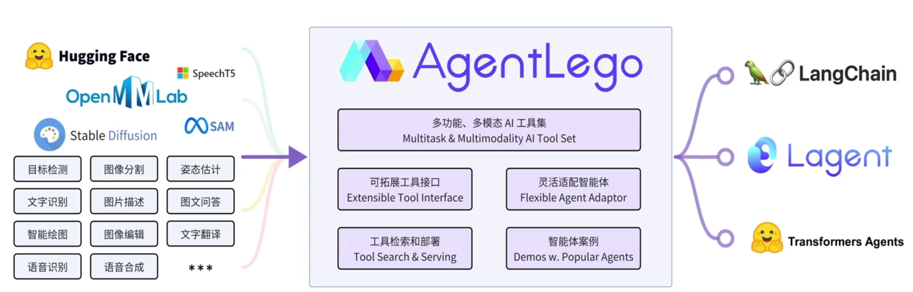
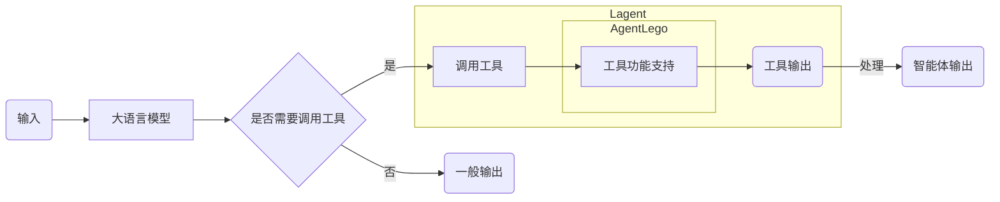
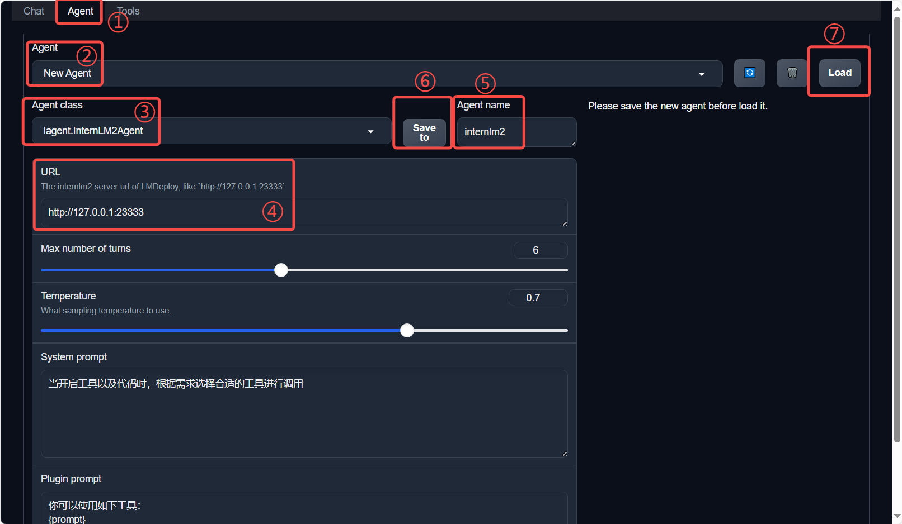
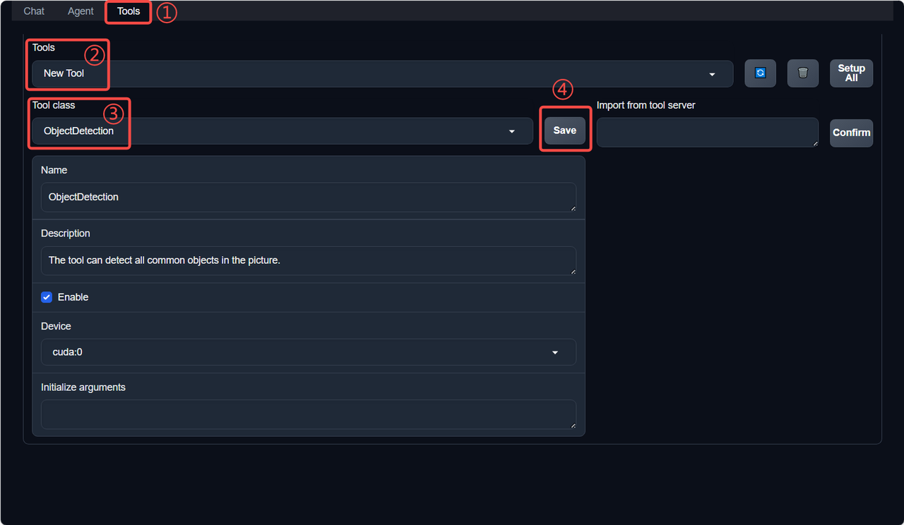

## 智能体

### 定义

1. 可以感知环境中的动态条件
2. 能采取动作影响环境
3. 能运用推理能力理解信息、解决问题、产生推断、决定动作

### 组成

- 大脑：作为控制器，承担记忆、思考和决策任务；接受来自感知模块信息并采取相应动作
- 感知：对外部环境的多模态信息进行感知和处理；包括但不限于图像、音频、视频、传感器等
- 动作：利用并执行工具以影响环境；工具可能包括文本的检索、调用相关API、操控机械臂等

### 范式

#### AutoGPT



- 输入  -->  选择工具  -->  人工干预  -->  执行工具  -->  结束条件（否，选择工具）  -->  结束

#### ReWoo



- 输入  -->  计划拆分  -->  DAG  -->  计划执行   -->  结束

#### ReAct



- 输入  -->  选择工具  -->  执行工具  -->  结束条件（否，选择工具）  -->  结束

### Lagent



- Lagent 是一个轻量级开源智能体框架，旨在让用户可以高效地构建基于大语言模型的智能体
- 提供了一些典型工具以增强大语言模型的能力

- Lagent 支持了包括 AutoGPT、ReAct 等在内的多个经典智能体范式，也支持了如下工具：

  - Arxiv 搜索

  - Bing 地图

  - Google 学术搜索

  - Google 搜索

  - 交互式 IPython 解释器

  - IPython 解释器

  - PPT

  - Python 解释器

### AgentLego



- AgentLego 是一个提供了多种开源工具 API 的多模态工具包，旨在像是乐高积木一样，让用户可以快速简便地拓展自定义工具，从而组装出自己的智能体
- 通过 AgentLego 算法库，不仅可以直接使用多种工具，也可以利用这些工具，在相关智能体框架（如 Lagent，Transformers Agent 等）的帮助下，快速构建可以增强大语言模型能力的智能体

<table align='center'>
    <tr align='center' valign='bottom'>
        <b><td>通用能力</td></b>
        <b><td>语音相关</td></b>
        <b><td>图像处理</td></b>
        <b><td>AIGC</td></b>
    </tr>
    <tr valign='top'>
    <td>
        <ul>
        <li>计算器</li>
        <li>谷歌搜索</li>
        </ul>
    </td>
    <td>
        <ul>
        <li>文本 -> 音频（TTS）</li>
        <li>音频 -> 文本（STT）</li>
        </ul>
    </td>
    <td>
        <ul>
        <li>描述输入图像</li>
        <li>识别文本（OCR）</li>
        <li>视觉问答（VQA）</li>
        <li>人体姿态估计</li>
        <li>人脸关键点检测</li>
        <li>图像边缘提取（Canny）</li>
        <li>深度图生成</li>
        <li>生成涂鸦（Scribble）</li>
        <li>检测全部目标</li>
        <li>检测给定目标</li>
        <li>SAM
            <ul>
            <li>分割一切</li>
            <li>分割给定目标</li>
            </ul>
        </li>
        </ul>
    </td>
    <td>
        <ul>
        <li>文生图</li>
        <li>图像拓展</li>
        <li>删除给定对象</li>
        <li>替换给定对象</li>
        <li>根据指令修改</li>
        <li>ControlNet 系列
            <ul>
            <li>根据边缘+描述生成</li>
            <li>根据深度图+描述生成</li>
            <li>根据姿态+描述生成</li>
            <li>根据涂鸦+描述生成</li>
            </ul>
        </li>
        <li>ImageBind 系列
            <ul>
            <li>音频生成图像</li>
            <li>热成像生成图像</li>
            <li>音频+图像生成图像</li>
            <li>音频+文本生成图像</li>
            </ul>
        </li>
    </td>
    </tr>
</table>

### 关系



- lagent：框架，agentlego：工具包


## 实践

### env

```
mkdir -p /root/agent

studio-conda -t agent -o pytorch-2.1.2

# 自定义配置
conda create -n agent
conda activate agent
conda install python=3.10
conda install pytorch==2.1.2 torchvision==0.16.2 torchaudio==2.1.2 pytorch-cuda=11.8 -c pytorch -c nvidia
```

### install

```
# lagent and agentlego
cd /root/agent
conda activate agent
git clone https://gitee.com/internlm/lagent.git
cd lagent && git checkout 581d9fb && pip install -e . && cd ..
git clone https://gitee.com/internlm/agentlego.git
cd agentlego && git checkout 7769e0d && pip install -e . && cd ..

# 其他依赖
conda activate agent
pip install lmdeploy==0.3.0


cd /root/agent
git clone -b camp2 https://gitee.com/internlm/Tutorial.git
```

### Lagent Web Demo

#### LMDeploy部署api server

```
conda activate agent
lmdeploy serve api_server /root/share/new_models/Shanghai_AI_Laboratory/internlm2-chat-7b \
                            --server-name 127.0.0.1 \
                            --model-name internlm2-chat-7b \
                            --cache-max-entry-count 0.1
```

#### 启动web demo

```
conda activate agent
cd /root/agent/lagent/examples
streamlit run internlm2_agent_web_demo.py --server.address 127.0.0.1 --server.port 7860

ssh -CNg -L 7860:127.0.0.1:7860 -L 23333:127.0.0.1:23333 root@ssh.intern-ai.org.cn -p 你的 ssh 端口号
```

#### Lagent工具创建

- Lagent 中关于工具部分的介绍文档位于 https://lagent.readthedocs.io/zh-cn/latest/tutorials/action.html 

- 步骤
  1. 继承 BaseAction 类
  2. 实现简单工具的 run 方法；或者实现工具包内每个子工具的功能
  3. 简单工具的 run 方法可选被 tool_api 装饰；工具包内每个子工具的功能都需要被 tool_api 装饰
- 例子

```
# 创建工具文件
touch /root/agent/lagent/lagent/actions/weather.py


# 工具文件内填入
import json
import os
import requests
from typing import Optional, Type

from lagent.actions.base_action import BaseAction, tool_api
from lagent.actions.parser import BaseParser, JsonParser
from lagent.schema import ActionReturn, ActionStatusCode

class WeatherQuery(BaseAction):
    """Weather plugin for querying weather information."""
    
    def __init__(self,
                 key: Optional[str] = None,
                 description: Optional[dict] = None,
                 parser: Type[BaseParser] = JsonParser,
                 enable: bool = True) -> None:
        super().__init__(description, parser, enable)
        key = os.environ.get('WEATHER_API_KEY', key)
        if key is None:
            raise ValueError(
                'Please set Weather API key either in the environment '
                'as WEATHER_API_KEY or pass it as `key`')
        self.key = key
        self.location_query_url = 'https://geoapi.qweather.com/v2/city/lookup'
        self.weather_query_url = 'https://devapi.qweather.com/v7/weather/now'

    @tool_api
    def run(self, query: str) -> ActionReturn:
        """一个天气查询API。可以根据城市名查询天气信息。
        
        Args:
            query (:class:`str`): The city name to query.
        """
        tool_return = ActionReturn(type=self.name)
        status_code, response = self._search(query)
        if status_code == -1:
            tool_return.errmsg = response
            tool_return.state = ActionStatusCode.HTTP_ERROR
        elif status_code == 200:
            parsed_res = self._parse_results(response)
            tool_return.result = [dict(type='text', content=str(parsed_res))]
            tool_return.state = ActionStatusCode.SUCCESS
        else:
            tool_return.errmsg = str(status_code)
            tool_return.state = ActionStatusCode.API_ERROR
        return tool_return
    
    def _parse_results(self, results: dict) -> str:
        """Parse the weather results from QWeather API.
        
        Args:
            results (dict): The weather content from QWeather API
                in json format.
        
        Returns:
            str: The parsed weather results.
        """
        now = results['now']
        data = [
            f'数据观测时间: {now["obsTime"]}',
            f'温度: {now["temp"]}°C',
            f'体感温度: {now["feelsLike"]}°C',
            f'天气: {now["text"]}',
            f'风向: {now["windDir"]}，角度为 {now["wind360"]}°',
            f'风力等级: {now["windScale"]}，风速为 {now["windSpeed"]} km/h',
            f'相对湿度: {now["humidity"]}',
            f'当前小时累计降水量: {now["precip"]} mm',
            f'大气压强: {now["pressure"]} 百帕',
            f'能见度: {now["vis"]} km',
        ]
        return '\n'.join(data)

    def _search(self, query: str):
        # get city_code
        try:
            city_code_response = requests.get(
                self.location_query_url,
                params={'key': self.key, 'location': query}
            )
        except Exception as e:
            return -1, str(e)
        if city_code_response.status_code != 200:
            return city_code_response.status_code, city_code_response.json()
        city_code_response = city_code_response.json()
        if len(city_code_response['location']) == 0:
            return -1, '未查询到城市'
        city_code = city_code_response['location'][0]['id']
        # get weather
        try:
            weather_response = requests.get(
                self.weather_query_url,
                params={'key': self.key, 'location': city_code}
            )
        except Exception as e:
            return -1, str(e)
        return weather_response.status_code, weather_response.json()
```


```
conda activate agent
lmdeploy serve api_server /root/share/new_models/Shanghai_AI_Laboratory/internlm2-chat-7b \
                            --server-name 127.0.0.1 \
                            --model-name internlm2-chat-7b \
                            --cache-max-entry-count 0.1

# new terminal
export WEATHER_API_KEY=在2.2节获取的API KEY
# 比如 export WEATHER_API_KEY=1234567890abcdef
conda activate agent
cd /root/agent/Tutorial/agent
streamlit run internlm2_weather_web_demo.py --server.address 127.0.0.1 --server.port 7860
```


### AgentLego

#### quick start

- 下载demo文件

```
cd /root/agent
wget http://download.openmmlab.com/agentlego/road.jpg
```

- 安装目标检测工具运行时所需依赖，AgentLego 所实现的目标检测工具是基于 mmdet (MMDetection) 算法库中的 RTMDet-Large 模型，因此我们首先安装 mim，然后通过 mim 工具来安装 mmdet

```
conda activate agent
pip install openmim==0.3.9
mim install mmdet==3.3.0
```

- /root/agent 目录下新建 direct_use.py 以直接使用目标检测工具

```
import re

import cv2
from agentlego.apis import load_tool

# load tool
tool = load_tool('ObjectDetection', device='cuda')

# apply tool
visualization = tool('/root/agent/road.jpg')
print(visualization)

# visualize
image = cv2.imread('/root/agent/road.jpg')

preds = visualization.split('\n')
pattern = r'(\w+) \((\d+), (\d+), (\d+), (\d+)\), score (\d+)'

for pred in preds:
    name, x1, y1, x2, y2, score = re.match(pattern, pred).groups()
    x1, y1, x2, y2, score = int(x1), int(y1), int(x2), int(y2), int(score)
    cv2.rectangle(image, (x1, y1), (x2, y2), (0, 255, 0), 1)
    cv2.putText(image, f'{name} {score}', (x1, y1), cv2.FONT_HERSHEY_SIMPLEX, 0.8, (0, 255, 0), 1)

cv2.imwrite('/root/agent/road_detection_direct.jpg', image)
```

- 推理

```
python /root/agent/direct_use.py
```

#### 智能体工具使用

- 修改模型
  - AgentLego 算法库默认使用 InternLM2-Chat-20B 模型，需要修改 /root/agent/agentlego/webui/modules/agents/lagent_agent.py 文件的第 105行位置，将 internlm2-chat-20b 修改为 internlm2-chat-7b

```diff
def llm_internlm2_lmdeploy(cfg):
    url = cfg['url'].strip()
    llm = LMDeployClient(
-         model_name='internlm2-chat-20b',
+         model_name='internlm2-chat-7b',
        url=url,
        meta_template=INTERNLM2_META,
        top_p=0.8,
        top_k=100,
        temperature=cfg.get('temperature', 0.7),
        repetition_penalty=1.0,
        stop_words=['<|im_end|>'])
    return llm
```

- LMDeploy部署

```
conda activate agent
lmdeploy serve api_server /root/share/new_models/Shanghai_AI_Laboratory/internlm2-chat-7b \
                            --server-name 127.0.0.1 \
                            --model-name internlm2-chat-7b \
                            --cache-max-entry-count 0.1
```

- 启动AgentLego WebUI

```
conda activate agent
cd /root/agent/agentlego/webui
python one_click.py

ssh -CNg -L 7860:127.0.0.1:7860 -L 23333:127.0.0.1:23333 root@ssh.intern-ai.org.cn -p 你的 ssh 端口号
```

- 使用 AgentLego WebUI



- 配置工具



- 进入对话页面


#### AgentLego自定义工具

- 基于 AgentLego 构建自己的自定义工具，文档地址为 https://agentlego.readthedocs.io/zh-cn/latest/modules/tool.html
- 步骤：第一二四步是必须的步骤
  1. 继承 BaseTool 类
  2. 修改 default_desc 属性（工具功能描述）
  3. 如有需要，重载 setup 方法（重型模块延迟加载）
  4. 重载 apply 方法（工具功能实现）

- 例子

```
# 创建工具文件
touch /root/agent/agentlego/agentlego/tools/magicmaker_image_generation.py

# 填入内容
import json
import requests

import numpy as np

from agentlego.types import Annotated, ImageIO, Info
from agentlego.utils import require
from .base import BaseTool


class MagicMakerImageGeneration(BaseTool):

    default_desc = ('This tool can call the api of magicmaker to '
                    'generate an image according to the given keywords.')

    styles_option = [
        'dongman',  # 动漫
        'guofeng',  # 国风
        'xieshi',   # 写实
        'youhua',   # 油画
        'manghe',   # 盲盒
    ]
    aspect_ratio_options = [
        '16:9', '4:3', '3:2', '1:1',
        '2:3', '3:4', '9:16'
    ]

    @require('opencv-python')
    def __init__(self,
                 style='guofeng',
                 aspect_ratio='4:3'):
        super().__init__()
        if style in self.styles_option:
            self.style = style
        else:
            raise ValueError(f'The style must be one of {self.styles_option}')
        
        if aspect_ratio in self.aspect_ratio_options:
            self.aspect_ratio = aspect_ratio
        else:
            raise ValueError(f'The aspect ratio must be one of {aspect_ratio}')

    def apply(self,
              keywords: Annotated[str,
                                  Info('A series of Chinese keywords separated by comma.')]
        ) -> ImageIO:
        import cv2
        response = requests.post(
            url='https://magicmaker.openxlab.org.cn/gw/edit-anything/api/v1/bff/sd/generate',
            data=json.dumps({
                "official": True,
                "prompt": keywords,
                "style": self.style,
                "poseT": False,
                "aspectRatio": self.aspect_ratio
            }),
            headers={'content-type': 'application/json'}
        )
        image_url = response.json()['data']['imgUrl']
        image_response = requests.get(image_url)
        image = cv2.cvtColor(cv2.imdecode(np.frombuffer(image_response.content, np.uint8), cv2.IMREAD_COLOR),cv2.COLOR_BGR2RGB)
        return ImageIO(image)
```

- 注册新工具

  - 修改 /root/agent/agentlego/agentlego/tools/__init__.py 文件，并且将其加入了 __all__ 列表中

  - ```
    from .base import BaseTool
    from .calculator import Calculator
    from .func import make_tool
    from .image_canny import CannyTextToImage, ImageToCanny
    from .image_depth import DepthTextToImage, ImageToDepth
    from .image_editing import ImageExpansion, ImageStylization, ObjectRemove, ObjectReplace
    from .image_pose import HumanBodyPose, HumanFaceLandmark, PoseToImage
    from .image_scribble import ImageToScribble, ScribbleTextToImage
    from .image_text import ImageDescription, TextToImage
    from .imagebind import AudioImageToImage, AudioTextToImage, AudioToImage, ThermalToImage
    from .object_detection import ObjectDetection, TextToBbox
    from .ocr import OCR
    from .scholar import *  # noqa: F401, F403
    from .search import BingSearch, GoogleSearch
    from .segmentation import SegmentAnything, SegmentObject, SemanticSegmentation
    from .speech_text import SpeechToText, TextToSpeech
    from .translation import Translation
    from .vqa import VQA
    + from .magicmaker_image_generation import MagicMakerImageGeneration
    
    __all__ = [
        'CannyTextToImage', 'ImageToCanny', 'DepthTextToImage', 'ImageToDepth',
        'ImageExpansion', 'ObjectRemove', 'ObjectReplace', 'HumanFaceLandmark',
        'HumanBodyPose', 'PoseToImage', 'ImageToScribble', 'ScribbleTextToImage',
        'ImageDescription', 'TextToImage', 'VQA', 'ObjectDetection', 'TextToBbox', 'OCR',
        'SegmentObject', 'SegmentAnything', 'SemanticSegmentation', 'ImageStylization',
        'AudioToImage', 'ThermalToImage', 'AudioImageToImage', 'AudioTextToImage',
        'SpeechToText', 'TextToSpeech', 'Translation', 'GoogleSearch', 'Calculator',
    -     'BaseTool', 'make_tool', 'BingSearch'
    +     'BaseTool', 'make_tool', 'BingSearch', 'MagicMakerImageGeneration'
    ]
    ```

- 测试

```
conda activate agent
lmdeploy serve api_server /root/share/new_models/Shanghai_AI_Laboratory/internlm2-chat-7b \
                            --server-name 127.0.0.1 \
                            --model-name internlm2-chat-7b \
                            --cache-max-entry-count 0.1
                            
                            
conda activate agent
cd /root/agent/agentlego/webui
python one_click.py


ssh -CNg -L 7860:127.0.0.1:7860 -L 23333:127.0.0.1:23333 root@ssh.intern-ai.org.cn -p 你的 ssh 端口号
```

