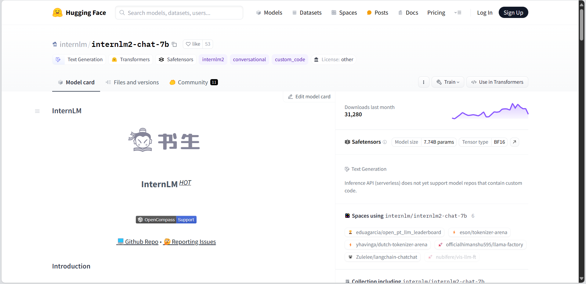

**基础作业 (结营必做)**

- 使用 `InternLM2-Chat-1.8B` 模型生成 300 字的小故事（需截图）

**进阶作业 (优秀学员必做)**

- 熟悉 `huggingface` 下载功能，使用 `huggingface_hub` python 包，下载 `InternLM2-Chat-7B` 的 `config.json` 文件到本地（需截图下载过程）
- 完成 `浦语·灵笔2` 的 `图文创作` 及 `视觉问答` 部署（需截图）
- 完成 `Lagent` 工具调用 `数据分析` Demo 部署（需截图）


### 基础作业

#### 加载模型


### 输入指令


### 进阶作业

#### 下载InternLM2-Chat-7B的config.json

##### 获取下载仓库地址



- internlm/internlm2-chat-7b

##### 创建下载程序

- 在开发机 /root/demo 目录下创建 download_huggingface.py 输入

```
import os
from huggingface_hub import hf_hub_download  # Load model directly

# filename：文件名称
hf_hub_download(repo_id="internlm/internlm2-chat-7b", filename="config.json", local_dir='./')
```


##### 执行

- python ./download_huggingface.py 


#### 浦语·灵笔2的图文创作及视觉问答部署

##### env配置

```
conda activate demo
# 补充环境包
pip install timm==0.4.12 sentencepiece==0.1.99 markdown2==2.4.10 xlsxwriter==3.1.2 gradio==4.13.0 modelscope==1.9.5
```

##### 下载仓库

```
cd /root/demo
git clone https://gitee.com/internlm/InternLM-XComposer.git
# git clone https://github.com/internlm/InternLM-XComposer.git
cd /root/demo/InternLM-XComposer
git checkout f31220eddca2cf6246ee2ddf8e375a40457ff626
```

##### 建立软链接

```
ln -s /root/share/new_models/Shanghai_AI_Laboratory/internlm-xcomposer2-7b /root/models/internlm-xcomposer2-7b
ln -s /root/share/new_models/Shanghai_AI_Laboratory/internlm-xcomposer2-vl-7b /root/models/internlm-xcomposer2-vl-7b
```

##### 运行图文写作

```
cd /root/demo/InternLM-XComposer
python /root/demo/InternLM-XComposer/examples/gradio_demo_composition.py  \
--code_path /root/models/internlm-xcomposer2-7b \
--private \
--num_gpus 1 \
--port 6006
```


##### 运行图片理解

```
cd /root/demo/InternLM-XComposer
python /root/demo/InternLM-XComposer/examples/gradio_demo_chat.py  \
--code_path /root/models/internlm-xcomposer2-vl-7b \
--private \
--num_gpus 1 \
--port 6006
```


#### Lagent工具调用数据分析Demo 部署

##### env 配置

```
bash
conda activate demo
cd /root/demo

git clone https://gitee.com/internlm/lagent.git
# git clone https://github.com/internlm/lagent.git
cd /root/demo/lagent
git checkout 581d9fb8987a5d9b72bb9ebd37a95efd47d479ac
pip install -e . # 源码安装
```


##### 配置模型

```
cd /root/demo/lagent

# 软链接
ln -s /root/share/new_models/Shanghai_AI_Laboratory/internlm2-chat-7b /root/models/internlm2-chat-7b
```

##### 修改文件

- examples/internlm2_agent_web_demo_hf.py

```
# 其他代码... 71行左右
value='/root/models/internlm2-chat-7b'
# 其他代码...
```

##### 运行

```
streamlit run /root/demo/lagent/examples/internlm2_agent_web_demo_hf.py --server.address 127.0.0.1 --server.port 6006

# 端口映射
ssh -CNg -L 6006:127.0.0.1:6006 root@ssh.intern-ai.org.cn -p 3911
```


