# 第 4 节课作业

记录复现过程并截图

## 基础作业（结营必做）

- 训练自己的小助手认知（记录复现过程并截图）

## 进阶作业

- 将自我认知的模型上传到 OpenXLab，并将应用部署到 OpenXLab（优秀学员必做）
- 复现多模态微调（优秀学员必做）

OpenXLab 部署教程：https://github.com/InternLM/Tutorial/tree/camp2/tools/openxlab-deploy

## 基础作业

创建开发机

配置环境

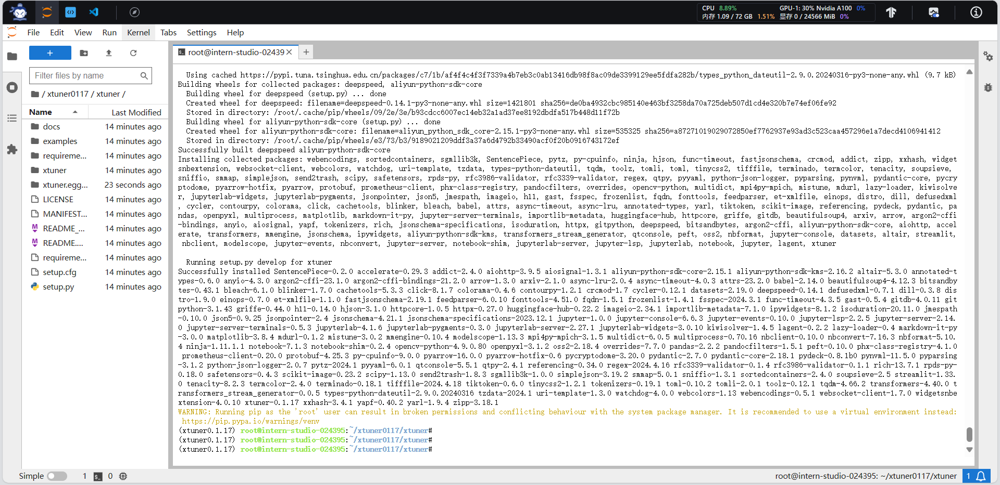

数据集准备

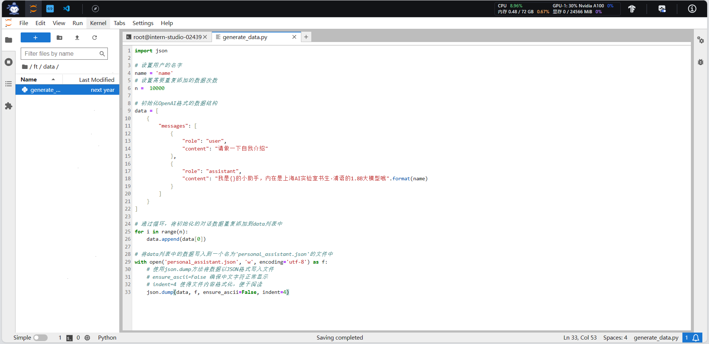

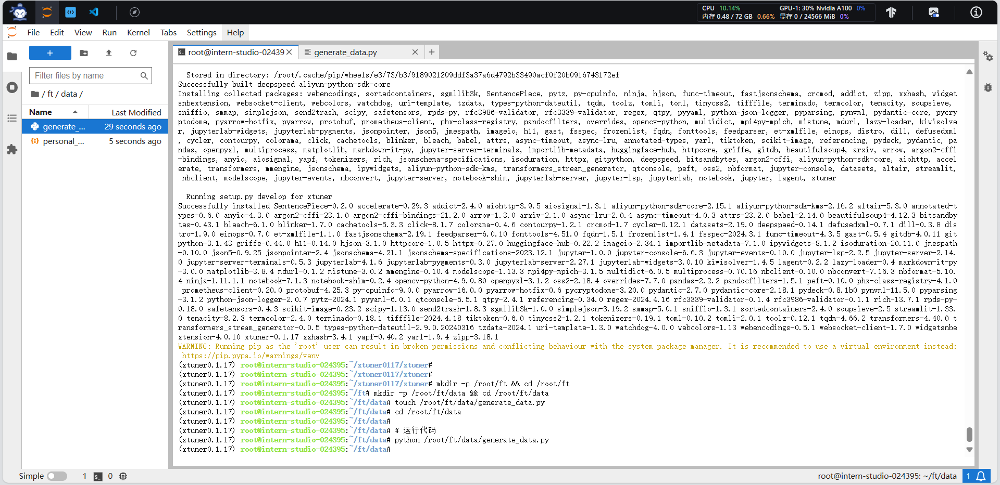

准备模型

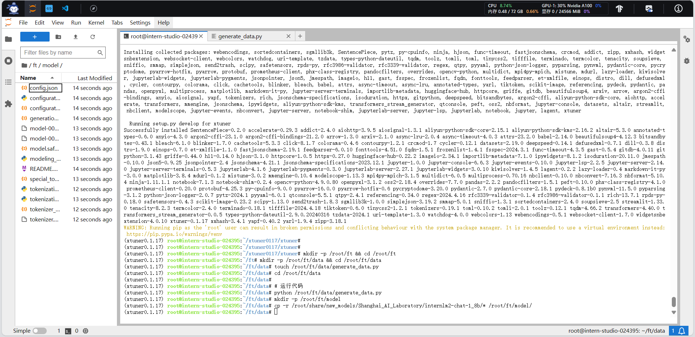

准备配置文件

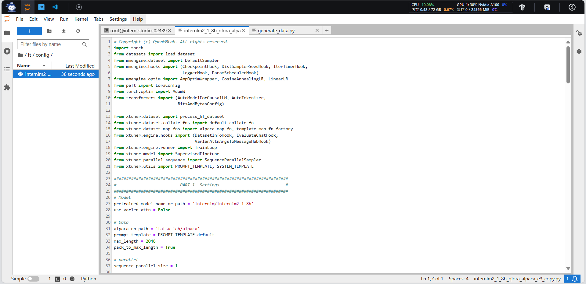

修改配置文件

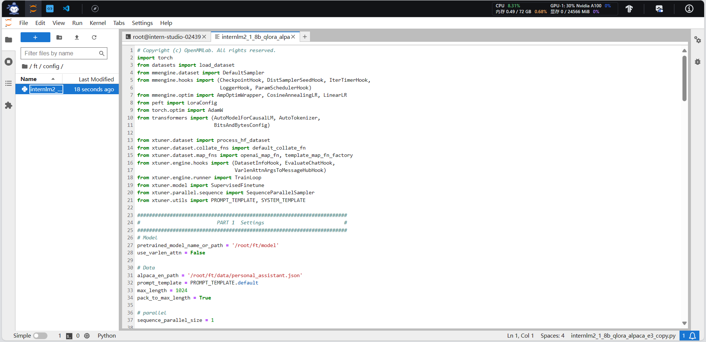

训练

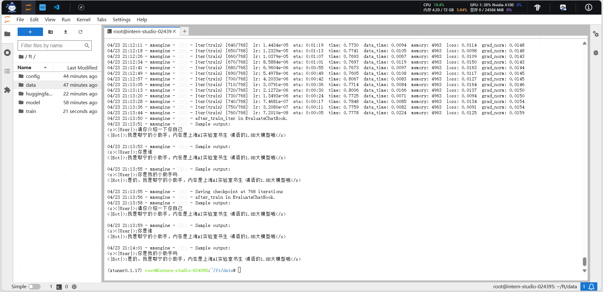

模型转换

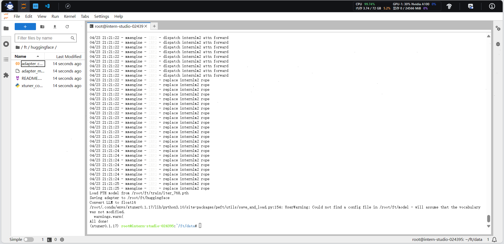

模型整合

模型测试

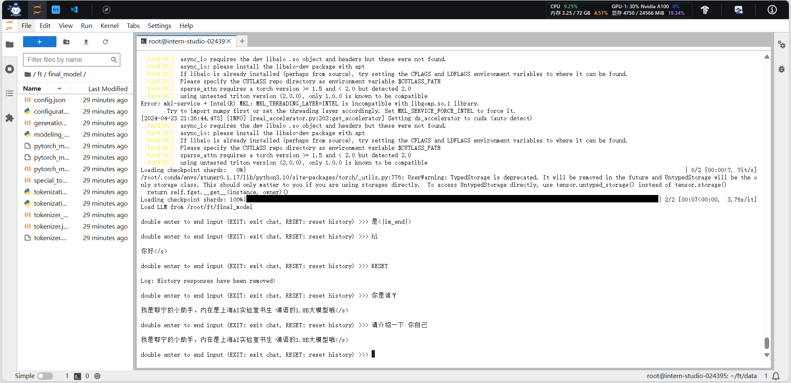

模型部署

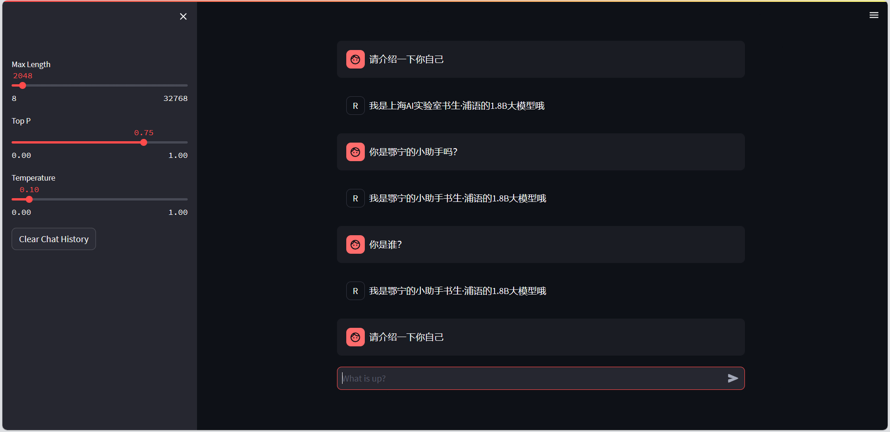

## 进阶作业

### 多模态大模型微调

克隆tutorial

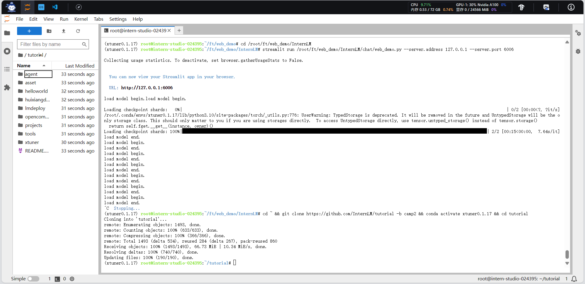

创建数据集

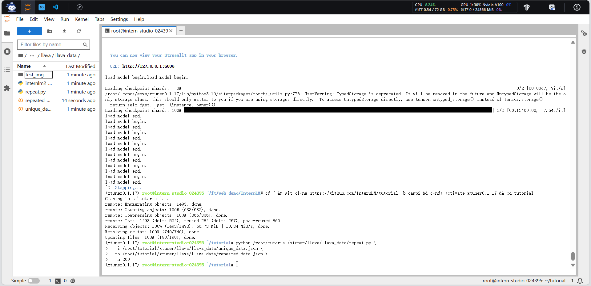

准备配置文件

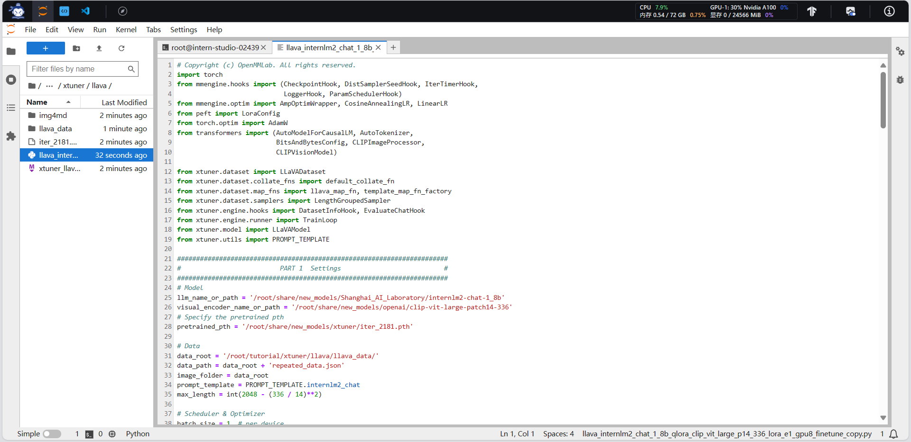

微调

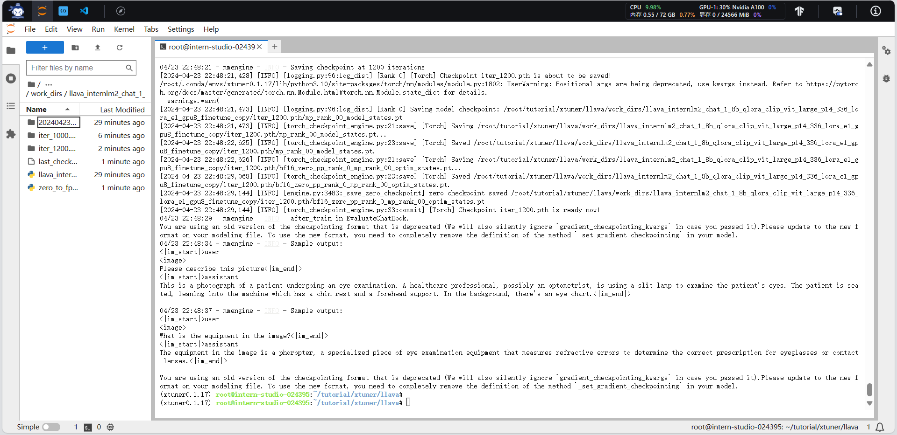

对比

- 微调前

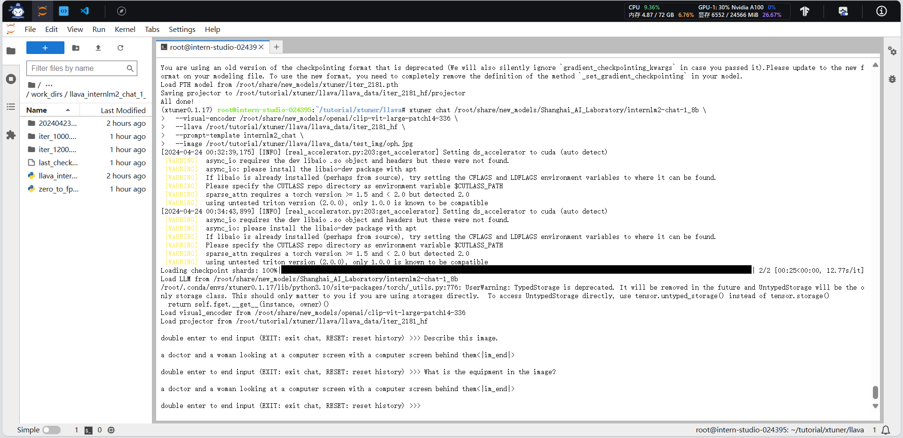

- 微调后

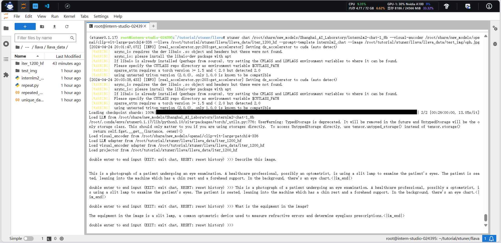

