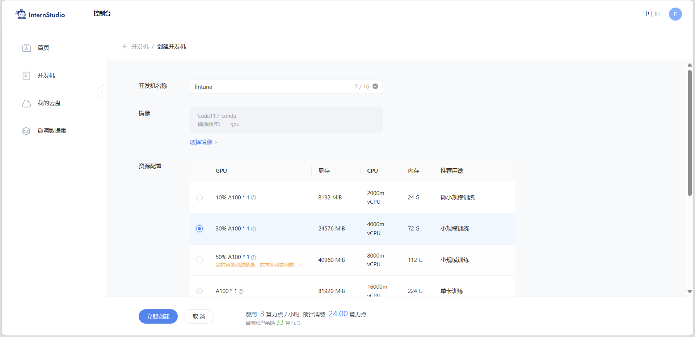
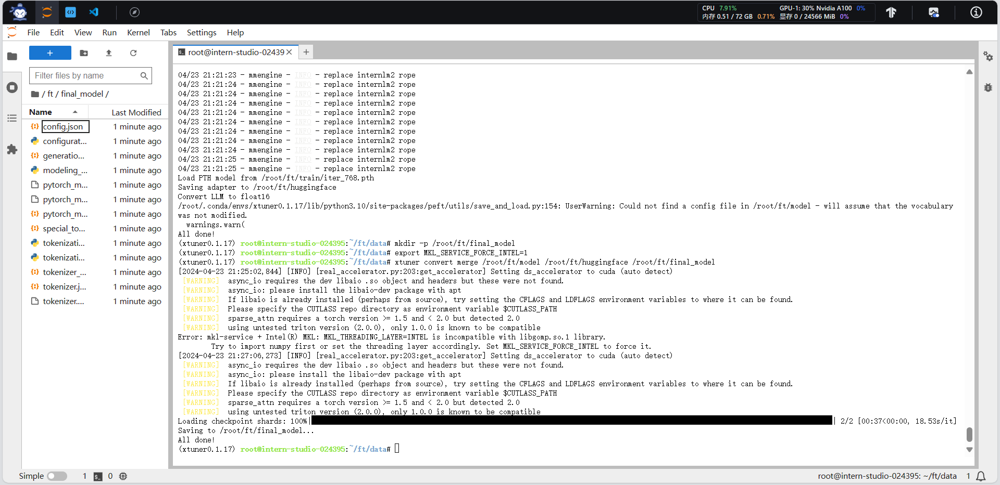

# 第 4 节课作业

记录复现过程并截图

## 基础作业（结营必做）

- 训练自己的小助手认知（记录复现过程并截图）

## 进阶作业

- 将自我认知的模型上传到 OpenXLab，并将应用部署到 OpenXLab（优秀学员必做）
- 复现多模态微调（优秀学员必做）

OpenXLab 部署教程：https://github.com/InternLM/Tutorial/tree/camp2/tools/openxlab-deploy

## 基础作业

创建开发机

配置环境

数据集准备

准备模型

准备配置文件

修改配置文件

训练

模型转换

模型整合

模型测试

模型部署

## 进阶作业

### 多模态大模型微调

克隆tutorial

创建数据集

准备配置文件

微调

对比

- 微调前

- 微调后

