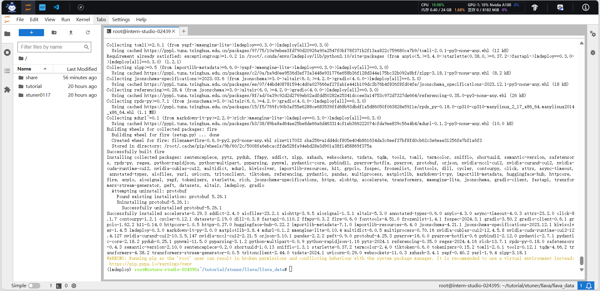

## 基础作业（结营必做）

完成以下任务，并将实现过程记录截图：

- 配置 LMDeploy 运行环境
- 以命令行方式与 InternLM2-Chat-1.8B 模型对话

## 进阶作业

完成以下任务，并将实现过程记录截图：

- 设置KV Cache最大占用比例为0.4，开启W4A16量化，以命令行方式与模型对话。（优秀学员必做）
- 以API Server方式启动 lmdeploy，开启 W4A16量化，调整KV Cache的占用比例为0.4，分别使用命令行客户端与Gradio网页客户端与模型对话。（优秀学员必做）
- 使用W4A16量化，调整KV Cache的占用比例为0.4，使用Python代码集成的方式运行internlm2-chat-1.8b模型。（优秀学员必做）
- 使用 LMDeploy 运行视觉多模态大模型 llava gradio demo。（优秀学员必做）
- 将 LMDeploy Web Demo 部署到 [OpenXLab](https://github.com/InternLM/Tutorial/blob/camp2/tools/openxlab-deploy) 。


## 基础作业

### 配置环境



### 命令行对话


## 进阶作业

- 设置KV Cache最大占用比例为0.4，开启W4A16量化，以命令行方式与模型对话


- 以API Server方式启动 lmdeploy，开启 W4A16量化，调整KV Cache的占用比例为0.4，分别使用命令行客户端与Gradio网页客户端与模型对话

```
# cmd
lmdeploy serve api_server /root/internlm2-chat-1_8b-4bit --model-format awq --quant-policy 1 --cache-max-entry-count 0.4 --server-name 0.0.0.0 --server-port 23333 --tp 1
```


命令行对话


网页对话


- 使用W4A16量化，调整KV Cache的占用比例为0.4，使用Python代码集成的方式运行internlm2-chat-1.8b模型


- 使用 LMDeploy 运行视觉多模态大模型 llava gradio demo

