## 基础作业

1. 完成 Lagent Web Demo 使用，并在作业中上传截图。文档可见 [Lagent Web Demo](https://github.com/InternLM/Tutorial/blob/camp2/agent/lagent.md#1-lagent-web-demo)
2. 完成 AgentLego 直接使用部分，并在作业中上传截图。文档可见 [直接使用 AgentLego](https://github.com/InternLM/Tutorial/blob/camp2/agent/agentlego.md#1-直接使用-agentlego)。

## 进阶作业

1. 完成 AgentLego WebUI 使用，并在作业中上传截图。文档可见 [AgentLego WebUI](https://github.com/InternLM/Tutorial/blob/camp2/agent/agentlego.md#2-作为智能体工具使用)。
2. 使用 Lagent 或 AgentLego 实现自定义工具并完成调用，并在作业中上传截图。文档可见：
   - [用 Lagent 自定义工具](https://github.com/InternLM/Tutorial/blob/camp2/agent/lagent.md#2-用-lagent-自定义工具)
   - [用 AgentLego 自定义工具](https://github.com/InternLM/Tutorial/blob/camp2/agent/agentlego.md#3-用-agentlego-自定义工具)

## 基础作业

### 1

- web demo

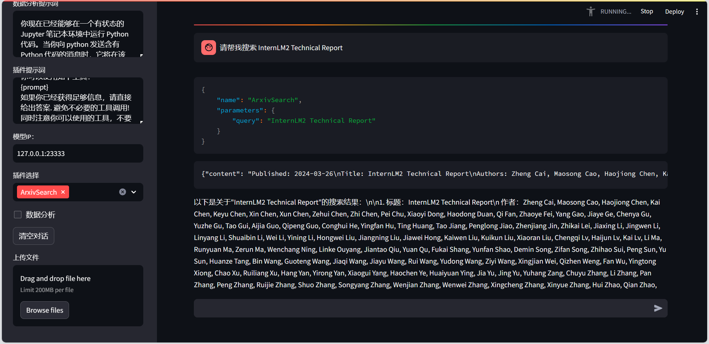

### 2

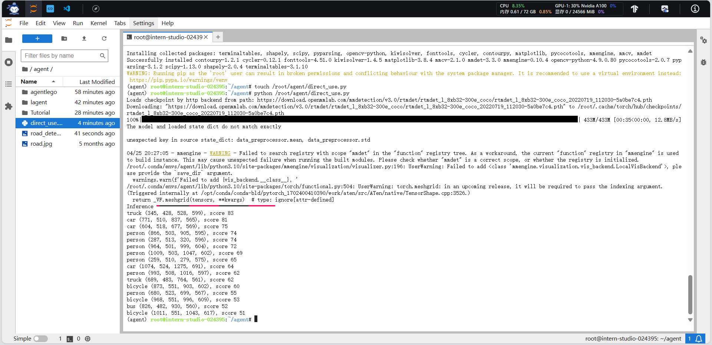

原图

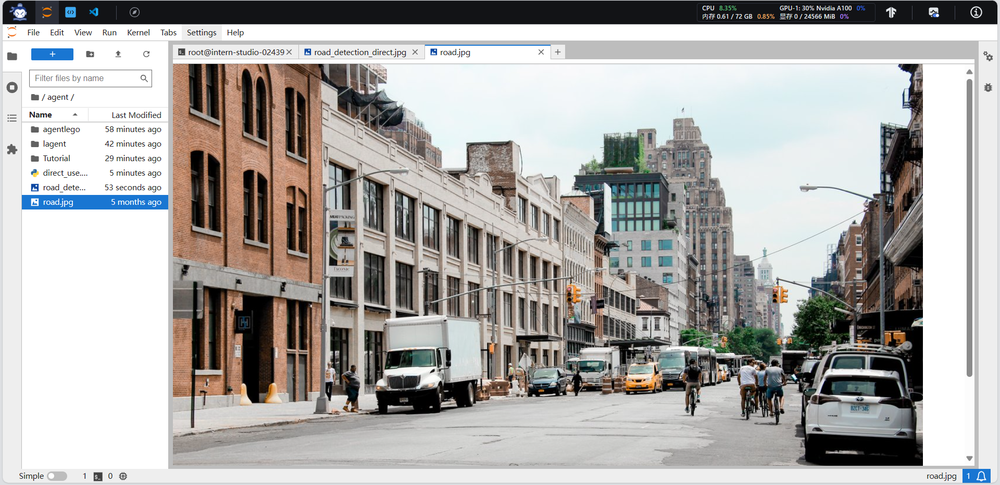

结果

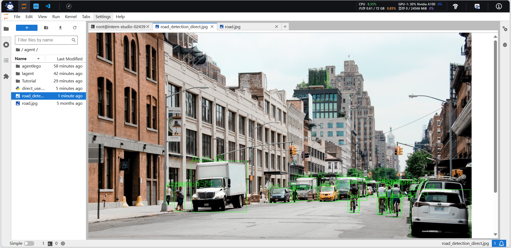

## 进阶作业

### 1

- 配置agent

- 配置工具

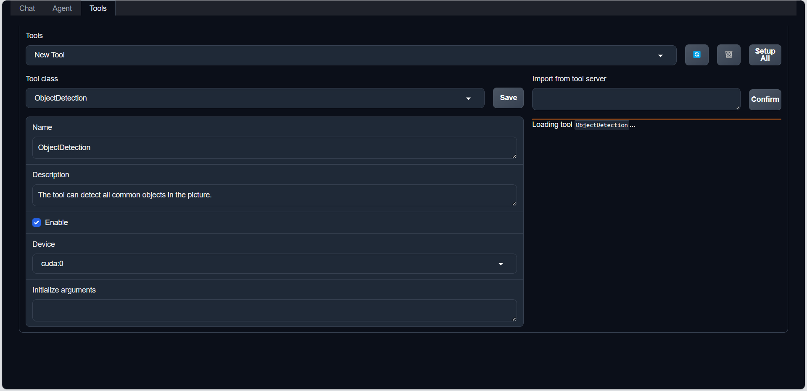

- 检测

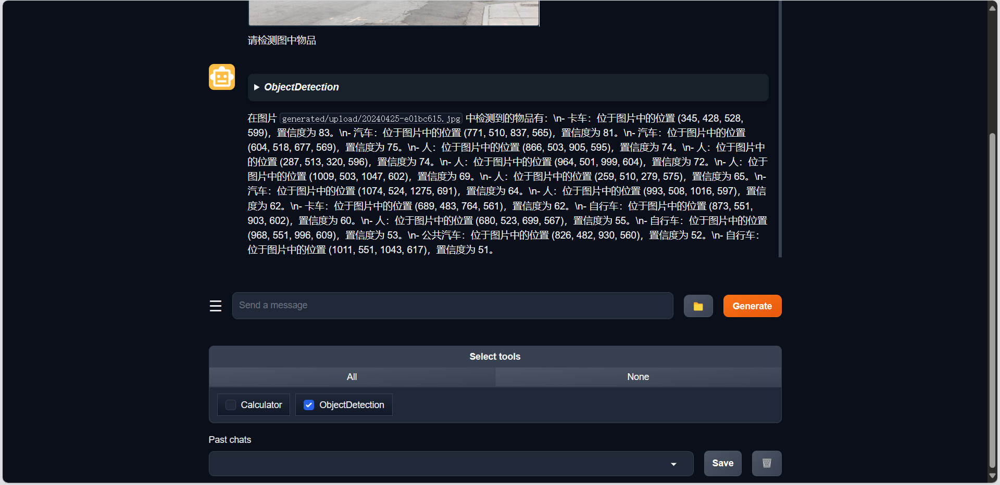

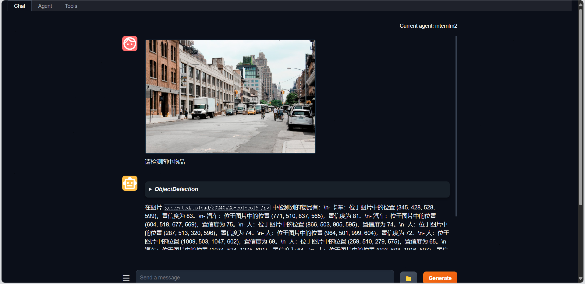

### 2

- Lagent自定义工具

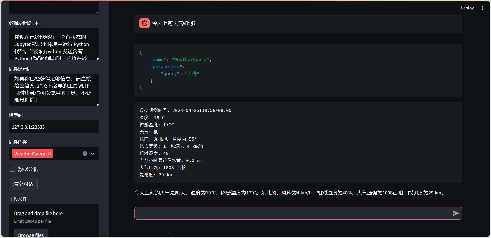

- AgentLego自定义工具

配置agent

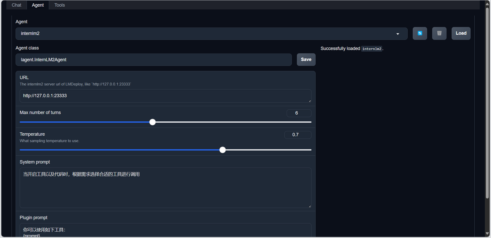

配置工具

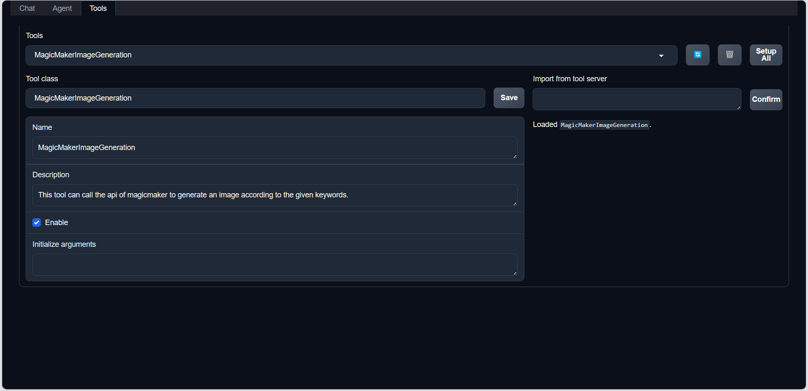

生成

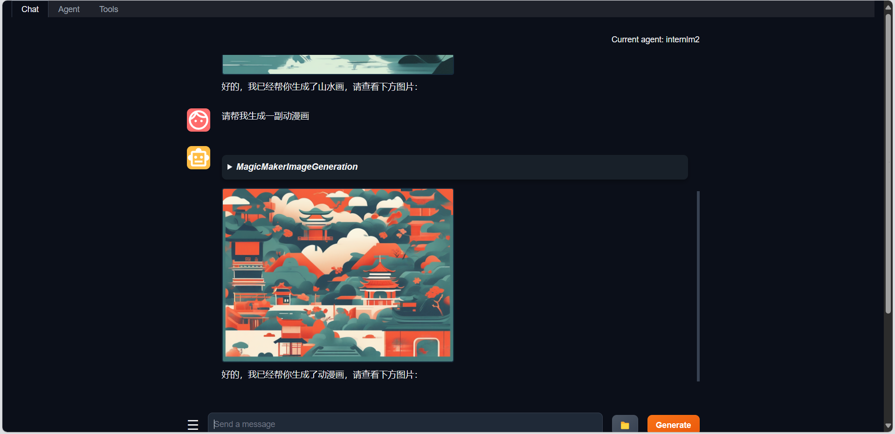