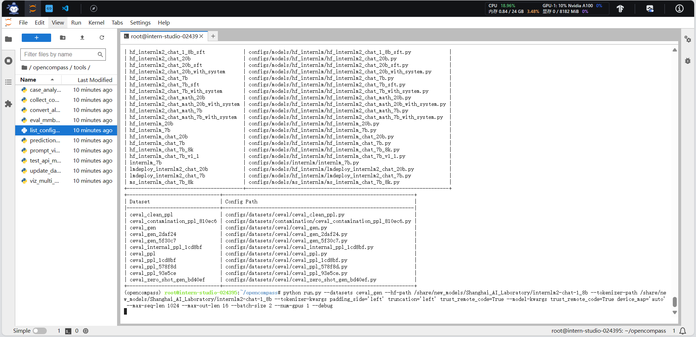

### 基础作业

- 使用 OpenCompass 评测 internlm2-chat-1_8b 模型在 C-Eval 数据集上的性能

### 进阶作业

- 将自定义数据集提交至OpenCompass官网

提交地址：[https://hub.opencompass.org.cn/dataset-submit?lang=[object%20Object\]](https://hub.opencompass.org.cn/dataset-submit?lang=[object Object])
提交指南：https://mp.weixin.qq.com/s/_s0a9nYRye0bmqVdwXRVCg
Tips：不强制要求配置数据集对应榜单（ leaderboard.xlsx ），可仅上传 EADME_OPENCOMPASS.md 文档

## 基础作业

